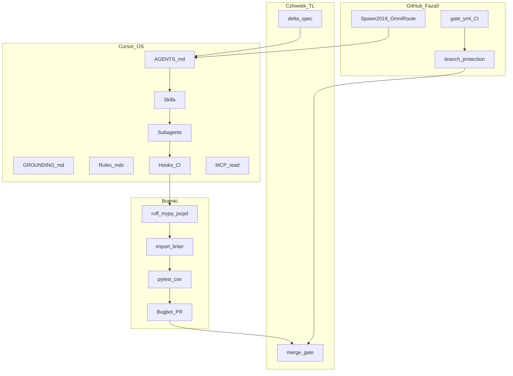

# Plan: Cursor jako software factory (~30 osób) dla OmniRoute

## 0. Werdykt weryfikacji nowych źródeł (31.08.2026)

Źródła: [Audyt Gemini PDF](D:\OMNIROUTE\Informacje%20z%20claude\Audyt%20architektury%20AI%20dla%20ERP%20-%20Google%20Gemini.pdf), [ChatGPT share](https://chatgpt.com/share/6a95817e-bbac-83eb-96b1-26528a80fa44), Consensus, badania (Treude context rot, Palmblad GROUNDING, Galster config, arXiv deterministic control plane 2606.26924, Morph/Cursor rules 2026, CSA README injection).

### Co NOWE źródła potwierdzają (plan zostaje / wzmacniamy)


| Teza                                              | Gemini                  | ChatGPT                 | Nauka/eksperci                              | Decyzja w planie                            |
| ------------------------------------------------- | ----------------------- | ----------------------- | ------------------------------------------- | ------------------------------------------- |
| 500×Rules/Skills w kontekście = context poisoning | Tak                     | Tak (nie wrzucaj 1000)  | Treude rot; Morph: alwaysApply <~2k tokenów | **Cap alwaysApply ≤3**; reszta globs/Skills |
| Multi-agent „zebranie” pogarsza jakość            | Tak                     | Tak (error propagation) | Multi-agent chatter literature              | **Taśma artefaktów**, nie chat agent↔agent  |
| Rules ≠ Skills ≠ Tools                            | Tak                     | Tak                     | Cursor docs 2026                            | Czysty podział ról                          |
| LLM extract → kod waliduje/liczy/zapisuje         | Tak                     | Tak (z AGENTS-v2)       | Wasze zasady 4–8                            | **GROUNDING HCs** + Zero Write Autonomia    |
| Modular monolith + Temporal                       | Tak (Wariant A dla OCR) | Tak (systemdesign)      | Wasz REWIZJA-STOSU                          | **FastAPI + Temporal + Vite**               |
| Knowledge poza kontekstem + retrieval 8–20        | Częściowo (JIT rules)   | Tak (Knowledge Library) | RAG tylko dla nieustrukturyzowanego         | `docs/_knowledge/` + skill retrieve         |


### Co przyjmujemy z Gemini/ChatGPT jako ULEPSZENIE planu

1. **Knowledge Library** — katalog wzorców Tools/Prompting/Memory/Rules/Skills **poza** always-context; agent dostaje 8–20 trafień przez skill `knowledge-retrieve`, nigdy 1000 naraz.
2. **Matryca modułu (Module Factory)** — każdy BC: `schemas` + `service` + `api` + opcjonalnie `ai_transforms` + generator (`just new-module`); Golden Standard = pierwszy plaster RLS/tenancy.
3. `**ui-design-system.mdc**` — anti-AI-slop (data density, zakaz fioletowych gradientów/landing paddings); PostHog od dnia 1.
4. **Zero Write Autonomia (runtime produktu)** — AI generuje Intent/Command payload; zapis tylko przez deterministyczny `service` + walidację + HITL gdzie wymagane.
5. **Integrity instrukcji** — `agentlint` / hash check na AGENTS+rules (CSA injection / arXiv control plane) w CI.
6. **Komunikacja agentów tylko przez artefakty** (delta, ADR, OpenAPI, test report) — potwierdza ChatGPT „software factory”.

### Co ODRZUCAMY mimo propozycji w nowych źródłach


| Propozycja                          | Źródło                     | Dlaczego odrzucamy                                                                     |
| ----------------------------------- | -------------------------- | -------------------------------------------------------------------------------------- |
| Pełny Event Sourcing jako fundament | Gemini                     | OmniRoute kanon: **outbox + audit_log**; ES = dług i złożoność                         |
| NestJS / Next.js jako primary       | Gemini (gdy „tylko parse”) | Ciężki OCR/PDF → **Python**; frontend = **Vite SPA** (docs), portal SSR osobno później |
| Turborepo/Nx obowiązkowo            | Gemini                     | Python monolit + **import-linter** wystarczy na start; Nx opcjonalnie później          |
| 13–30 nazwanych person agentów      | ChatGPT (wczesna rada)     | Sam ChatGPT to później korektuje; Wasza REWIZJA odrzuca persony                        |
| Dump 2×200 repo do Cursor           | Pytanie użytkownika        | Oba źródła: **pogarsza**; tylko curated library + retrieval                            |
| RAG na logikę wyceny / schemat DB   | Gemini                     | Zakaz — logika w typowanym kodzie/SQL                                                  |


### Werdykt vs poprzedni plan

**Kierunek był już właściwy (~85%).** Nowe źródła **nie zmieniają stosu ani metodyki WIP=1**, lecz:

- zaostrzają anty-poisoning,
- dodają Knowledge Library + Module Factory + UI anti-slop + integrity scan,
- formalizują „software factory przez artefakty”.

## Założenia zamknięte (bez otwartych forków)

- **Operator:** 1 człowiek + agenci AI (symulacja ~30 ról SH jako **powierzchnie procesu**, nie persony).
- **Metafora:** nie „30 agentów na stand-upie” — **kontrolowana fabryka** (Gemini) / **AI software factory** (ChatGPT).
- **Kształt produktu:** modularny monolit OmniRoute (morze → droga → lot); wejście wąskie = stawki/wyceny.
- **Metodyka:** WIP=1 + delta-spec + XP. Bez Scrum/person CEO–CFO.
- **Deliverable:** Fazy **0+A+B + C.1–C.4 + D minimal** ukończone (31.08.2026). Następne: plaster **0.10** langfuse / promptfoo CI.

---

## A.5 Audyt Cursor IDE (31.08.2026) — przed Build

### Co JUŻ jest w repo (OK — agent widzi automatycznie)

| Element | Stan | Lokalizacja |
|---------|------|-------------|
| Rules (10) | OK | `.cursor/rules/*.mdc` — 3× alwaysApply + 7 globs |
| Skills (10) | OK | `.cursor/skills/*/SKILL.md` |
| Commands (6) | OK | `.cursor/commands/*.md` |
| Hooks | OK | `.cursor/hooks.json` + 3 skrypty Python |
| Agent settings (projekt) | OK | `.cursor/settings.json` — autoReview, excludePatterns |
| GitHub MCP (definicja) | OK | `.cursor/mcp.json` — wymaga `GITHUB_PAT` |
| Subagent | OK | `.cursor/subagents/lowca-duplikatow.md` |
| Plan | OK | `.cursor/plans/omniroute-realizacja.plan.md` |
| AGENTS + GROUNDING | OK | root |
| CI bootstrap | OK | `.github/workflows/gate.yml` |

### Co BRAKUJE / wymaga akcji przed Build

| Element | Stan | Akcja przy Build |
|---------|------|------------------|
| **gh CLI** | Brak w PATH | `winget install GitHub.cli` → `gh auth login` (interakcja użytkownika) |
| **GITHUB_PAT** | NOT_SET | Fine-grained PAT (`repo` read) → env Windows + Cursor MCP |
| **GitHub MCP aktywny** | Niezweryfikowany | Cursor **Customize → MCP** → włącz `github` → zielony status |
| **Customize panel** | Do weryfikacji | **Settings → Open Customize** → Rules/Skills/MCP z projektu widoczne |
| **`.env.example`** | Brak | Utworzyć szablon (`GITHUB_PAT=`, później DB keys) |
| **`.cursor/plans/` w git** | Untracked | Commit po akceptacji planu |
| **Branch protection** | Cel B.7 | **Free private → API 403** (2026-08-31); Pro/public lub procedura ręczna |
| **Postgres MCP** | Celowo brak | Faza B — gdy jest lokalna DB |
| **Context7 / Playwright MCP** | Celowo brak | Faza B/D — nie teraz |
| **Skills Phase B+** | Celowo brak | `openfga-change`, `temporal-workflow` itd. — przy modułach |
| **agentlint CI** | w `just gate` | DONE (D minimal) |
| **Bugbot / Automations** | Celowo brak | Faza D |
| **Memories Cursor** | N/A (usunięte v2.1+) | Zastąpione przez `.cursor/rules/` — OK |

### Ustawienia Cursor IDE (user settings) — rekomendacja

Obecne (`%APPDATA%\Cursor\User\settings.json`):
- `git.autofetch`: true — OK
- `cursor.composer.shouldChimeAfterChatFinishes`: true — OK
- `cursor.composer.conversationDensity`: compact-ungrouped — OK

**Nie wymaga zmian** dla OmniRoute. Opcjonalnie po Fazie B:
- `editor.formatOnSave`: true (gdy ruff/prettier skonfigurowane)

**Ręcznie w UI (1×):**
1. **Settings → Open Customize** — potwierdź że project Rules (10), Skills (10), MCP github są widoczne
2. **Settings → General** → Continue Interrupted Agents: ON (już masz)
3. **Settings → Git & PRs** — po `gh auth login` połączenie z GitHub

### Sekwencja Build (Faza A.5 → B)


- **Kanon w repo:** `AGENTS.md`, `GROUNDING.md`, [ADR-0001](D:\OMNIROUTE\docs\adr\0001-cursor-software-factory-weryfikacja.md), archiwum `Informacje z claude/`.
- **Repo:** [https://github.com/Spawn2018/OmniRoute](https://github.com/Spawn2018/OmniRoute) (`main`).

## Stan faktyczny vs plan (audyt 31.08.2026, po CI fix)


| Ustalenie z rozmowy                                                  | W planie                            | W repo / GitHub                            | Status                       |
| -------------------------------------------------------------------- | ----------------------------------- | ------------------------------------------ | ---------------------------- |
| §0 Gemini + ChatGPT + nauka                                          | Tak (§0)                            | ADR-0001                                   | OK                           |
| Faza 0: private repo Spawn2018/OmniRoute + push                      | Tak                                 | origin/main                                | OK                           |
| Faza A: Cursor OS (rules/skills/hooks/AGENTS/GROUNDING)              | Tak                                 | pliki na main                              | OK                           |
| Bootstrap `just gate` = tylko `agent-refs` do Fazy B                 | historyczne (commit `58facbd`)      | `just gate` = check + test-unit + arch + frontend + dup + agentlint | **supersedowane** |
| ADR-0001 w docs/adr                                                  | brakowało linku                     | plik na main (`e21ac45`)                   | **dopisane**                 |
| 8 ulepszeń wykonania (nested AGENTS, golden exemplar, agentlint CI…) | w ADR-0001                          | 0.3 exemplar + agentlint w gate + nested AGENTS w tenancy/extraction | OK — D minimal |
| Branch protection na `main`                                          | opisane                             | API 403 (Free private)                     | procedura: `docs/ops/branch-protection.md` |
| Pełny gate (ruff/mypy/pytest/import-linter)                          | DoD §9                              | `just gate` + CI                           | DONE                         |
| Plaster 0.3 RLS                                                      | Faza B                              | `docs/deltas/archived/0.3-tenancy.md`      | DONE                         |
| Fazy C–D                                                             | C + D                               | C.1–C.4 + D minimal w kodzie               | next = 0.10 langfuse/promptfoo |





---

## 1. Model „30 osób” → 6 powierzchni agentowych (nie 30 person)


| Klaster ról SH            | Powierzchnia Cursor                                                                    | Co robi                             |
| ------------------------- | -------------------------------------------------------------------------------------- | ----------------------------------- |
| Product / BA              | Ty + Plan Mode + delta-spec                                                            | Zakres, „poza zakresem”, acceptance |
| Architect / TL            | Plan Mode + `GROUNDING.md` + import-linter                                             | Granice BC, ADR                     |
| Backend / Frontend / Data | Agent implementujący + rules globs + nested `AGENTS.md`                                | Kod w jednym plastrze               |
| Platform / DevOps         | Skills Temporal/OpenFGA + Automations CI                                               | Workers, deploy, babysit PR         |
| QA                        | Hooks + testolog + `just gate`                                                         | Fail-first tests, izolacja tenantów |
| Security / Review board   | always-security rule + równoległe review (correctness / security / duplikaty / domena) | Przed merge                         |


**Dlaczego nie 30 subagentów:** chaos koordynacji, kolizje zapisu, koszt tokenów. Badania i Wasz PLAN odrzucają „zespół person”.


|              | Wybrane: 6 powierzchni + efemeryczne subagenty | Alternatywa: 30 person / zawsze-on multi-agent |
| ------------ | ---------------------------------------------- | ---------------------------------------------- |
| Plusy        | Izolacja kontekstu, przewidywalność, mniej rot | Iluzja pełnego SH                              |
| Minusy       | Człowiek musi być TL                           | Context rot, sprzeczne instrukcje, drożej      |
| Przewaga     | Pasuje do 1 operatora                          | —                                              |
| Słabość      | Nie „zastępuje” 30 seniorów                    | Halucynacje architektury przy skali            |
| Powód wyboru | Empiria Cursor + Wasza REWIZJA-BADAWCZA        | Odrzucone świadomie                            |


---

## 2. Hierarchia wiedzy (Memory & Knowledge Bases)

**Pamięć = filesystem + CI, nie chat i nie Memories Cursor przy cennikach.**


| Warstwa             | Plik / miejsce                         | Rola                                                                     | Budżet                        |
| ------------------- | -------------------------------------- | ------------------------------------------------------------------------ | ----------------------------- |
| Kontrakt cross-tool | `AGENTS.md` (z treścią v2, ≤130 linii) | Komendy, mapa modułów, twarde bany                                       | Zawsze w kontekście           |
| Domenowe HCs        | `GROUNDING.md` (nowe; Palmblad)        | Niemutowalne: RLS, Decimal, LLM nie liczy, charge=marża, sekrety tenanta | Zawsze / przy zmianach domeny |
| Specy               | `docs/spec/<moduł>.md` ≤400 linii      | Wymagania + acceptance                                                   | Na żądanie `@`                |
| Delta               | `docs/deltas/open/<id>.md`             | Jeden plaster                                                            | Sesja plastra                 |
| Stan                | `docs/state/CURRENT.md`, `PROGRESS.md` | Co jest „teraz”                                                          | Start sesji                   |
| ADR                 | `docs/adr/`                            | Decyzje architektoniczne                                                 | Przy sporze                   |
| Nested              | `modules/<bc>/AGENTS.md`               | Lokalne komendy + allowed deps                                           | Gdy agent w BC                |
| Chat                | Nowa rozmowa = 1 plaster               | Anti–window rot                                                          | —                             |


**Cursor Memories:** **wyłączone** dla pipeline ekstrakcji cenników / niezaufanego wejścia (Wasza decyzja M-20). Dozwolone tylko na lokalne preferencje UI edytora — nie jako źródło prawdy biznesowej.

**Knowledge Library (ChatGPT + Gemini JIT):** `docs/_knowledge/{tools,prompts,memory-patterns,rules-catalog,skills-catalog}/` — curated excerpts z OSS/repo, **nigdy** nie ładowane hurtowo. Skill `knowledge-retrieve` zwraca max 8–20 kart. RAG produktowy (pgvector) = tylko SOP/regulacje/maile; **zakaz RAG na logikę wyceny i schemat DB**.


|        | Filesystem + curated retrieve | Alternatywa: Memories / dump 1000 kart do kontekstu |
| ------ | ----------------------------- | --------------------------------------------------- |
| Plusy  | Audyt, wersje, anty-poisoning | Szybkie „wrzuć wszystko”                            |
| Minusy | Trzeba kuratować library      | Halucynacje, sprzeczne wzorce (Gemini+ChatGPT)      |
| Powód  | Oba nowe źródła + Treude      | Odrzucone                                           |


**Ochrona przed context rot / injection:** `check_agent_refs.py` + `agentlint` (CSA) / hash baseline instrukcji; zakaz bulk LLM-regen `AGENTS.md`.

---

## 3. Rules (`.cursor/rules/*.mdc`)

**Zasada:** Rules = krótkie, twarde wskazówki. Styl kodu → lintery, nie prose.


| Plik                   | `alwaysApply` / globs    | Treść                                                                               |
| ---------------------- | ------------------------ | ----------------------------------------------------------------------------------- |
| `context.mdc`          | always                   | CURRENT.md only; max 1 spec; MCP na schemat; zakaz eksploracji „na wszelki wypadek” |
| `security-tenancy.mdc` | always                   | RLS, `organization_id`, sekrety, PII, no cross-tenant, zero write-autonomii AI→DB   |
| `no-slop.mdc`          | always                   | Anti-boilerplate; LLM nie liczy; szukaj istniejącego; brak person                   |
| `backend.mdc`          | `backend/**/*.py`        | Warstwy api→services→repos; outbox; Decimal                                         |
| `database.mdc`         | migracje + models        | RLS + test izolacji                                                                 |
| `frontend.mdc`         | `frontend/**/*.{ts,tsx}` | features/*, TanStack, openapi-ts                                                    |
| `ui-design-system.mdc` | `frontend/**/*`          | Anti-AI-slop, data density, compact tables (Gemini)                                 |
| `testing.mdc`          | tests                    | Fail-first, izolacja tenantów                                                       |
| `performance.mdc`      | pricing/rates/services   | SQL hot path, p95                                                                   |
| `workflows.mdc`        | Temporal workflows       | Idempotencja, HITL                                                                  |


|        | Thin Rules + linters                           | Alternatywa: jeden mega `.cursorrules` / 40 alwaysApply |
| ------ | ---------------------------------------------- | ------------------------------------------------------- |
| Plusy  | Mniej tokenów, mniej konfliktów                | „Wszystko w jednym miejscu”                             |
| Minusy | Trzeba utrzymać globs                          | Context rot, ignorowanie przez model                    |
| Powód  | Cursor 2026 + Galster: context files z umiarem | Legacy `.cursorrules` → migracja i usunięcie            |


---

## 4. Skills (główny dom procesu SH)

Skills ładują się **on-demand** → anty–context-rot. To tu żyje „jak software house pracuje”.


| Skill                | Kiedy                   | Co wymusza                                                    |
| -------------------- | ----------------------- | ------------------------------------------------------------- |
| `nowy-plaster`       | Start                   | delta-spec, WIP=1, worktree                                   |
| `knowledge-retrieve` | Przed planem            | Max 8–20 kart z `_knowledge/` (nigdy dump)                    |
| `module-factory`     | Nowy BC                 | Matryca schemas/service/api/ai_transforms + `just new-module` |
| `lowca-duplikatow`   | Przed kodem             | jscpd + semantic reuse                                        |
| `migracja-rls`       | DDL                     | Plaster 0.3 + test izolacji                                   |
| `adapter-armatora`   | Integracje              | Adapter + pact + credentials tenanta                          |
| `ekstraktor`         | Cenniki/docs            | instructor + HITL + `source_ref`                              |
| `komponent-tabeli`   | UI grids                | TanStack / glide + density rules                              |
| `debug-wydajnosci`   | p95                     | EXPLAIN, k6                                                   |
| `pr-review`          | Przed PR                | 4 passa + artefakty (nie dyskusja)                            |
| `refaktor-pass`      | Tygodniowo / w plastrze | transferred/added ≥10%                                        |
| `temporal-workflow`  | RFQ / OCR jobs          | Retry, HITL, zero chat agent↔agent                            |
| `openfga-change`     | AuthZ                   | Model + testy                                                 |
| `zamknij-plaster`    | Koniec                  | delta→spec, CURRENT, nowa rozmowa                             |


Commands (UX człowieka): `/plaster`, `/testy`, `/bramka`, `/zamknij`, `/delta`, `/refaktor` — cienkie wrappery nad skills.


|        | Skills on-demand                     | Alternatywa: wszystko w Rules / długi system prompt |
| ------ | ------------------------------------ | --------------------------------------------------- |
| Plusy  | Procedury bez stałego kosztu tokenów | Prostsze na start                                   |
| Minusy | Agent może pominąć słaby description | Zawsze w kontekście = rot                           |
| Powód  | Oficjalny model Cursor Skills 2026   | Rules zostają tylko na essentials                   |


---

## 5. Prompt Engineering (operacyjny, nie „magiczne prompty”)

**Wzorce zamknięte:**

1. **Delta-spec przed kodem** — ≤3 zdania zakresu; „poza zakresem” obowiązkowe; kryteria maszynowe (`just gate` green).
2. **Plan Mode** domyślnie przy zmianie cross-module / pieniądze / authz / migracje.
3. **Jedna rozmowa = jeden plaster**; po zamknięciu — nowa.
4. **Prompt implementacji:** wskaż `@delta`, `@spec`, `@GROUNDING`, dozwolone ścieżki; zakaz „ulepsz po drodze”.
5. **Fail-first:** testolog pisze testy czerwone zanim agent koduje.
6. **Po błędzie agenta:** nie tylko „spróbuj inaczej” — **update Rule/Skill/Hook** (pętla uczenia SH).
7. **GROUNDING HCs** mają pierwszeństwo nad „pomocnym” promptem użytkownika (np. nie wolno pominąć RLS „dla szybkości”).


|        | Spec-driven + fail-first                 | Alternatywa: vibe coding / długi chat bez spec         |
| ------ | ---------------------------------------- | ------------------------------------------------------ |
| Plusy  | Mniej halucynacji zakresu, audytowalność | Szybki start demo                                      |
| Minusy | ~15 min narzutu na plaster               | Dług techniczny (He 2025: velocity↑ potem complexity↑) |
| Powód  | ERP bez miejsca na pomyłki               | Odrzucone poza spike’ami izolowanymi                   |


**Promptfoo** na ścieżkach LLM (ekstrakcja): regresja promptów jak testy jednostkowe.

---

## 6. Tools & Integrations (MCP + lokalne CLIs + CI)

### 6.1 MCP (wąskie, read-mostly)


| MCP               | Cel                                 | Tryb                     |
| ----------------- | ----------------------------------- | ------------------------ |
| Postgres          | Podgląd schematu / EXPLAIN (dev DB) | Read                     |
| Context7          | Aktualna dokumentacja bibliotek     | Read                     |
| GitHub            | PR, issues                          | Read + ograniczone write |
| Playwright        | E2E smoke                           | Sandbox                  |
| Sentry / Langfuse | Odczyt błędów i śladów LLM          | Read                     |


Zapisy wrażliwe (migracje, sekrety, prod) → **CLI/skrypty + approval**, nie swobodny MCP write.


|        | Wąski MCP + dojrzałe CLI                | Alternatywa: 15 serwerów MCP / pełny write |
| ------ | --------------------------------------- | ------------------------------------------ |
| Plusy  | Mniej tool spam, mniej wycieku sekretów | „Agent wszystko potrafi”                   |
| Minusy | Trzeba znać komendy w AGENTS            | Powierzchnia ataku, halucynacje narzędzi   |
| Powód  | Cursor best practices + ERP compliance  | —                                          |


### 6.2 Subagenci (efemeryczne)

`lowca-duplikatow` (jest w `.cursor/subagents/`). Persony `weryfikator` / `kronikarz` / `audytor-wydajnosci` **nie istnieją** w repo — człowiek + `just gate` + skill `zamknij-plaster`. Parallel tylko na **niezależnych** jednostkach; **jeden writer**.

### 6.3 Hooks (deterministyczne — „nie da się uprzejmie zignorować”)

- `afterFileEdit`: ruff format / mypy targeted / tsc
- `preCommit` / `stop`: import-linter, jscpd ≤3%, secrets, `just test` dla zmienionych pakietów
- `beforeShell`: blokada destrukcyjnych komend, failClosed na secrets


|        | Hooks + CI                                          | Alternatywa: „agent obieca w promptcie” |
| ------ | --------------------------------------------------- | --------------------------------------- |
| Plusy  | Nie da się pominąć                                  | Zero setupu                             |
| Minusy | Kruchość PATH/matcherów                             | Model omija                             |
| Powód  | Wasza zasada: *„Dyscyplina nie działa. Działa CI.”* | —                                       |


### 6.4 Automations (dopiero po stabilnym local skill)

- PR opened → Bugbot + pr-agent + `just gate`
- Cotygodniowy `refaktor-pass` / jscpd report
- Flaky test grind

---

## 7. Ciągły refaktoring (wbudowany w OS)

- W każdym plastrze: budżet refaktoru; metryka **kod przeniesiony / dodany ≥10%**.
- Trzecie powtórzenie → wyodrębnienie (drugie nie).
- Slot co 4 tygodnie + Automation tygodniowa.
- Review skill zawsze sprawdza Type-4 semantic clones (nie tylko jscpd).
- Stop conditions: 3 nieudane naprawy / `noqa` / zmienianie testów pod wynik → eskalacja do człowieka.

---

## 8. Składanie z GitHub (nie od zera) — kanoniczna lista

**Szkielet startowy:** `fastapi/full-stack-fastapi-template` → przyciąć do modularnego monolitu (backend + Vite SPA), usunąć zbędne.


| Warstwa               | Repo (używamy)                                                                                                            | Alternatywa odrzucona / odroczona                                           |
| --------------------- | ------------------------------------------------------------------------------------------------------------------------- | --------------------------------------------------------------------------- |
| API                   | `fastapi/fastapi` + `emmett-framework/granian`                                                                            | uvicorn (OK, ale granian = Wasz kanon)                                      |
| ORM/migracje          | `sqlalchemy/sqlalchemy` + Alembic                                                                                         | Tortoise / raw SQL everywhere                                               |
| AuthZ                 | `openfga/openfga`                                                                                                         | Casbin (lżej, słabsze grafy); DIY RBAC                                      |
| IdP                   | Keycloak **lub** Ory Kratos (wybór przy bootstrapie IdP: **Keycloak** jako default — bogatszy ecosystem docs dla agentów) | Własny auth                                                                 |
| Workflow              | `temporalio/temporal`                                                                                                     | Celery jako fundament procesów                                              |
| Fairness/jobs         | `hatchet-dev/hatchet` + `procrastinate-org/procrastinate`                                                                 | Tylko Redis queue                                                           |
| UI                    | Vite + React 19 (+Compiler) + TanStack Router/Query/Form/Table + `shadcn-ui/ui` + DataTableShell; wzorce z `satnaing/shadcn-admin`; PostHog | Next.js primary (odrzucone); TanStack Start = Assess — odroczony; ThemeForest AI dashboards |
| Grid                  | **DataTableShell** = TanStack Table + Virtual + @dnd-kit ColumnEditor + `table_view` RLS | Ag Grid / drugi engine — tylko z ADR |
| UX analytics          | `PostHog/posthog-js` od B.5 (shell) — eventy widoków/filtrów                                                          | Brak telemetrii                                                             |
| AI extract            | `567-labs/instructor` + Claude                                                                                            | LangChain-first                                                             |
| Docs OCR              | `docling-project/docling` (+ marker A/B); opcjonalnie unstructured                                                        | Tylko pdfplumber                                                            |
| Agent instr. security | `kriskimmerle/agentlint` w CI                                                                                             | Brak skanu injection                                                        |
| Safety LLM            | `protectai/llm-guard` + Presidio                                                                                          | „Ufamy modelowi”                                                            |
| Observability LLM     | `langfuse/langfuse`                                                                                                       | Brak trace                                                                  |
| Email                 | `postalsys/emailengine`                                                                                                   | Surowy IMAP w app                                                           |
| Vector                | `pgvector/pgvector` w tym samym PG                                                                                        | Osobna wektorowa DB na start                                                |
| Geo                   | `cristan/improved-un-locodes`                                                                                             | Ręczne UN/LOCODE                                                            |
| Fuzzy                 | `rapidfuzz/RapidFuzz`                                                                                                     | —                                                                           |
| Money/time            | `limist/py-moneyed`, `sdispater/pendulum`                                                                                 | float / naive datetime                                                      |
| PDF ofert             | `typst/typst`                                                                                                             | WeasyPrint (backup)                                                         |
| Object storage        | `minio/minio`                                                                                                             | S3-only lokalnie                                                            |
| Quality               | `astral-sh/ruff`, mypy, `import-linter`, jscpd, schemasthesis, k6                                                         | Tylko prettier                                                              |
| PR AI                 | Bugbot + `qodo-ai/pr-agent`                                                                                               | Samo „LGTM”                                                                 |
| PL                    | regonapi, klient KSeF (CIRFMF / smekcio)                                                                                  | Ręczne JPK na start MVP                                                     |


**Piszemy od zera (świadomie):** silnik stawek/kolizji, słownik `charge_code`+aliasy, quotation gap, variance wycena↔faktura, domain model `shipment`/`shipment_leg`.

**Kolejność klonowania (F0):** template → OpenFGA → Temporal (dev) → improved-un-locodes → docling A/B → instructor → langfuse → shadcn/TanStack → EmailEngine (gdy M-32).

---

## 9. Mapowanie na Definition of Done „jak człowiek”

Kod przechodzi merge tylko gdy:

1. Delta-spec zamknięta; testy domenowe napisane/zaakceptowane przez człowieka.
2. `just gate` green: agent-refs, agentlint, ruff/mypy, test-unit cov≥80%, arch, frontend typecheck+vitest, jscpd≤3%. Recipes `perf`/`docs`/`audit`/`dead` = **echo, nie DoD**.
3. Łowca duplikatów + review 4-pass.
4. Docs/spec/CURRENT zaktualizowane w tym samym PR.
5. Brak `noqa` bez ADR; brak float na money; brak cross-tenant SQL.
6. Dla LLM: langfuse trace + human approval zapisu.

---

## 10. Fazy wdrożenia setupu (po akceptacji planu)

### Faza 0 — GitHub — **UKOŃCZONA** (31.08.2026)

**Cel:** repozytorium, kontrola wersji i CI jako fundament — zanim powstanie OS Cursor i kod aplikacji.

**Konto:** `Spawn2018`. **Repo live:** [https://github.com/Spawn2018/OmniRoute](https://github.com/Spawn2018/OmniRoute)

#### 0.1 Repozytorium i lokalny git

1. Utwórz **prywatne** repo `Spawn2018/OmniRoute` na GitHub (opis: „Wielodostępna platforma spedycyjna — stawki, wyceny, zlecenia”).
2. W `D:\OMNIROUTE`:
  ```bash
   git init
   git branch -M main
   git remote add origin git@github.com:Spawn2018/OmniRoute.git
  ```
3. **Struktura initial commit** (bez push bez zgody użytkownika):
  - `AGENTS.md`, `GROUNDING.md`, `README.md`
  - `.gitignore`, `.github/workflows/gate.yml` (szkielet)
  - `docs/state/CURRENT.md`, `docs/state/PROGRESS.md` (puste szkielety)
  - `Informacje z claude/` — opcjonalnie w repo lub `.gitignore` (PDF-y duże; MD można commitować)
4. Commit: `chore: initial repo structure and CI skeleton`
5. Push: wykonany (użytkownik: `gh repo create … --push`; kolejne commity na `main`).

#### 0.2 GitHub MCP + gh CLI

`**.cursor/mcp.json**` — GitHub MCP (read-mostly):

```json
{
  "mcpServers": {
    "github": {
      "command": "npx",
      "args": ["-y", "@modelcontextprotocol/server-github"],
      "env": {
        "GITHUB_PERSONAL_ACCESS_TOKEN": "${env:GITHUB_PAT}"
      }
    }
  }
}
```

- **MCP:** odczyt PR, issues, diff, status checks — agent widzi stan repo bez klonowania kontekstu.
- **Write (merge, close issue, label):** wyłącznie przez `**gh` CLI z approval człowieka** — nie swobodny MCP write (zgodnie z §6.1 planu).

**Autoryzacja gh CLI:**

```bash
gh auth login
# GitHub.com → HTTPS lub SSH → login Spawn2018 → scope: repo, read:org, workflow
gh auth status
```

#### 0.3 Branch protection na `main`

W Settings → Branches → Branch protection rules:


| Reguła                       | Wartość                 |
| ---------------------------- | ----------------------- |
| Require status checks        | `gate` (job z workflow) |
| Require branches up to date  | tak                     |
| Require pull request reviews | 1 (człowiek)            |
| Restrict pushes              | tylko przez PR          |
| Do not allow bypassing       | tak                     |


**Efekt:** merge możliwy tylko gdy `just gate` / CI green + review.

#### 0.4 GitHub Actions — `.github/workflows/gate.yml` (stan aktualny)

**Ustalenie (CI fix `58facbd`):** do Fazy B `just gate` = wyłącznie `agent-refs` (`check_agent_refs.py`). Recipes `check`/`test`/`arch` **pomijają się**, dopóki nie ma `pyproject.toml` — **nie trzeba ich kasować w Fazie B**, tylko rozszerzyć `gate:` i dodać `pip`/`uv` w workflow.

```yaml
# bootstrap (aktualne)
- uses: actions/checkout@v4
- uses: extractions/setup-just@v2
- uses: actions/setup-python@v5  # 3.12
- run: just gate   # → agent-refs only
```

Pełny gate (ruff/mypy/pytest/lint-imports) = **rozszerzenie w Fazie B**, nie remount. Branch protection włącz po potwierdzonym green `gate`.

#### 0.5 Sekrety CI (nigdy w repo)


| Sekret                                    | Gdzie                              | Użycie             |
| ----------------------------------------- | ---------------------------------- | ------------------ |
| `INFISICAL_TOKEN` lub per-secret w GitHub | GitHub Secrets / Infisical         | CI deploy, DB test |
| `GITHUB_PAT`                              | lokalnie `.env` / Cursor env       | MCP read           |
| Klucze API (Anthropic, itd.)              | Infisical → sync do GitHub Secrets | CI promptfoo smoke |


**Zasada:** `.env` w `.gitignore`; produkcja i CI przez Infisical lub GitHub Encrypted Secrets.

#### 0.6 `.gitignore` (minimum)

```
.env
.env.*
!.env.example
node_modules/
__pycache__/
*.py[cod]
.venv/
dist/
.cursor/browser-logs/
# opcjonalnie — duże PDF-y archiwum:
Informacje z claude/*.pdf
```

#### 0.7 GitHub Copilot (opcjonalna nota)

Użytkownik ma Copilot na GitHub — może wspierać autocomplete w IDE. **Cursor używa własnych agentów** (Rules/Skills/Hooks); Copilot nie zastępuje AGENTS.md ani `just gate`. Nie konfiguruj Copilot Instructions jako źródła prawdy biznesowej.

#### 0.8 Link w `AGENTS.md`

Dodać w sekcji Nawigacja:

| Repozytorium GitHub | `https://github.com/Spawn2018/OmniRoute` |

---

#### Decyzje GitHub (z uzasadnieniem)

##### Private repo vs public


|                  | Private `Spawn2018/OmniRoute`                                               | Public                                      |
| ---------------- | --------------------------------------------------------------------------- | ------------------------------------------- |
| **Plusy**        | ERP SaaS, stawki, logika wyceny ukryte; zgodność z RODO/commercial          | Open source community, łatwiejsze portfolio |
| **Minusy**       | GitHub Free: unlimited private; Actions minuty limitowane                   | Konkurencja widzi architekturę i domenę     |
| **Powód wyboru** | Produkt na sprzedaż, wielu tenantów, wrażliwa logika marży (GROUNDING)      | —                                           |
| **Alternatywa**  | Public fork później tylko dla wybranych modułów OSS (np. adapter UN/LOCODE) | —                                           |


##### GitHub vs GitLab vs Cursor Origin


|                  | GitHub (`Spawn2018`)                                                            | GitLab                                 | Cursor Origin                                                                   |
| ---------------- | ------------------------------------------------------------------------------- | -------------------------------------- | ------------------------------------------------------------------------------- |
| **Plusy**        | Ekosystem planu: Actions, Bugbot, pr-agent, Renovate; MCP server; gh CLI        | Self-host, wbudowany registry          | Zero setup, natywna integracja Cursor                                           |
| **Minusy**       | Vendor lock mild                                                                | Mniejszy ekosystem AI/PR tools z planu | Beta; brak pełnego ekosystemu (Renovate, pr-agent); mniej dojrzałe branch rules |
| **Powód wyboru** | Plan §6.4, §8 zakłada GitHub Actions + Bugbot; hybryda z Origin możliwa później | —                                      | Origin jako mirror/backup, nie primary                                          |
| **Alternatywa**  | GitLab tylko jeśli self-host compliance wymusi                                  | Cursor Origin obserwować Q4 2026       | —                                                                               |


##### gh CLI vs tylko MCP


|                  | gh CLI + MCP read                                                         | Tylko MCP (full write)                                                   |
| ---------------- | ------------------------------------------------------------------------- | ------------------------------------------------------------------------ |
| **Plusy**        | Write przez jawne komendy + approval; audyt w shell history; skryptowalne | Mniej setupu                                                             |
| **Minusy**       | Trzeba `gh auth login`                                                    | MCP write = większa powierzchnia ataku; agent może merge bez świadomości |
| **Powód wyboru** | Plan §6.1: „Zapisy wrażliwe → CLI + approval”                             | Odrzucone dla merge/secrets                                              |
| **Alternatywa**  | GitHub App z granular permissions (później, dla Automations)              | —                                                                        |


##### GitHub Actions vs external CI


|                  | GitHub Actions (`gate.yml`)                                                 | External (Jenkins, CircleCI, Hetzner runner)          |
| ---------------- | --------------------------------------------------------------------------- | ----------------------------------------------------- |
| **Plusy**        | Native branch protection status checks; zero infra na start; `act` lokalnie | Pełna kontrola runnerów, compliance on-prem           |
| **Minusy**       | Minuty/miesiąc na Free; cold start                                          | Koszt utrzymania, osobna integracja z PR              |
| **Powód wyboru** | „Dyscyplina = CI”; plan od dnia 1 zakłada Actions; Hetzner deploy później   | External dopiero przy skali lub wymogu on-prem runner |
| **Alternatywa**  | Self-hosted runner na Hetzner (Faza D ops)                                  | —                                                     |


---

### Faza A — OS Cursor — **UKOŃCZONA** (31.08.2026)

AGENTS.md (v2), GROUNDING.md, rules (+ui-design-system), skills (+module-factory, knowledge-retrieve), hooks, commands, justfile bootstrap, check_agent_refs, ADR-0001.

### Faza B — Szkielet app — **UKOŃCZONA** (B.5–B.7 włącznie)

1. ~~Template FastAPI + `pyproject.toml`~~ ✅
2. ~~`just gate` + CI~~ ✅
3. ~~Plaster 0.3 RLS~~ ✅
4. ~~OpenFGA hello~~ ✅
5. ~~B.5 Frontend Shell 2026~~ ✅ (openapi-ts + lazy PostHog spłacone)
6. ~~B.6 DataTableShell~~ ✅
7. ~~B.7 Branch protection~~ ✅ procedura (`docs/ops/branch-protection.md`; Free private 403)

**TanStack Start:** Thoughtworks Assess 2026-04 — **odroczony**; wewnętrzna SPA wystarczy.

### Faza C — Platforma AI/docs — **C.1–C.4 DONE**

HITL + instructor + docling A/B w kodzie. **Następny plaster: 0.10** langfuse / promptfoo CI (nie cloud, nie żywy LLM w CI).

### Faza D — Operacyjny rytm — **DONE (minimal)**

agentlint w `just gate`; `pr-nudge.yml`; weekly-refactor + friday-retrospective. Bugbot = osobna GitHub App.

---

## 11. Ryzyka i mitygacje


| Ryzyko                                             | Mitygacja                                                                |
| -------------------------------------------------- | ------------------------------------------------------------------------ |
| Halucynacje architektury                           | import-linter + nested AGENTS allowed deps                               |
| Duplikacja semantyczna                             | jscpd + skill review + metryka refaktoru                                 |
| Context rot docs AI                                | CI refs + zakaz auto-AGENTS                                              |
| Szybkość bez jakości                               | Hooks failClosed + cov + człowiek na testach domenowych                  |
| Przeciążenie konfiguracją                          | Cap alwaysApply ≤3; reszta Skills; kwartalny prune                       |
| Konflikt docs Claude (v1 vs v2, Oracle vs Hetzner) | Przy bootstrapie: **tylko v2 + Hetzner**; stare pliki → `docs/_archive/` |


---

## Źródła decyzji (skrót)

- Wasze: PLAN-GLOWNY, AGENTS-v2, KIT, ZESTAW, CURSOR-PELNE, REWIZJA-BADAWCZA/STOSU, Consensus
- Nowe: Gemini audyt ERP (PDF), ChatGPT share (Ocena repozytoriów / systemdesign)
- Nauka/eksperci: Cursor Skills/Rules 2026; Morph alwaysApply budget; Galster; Treude context rot; Palmblad GROUNDING; Lulla/Gloaguen AGENTS.md; arXiv 2606.26924 deterministic control plane; CSA README/rules injection; agentlint

## Blokada realizacji — **zdjęta** (stan 2026-08-31 wieczór, po docs/OS sync)

**Audyt planu = aktualny:** Fazy 0+A+B + C.1–C.4 + D minimal w kodzie; gate pełny (nie agent-refs only).

**Otwarte (kolejność pracy, nie blokada planu):**

1. Plaster **0.10** langfuse / promptfoo CI (echo fixtures; no-op bez kluczy)
2. Vitest kolejki HITL + test HTTP XOR (`input_text` XOR `document_base64`)
3. JWT zamiast spoofowalnych headerów sesji
4. Split-screen HITL
5. Branch protection w UI GitHub — po Pro/Team; do wtedy `docs/ops/branch-protection.md`
6. Echo recipes (`just perf` / k6 / vulture / pip-audit) — dopiero gdy nie `echo`
7. 0.10+ : żywy LLM w CI, llm-guard ML, presidio, promptfoo 30 cenników, langfuse cloud

Canvas `post-audit-review` = przegląd, nie lista do kodu. Rejestr: `docs/ops/docs-debt.md` + `docs/PLAN-REALIZACJA.md` § leftoverów. Załączony plan software-house **nietknięty**.

Źródło prawdy stanu dnia: `docs/state/CURRENT.md` + ADR-0001.