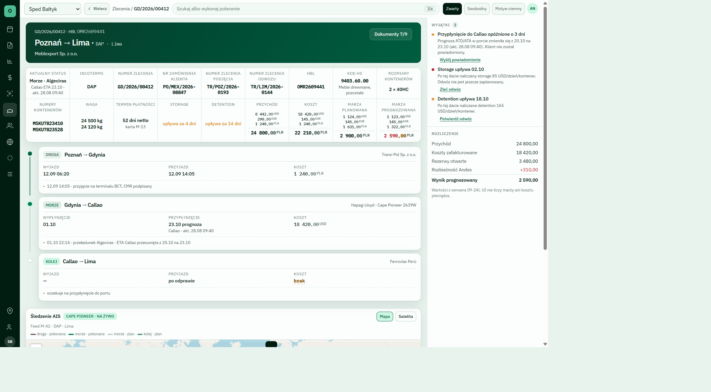

# OmniRoute

Wielodostępna platforma operacyjna dla spedycji. Jeden tenant, jeden zestaw stawek, jedna prawda o marży.

[Stan faz](#stan-faz) · [Szybki start](#szybki-start) · [Dokumentacja](#dokumentacja) · [Architektura](docs/ARCHITECTURE.md)

[](https://github.com/Spawn2018/OmniRoute/actions/workflows/gate.yml)

OmniRoute obsługuje katalogi (porty, kontrahenci, kody opłat), niemutowalne stawki kupna, wiersz `charge` (kupno i sprzedaż razem), wyceny oraz ekstrakcję cenników z recenzją człowieka. Produkt jest prywatny, wielotenantowy, z ruchem produkcyjnym jako celem — nie demonstracją.



*Makieta Zleceń z `docs/design/omniroute-ui.html`. Nie zrzut z runtime.*

## Co jest w produkcie

| Reguła | Znaczenie |
|---|---|
| Izolacja tenanta | `organization_id` w każdej tabeli biznesowej; RLS wymusza baza (`FORCE ROW LEVEL SECURITY`) |
| Marża | tylko na `charge` (kupno + sprzedaż, `Decimal`, ta sama waluta) |
| Stawka | niemutowalna `rate_line` z `source_ref`; zmiana = nowy wiersz i `superseded_by` |
| Model językowy | wyciąga dane; **nigdy nie liczy** marży, VAT ani kursu |
| Zapis z ekstrakcji | wyłącznie po akceptacji człowieka (HITL) |
| API | brak jawnego uprawnienia OpenFGA = odmowa |

Czego tu nie ma w runtime: Temporal, Hatchet, pgvector, live HTTP do armatorów, IMAP/Graph, KSeF. To cele z planu, nie działający stos. Auth0 i portale są odroczone.

## Stos

| Warstwa | Dziś |
|---|---|
| Baza | PostgreSQL 16, RLS, `pg_trgm`, kwoty `numeric` |
| API | FastAPI, granian, SQLAlchemy 2.0, Alembic, Pydantic v2 |
| Uprawnienia | OpenFGA (`authz/model.fga`) |
| UI | React 19 + Compiler, Vite, TanStack Router/Query/Form/Table, shadcn/ui, Tailwind v4 |
| Jakość | ruff, mypy `--strict`, pytest, import-linter, Playwright + axe, `just gate` |

Pełna mapa: [docs/ARCHITECTURE.md](docs/ARCHITECTURE.md). Rejestr modułów w kodzie: [docs/MODULES.md](docs/MODULES.md).

## Szybki start

Wymagania: Python 3.12, Node 22 / pnpm, `just`, PostgreSQL 16, OpenFGA.

**Docker (Postgres + OpenFGA):**

```bash
cp .env.example .env
just dev
```

API: `cd backend && granian --interface asgi app.main:app --reload --host 0.0.0.0 --port 8000`  
UI: `cd frontend && pnpm install && pnpm dev` (port 5173)

**Windows bez Dockera** (klaster w `tools/pg16`, OpenFGA w `tools/openfga/`):

```powershell
powershell -ExecutionPolicy Bypass -File scripts/dev-native.ps1 -SkipInstall -Seed
pg_ctl -D tools\pgdata -o "-p 5432" start
tools\openfga\openfga.exe run
```

Bramka przed pushem:

```bash
just hooks
just gate
```

Lokalny `just gate` zbiera `code-gate` i `meta-gate`. Playground Swagger/ReDoc jest wyłączony — to nie jest publiczne API.

## Dokumentacja

| Potrzebujesz | Plik |
|---|---|
| Co robić w tej sesji | [docs/state/CURRENT.md](docs/state/CURRENT.md) |
| Jedyny plan realizacji | [docs/PLAN-REALIZACJA.md](docs/PLAN-REALIZACJA.md) |
| Żywa wizja produktu | [docs/VISION.md](docs/VISION.md) |
| Kontrakt agenta | [AGENTS.md](AGENTS.md) |
| Twarde ograniczenia (HC) | [GROUNDING.md](GROUNDING.md) |
| Słownik PL/EN | [docs/GLOSSARY.md](docs/GLOSSARY.md) |
| Job operatora (ścieżka pieniądza) | [docs/operator/ścieżka-pieniędzy.md](docs/operator/ścieżka-pieniędzy.md) |
| Historia plastrów | [docs/state/PROGRESS.md](docs/state/PROGRESS.md) |
| ADR | [docs/adr/](docs/adr/) |

Blok **Stan faz** poniżej jest generowany z `CURRENT.md` (`just docs`). Nie edytuj go ręcznie.

## Stan faz

<!-- os-status:start -->
- **Ostatni plaster:** **453.0** AI4.1 — FK `counterfactual_run` → `plan_snapshot` + widok `what_if_replay`
- **Etap:** Plan — **454.0** AI4.2 kółka w SQL. Spec: brak — `/plan-modul`.
- **Następny:** **454.0** symulacja kółek w SQL (do 500k). Nie solver w Pythonie. Nie kwota.
- **Komenda teraz:** `/plan-modul` (z `docs/state/CURRENT.md`; Plan → `/plan-modul`, Refaktor → `/refaktor`, inaczej `/plaster`)
- **Jedyny plan:** `docs/PLAN-REALIZACJA.md` · `docs/state/CURRENT.md`
<!-- os-status:end -->

## Licencja

Repozytorium prywatne. Kod i treść należą do LOGMAR Sp. z o.o. Brak licencji open source.
