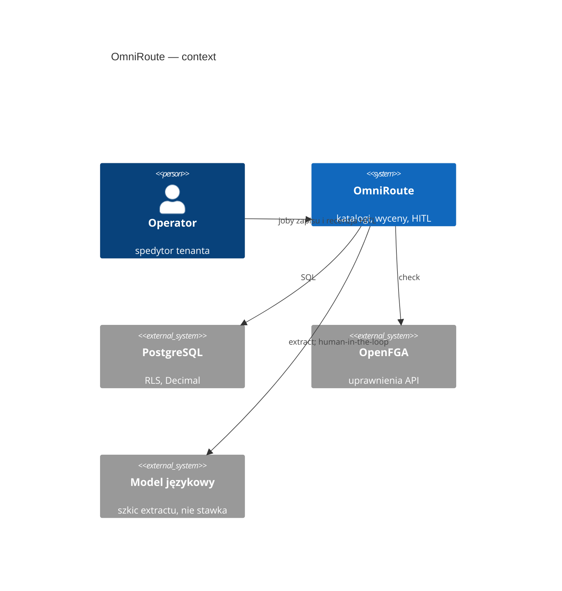
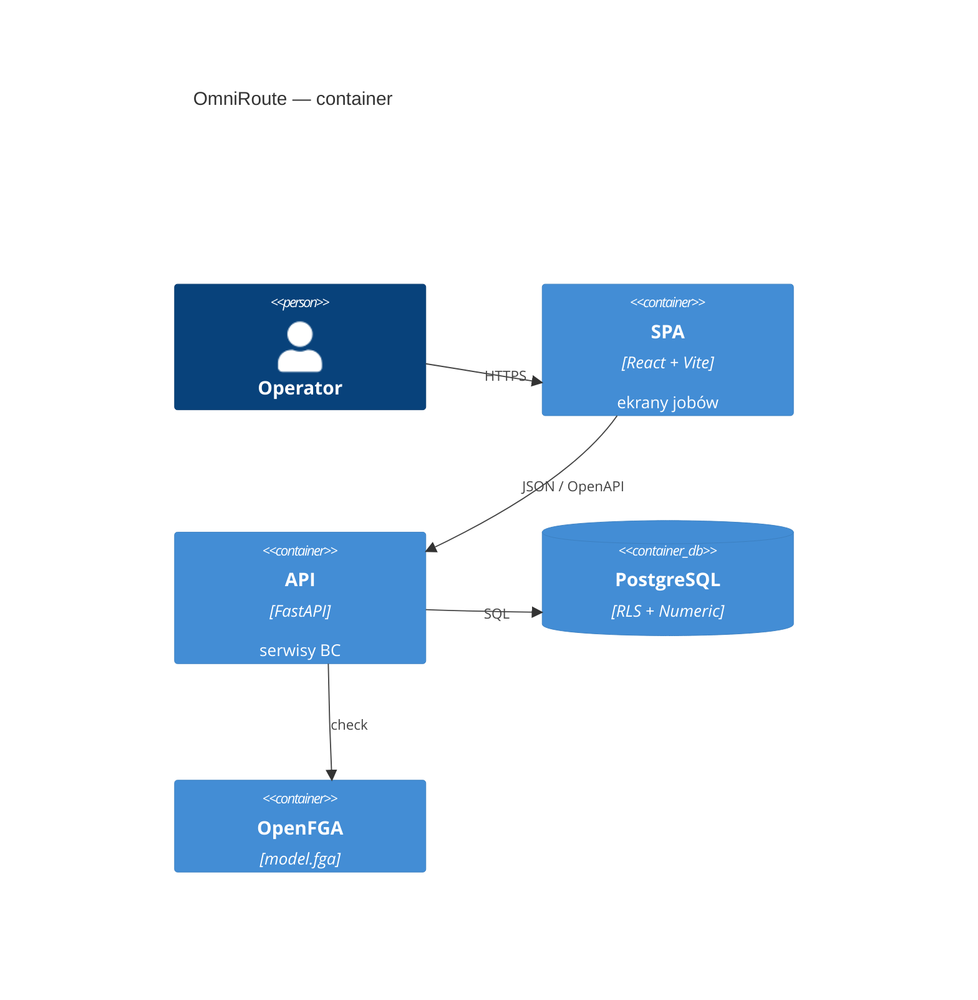

# OmniRoute — architektura

<!-- os-status:start -->
**Status:** **336.0** G16 HITL `billing_mark`. **Etap:** Plan — wolno `/plan-modul` **337.0** EXP7.2. **Następny:** **337.0** EXP7.2 poll CEIDG/KRS/VIES/biała lista → notice (węższa z kolejki; delta do utworzenia). Plan: [PLAN-REALIZACJA.md](PLAN-REALIZACJA.md).
<!-- os-status:end --> 
**Kształt:** modularny monolit (Python FastAPI + React Vite SPA)  
**ADR frontend:** [0002](adr/0002-frontend-platform-2026.md) (stack) · [0003](adr/0003-frontend-ui-system-2026.md) (tokeny, wzorce). Makiety: [docs/design/](design/README.md).

## C4

Context: operator pracuje w jednym produkcie; baza i uprawnienia są osobnymi systemami. LLM jest na zewnątrz i **nie zapisuje** stawek.



Container: SPA i API w jednym repozytorium, dwa procesy. Temporal / outbox — cel, nie runtime.



## Warstwy

<!-- os-tree:start -->
```
frontend/                 React 19 + Compiler, Vite, TanStack, shadcn, PostHog
  src/features/           aeo-dossier-mark · ai-copilot · air-freight · asn · bank-payment · billing-mark · bonded-mark · bookkeeping · calibration-mark · capa-mark · carbon-method · cargo-claim · cash-discount · cash-flow · channel-quotes · charge-codes · charge-template · charges · china-rail · circle-sim · clause-notice · cmms-mark · cod-instruction · collaboration-mark · commodity-codes · company-mark · consignment · cost-to-serve · credit-reviews · crm-lead · customer-contract · customer-sops · dangerous-goods · delay-forecast · dock-appointment · document-template · edi-map-mark · edi-message · entity-events · erp-connector · exchange-connector · executive-mark · extraction · extraction-quality · filing-scheme-mark · finance-board · fraud-flag · free-time-clock · freight-audit-mark · fuel-index · fx-difference · gdpr · geography · groupage · groupage-tariff · idp-connector · impact-scenario · intermodal-rail · intervention-outcome · kreptd-licence · lane-km · lane-pattern · lc-checklist · legal-hold-mark · load-plan-mark · local-charge · mail-integration · memory-edge · money-cost · monitoring-scheme · nbp-rates · ncts-draft · networks · observability · ocean-bill · ocean-lcl · oog-mark · operational-exception · operator-decisions · operator-notice · ops · organization-settings · otif-mark · outbox · pallet-balance · parties · party-document · party-scorecards · penalty-mark · plan-snapshot · planning · po-line · port-surcharges · prediction-ledgers · purchase-order · quotations · quote-invoice-settlement · rank-mark · rate-card · rate-lines · remediation-option · repair-playbook · road-transport · routing-guide · routing-guide-enforcement · routing-guide-match · sales-invoice · sanctions · sap-connector · session · shipment · shipment-document · shipment-package · sla-clause · spend-mark · task-template · telematics-connector · tenancy · tenant-contract-kek · tenant-rollout · tender · tender-award-review · tender-bid-stance · tender-carbon-mark · tender-consortium-member · tender-data-room · tender-lane · tender-lot · tender-matrix-cell · tender-playbook · tender-prospect · tender-quote · tender-rfp-intake · tender-round · tender-ted-notice · tender-win-loss · terminal-slot-connector · tower-impact · tracking · twin-mark · visibility-connector · war-room-mark · watchtower · weather-observation · yard-mark
  src/components/ui/      shadcn
  src/components/data-table/  DataTableShell (Golden Standard)
backend/app/
  api/             routery, DTO, require_permission — bez logiki
  services/        aeo_dossier_marks · bank_payments · billing_marks · bonded_marks · booking_instructions · bookkeeping · calibration_marks · capa_marks · carbon_methods · cargo_claims · carrier_inquiries · cash_discounts · cash_flows · channel_quotes · charge_codes · charge_templates · charges · circle_sims · clause_notices · cmms_marks · cod_instructions · collaboration_marks · collective_invoices · commodity_codes · company_marks · consignments · containers · cost_to_serve · crm_leads · customer_contracts · customer_rfqs · dangerous_goods · delay_forecasts · dock_appointments · document_checklist_rules · document_dispatch_rules · document_templates · edi_map_marks · edi_messages · entity_events · erp_connectors · exchange_connectors · executive_marks · extraction · field_carry_forwards · filing_scheme_marks · fraud_flags · free_time_clocks · freight_audit_marks · fuel_indexes · fx_differences · gdpr_requests · geography · groupage_lines · groupage_tariffs · idp_connectors · impact_scenarios · inbound_messages · incoterm_responsibilities · intervention_outcomes · kreptd_licences · lane_kms · lane_patterns · lc_checklists · legal_hold_marks · load_plan_marks · local_charges · mail_drafts · memory_edges · money_costs · monitoring_schemes · nbp_rates · ncts_drafts · networks · ocean_bills · oog_marks · operational_exceptions · operator_decisions · operator_notices · organization_calendars · organization_settings · otif_marks · outbox_events · pallet_balances · parties · party_documents · penalty_marks · plan_snapshots · port_surcharges · prediction_ledgers · purchase_orders · quotations · quote_invoice_settlements · rank_marks · rate_cards · rate_lines · remediation_options · repair_playbooks · resources · routing_guide_enforcements · routing_guide_matches · routing_guides · sales_invoices · sap_connectors · shipment_documents · shipment_legs · shipment_packages · shipment_stakeholders · shipments · sla_clauses · spend_marks · stops · task_templates · telematics_connectors · tenancy · tenant_contract_keks · tender_award_reviews · tender_bid_stances · tender_carbon_marks · tender_consortium_members · tender_data_rooms · tender_lanes · tender_lots · tender_matrix_cells · tender_playbooks · tender_prospects · tender_quotes · tender_rfp_intakes · tender_rounds · tender_ted_notices · tender_win_losses · tenders · terminal_slot_connectors · tower_impacts · tracking_events · trips · twin_marks · visibility_connectors · war_room_marks · weather_observations · yard_marks
  repositories/    dostęp SQL
  models/          SQLAlchemy
  domain/          typy, wyjątki, Money
  ai_transforms/   ekstrakcja → JSON (stateless, HITL)
  workflows/       Temporal (wizja — nie działający system)
  integrations/    OpenFGA, docling, langfuse (trace przy extract; no-op bez kluczy)
authz/             model.fga (źródło prawdy AuthZ)
```
<!-- os-tree:end -->

## Granice

- import-linter: warstwy + niezależność BC.
- Multi-tenancy: RLS PostgreSQL + OpenFGA na API.
- AI: extract only; zapis przez `service` + HITL.
- Tabele UI: wyłącznie DataTableShell — drugi grid engine wymaga ADR.

## Integracje

PostgreSQL 16 · OpenFGA · Langfuse (trace, no-op bez kluczy) · PostHog  
**(cel, nie runtime):** Redis · MinIO · Temporal · Hatchet · EmailEngine

## Dokumentacja

- Stan: `docs/state/CURRENT.md`
- ADR: `docs/adr/`
- Spec: `docs/spec/`
- Knowledge (retrieve, nie dump): `docs/_knowledge/`
- Archiwum: `Informacje z claude/` — **nie ładować hurtowo do kontekstu agenta**
