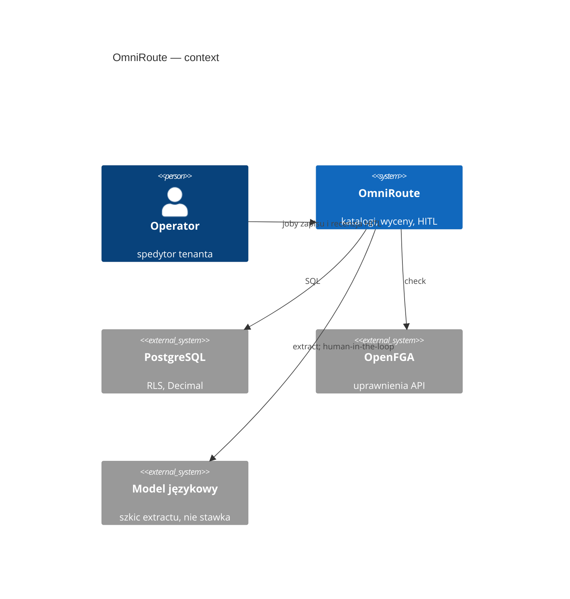
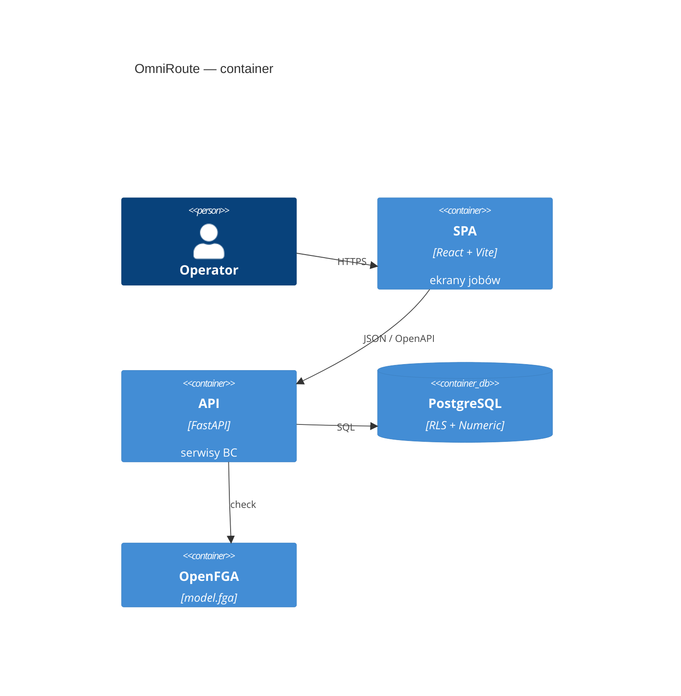

# OmniRoute — architektura

<!-- os-status:start -->
**Status:** **239.0** leftover T3 VGM bundle na `container`. **Etap:** Kod. **Następny:** **240.0** leftover T3 `last_survey_at` na `container` → `booking_no` → `carrier_party_id` → `shipment_leg_id` → eventy 2a/2b → `stop_group`/EXP1 → km/`/fleet` → `consignment` → T6 mapa → SQL `charge` → lookup/KSeF TE → outbox T5 → `plan_snapshot`/kółka → F9 Optima fixture → T8 → S53 Auth0 → portale/diada → CT7/CI9/reszta pinu 2026-09-08c. Leftover HITL/SQL = praca. Park = live HTTP bez testu albo sekretu, nie skip pola. Live M-02 konsument / Auth0 / portale tylko gdy ten ID jest bieżącym Q. P6c auto-award zakaz. Nic z pinu nie wypada. Nie zgaduj 71–240. Plan: [PLAN-REALIZACJA.md](PLAN-REALIZACJA.md).
<!-- os-status:end --> 
**Kształt:** modularny monolit (Python FastAPI + React Vite SPA)  
**ADR frontend:** [0002](adr/0002-frontend-platform-2026.md) (stack) · [0003](adr/0003-frontend-ui-system-2026.md) (tokeny, wzorce). Makiety: [docs/design/](design/README.md).

## C4

Context: operator pracuje w jednym produkcie; baza i uprawnienia są osobnymi systemami. LLM jest na zewnątrz i **nie zapisuje** stawek.



Container: SPA i API w jednym repozytorium, dwa procesy. Temporal / outbox — cel, nie runtime.



## Warstwy

<!-- os-tree:start -->
```
frontend/                 React 19 + Compiler, Vite, TanStack, shadcn, PostHog
  src/features/           ai-copilot · air-freight · bank-payment · bookkeeping · carbon-method · cargo-claim · cash-discount · cash-flow · channel-quotes · charge-codes · charge-template · charges · china-rail · cod-instruction · commodity-codes · cost-to-serve · credit-reviews · customer-sops · dangerous-goods · dock-appointment · document-template · edi-message · entity-events · executive-mark · extraction · extraction-quality · finance-board · fraud-flag · free-time-clock · fuel-index · fx-difference · gdpr · geography · groupage · groupage-tariff · intermodal-rail · kreptd-licence · lane-pattern · local-charge · mail-integration · memory-edge · money-cost · monitoring-scheme · nbp-rates · networks · observability · ocean-bill · ocean-lcl · operational-exception · operator-decisions · operator-notice · ops · organization-settings · outbox · pallet-balance · parties · party-document · party-scorecards · port-surcharges · prediction-ledgers · quotations · quote-invoice-settlement · rank-mark · rate-card · rate-lines · road-transport · sales-invoice · sanctions · session · shipment · shipment-document · shipment-package · telematics-connector · tenancy · tenant-rollout · tender · tender-award-review · tender-bid-stance · tender-carbon-mark · tender-consortium-member · tender-data-room · tender-lane · tender-lot · tender-matrix-cell · tender-playbook · tender-prospect · tender-quote · tender-rfp-intake · tender-round · tender-ted-notice · tender-win-loss · tower-impact · tracking · twin-mark · war-room-mark · watchtower · weather-observation
  src/components/ui/      shadcn
  src/components/data-table/  DataTableShell (Golden Standard)
backend/app/
  api/             routery, DTO, require_permission — bez logiki
  services/        bank_payments · booking_instructions · bookkeeping · carbon_methods · cargo_claims · carrier_inquiries · cash_discounts · cash_flows · channel_quotes · charge_codes · charge_templates · charges · cod_instructions · collective_invoices · commodity_codes · containers · cost_to_serve · customer_rfqs · dangerous_goods · dock_appointments · document_checklist_rules · document_dispatch_rules · document_templates · edi_messages · entity_events · executive_marks · extraction · field_carry_forwards · fraud_flags · free_time_clocks · fuel_indexes · fx_differences · gdpr_requests · geography · groupage_lines · groupage_tariffs · inbound_messages · incoterm_responsibilities · kreptd_licences · lane_patterns · local_charges · mail_drafts · memory_edges · money_costs · monitoring_schemes · nbp_rates · networks · ocean_bills · operational_exceptions · operator_decisions · operator_notices · organization_calendars · organization_settings · outbox_events · pallet_balances · parties · party_documents · port_surcharges · prediction_ledgers · quotations · quote_invoice_settlements · rank_marks · rate_cards · rate_lines · resources · sales_invoices · shipment_documents · shipment_legs · shipment_packages · shipment_stakeholders · shipments · stops · telematics_connectors · tenancy · tender_award_reviews · tender_bid_stances · tender_carbon_marks · tender_consortium_members · tender_data_rooms · tender_lanes · tender_lots · tender_matrix_cells · tender_playbooks · tender_prospects · tender_quotes · tender_rfp_intakes · tender_rounds · tender_ted_notices · tender_win_losses · tenders · tower_impacts · tracking_events · trips · twin_marks · war_room_marks · weather_observations
  repositories/    dostęp SQL
  models/          SQLAlchemy
  domain/          typy, wyjątki, Money
  ai_transforms/   ekstrakcja → JSON (stateless, HITL)
  workflows/       Temporal (wizja — nie działający system)
  integrations/    OpenFGA, docling, langfuse (trace przy extract; no-op bez kluczy)
authz/             model.fga (źródło prawdy AuthZ)
```
<!-- os-tree:end -->

## Granice

- import-linter: warstwy + niezależność BC.
- Multi-tenancy: RLS PostgreSQL + OpenFGA na API.
- AI: extract only; zapis przez `service` + HITL.
- Tabele UI: wyłącznie DataTableShell — drugi grid engine wymaga ADR.

## Integracje

PostgreSQL 16 · OpenFGA · Langfuse (trace, no-op bez kluczy) · PostHog  
**(cel, nie runtime):** Redis · MinIO · Temporal · Hatchet · EmailEngine

## Dokumentacja

- Stan: `docs/state/CURRENT.md`
- ADR: `docs/adr/`
- Spec: `docs/spec/`
- Knowledge (retrieve, nie dump): `docs/_knowledge/`
- Archiwum: `Informacje z claude/` — **nie ładować hurtowo do kontekstu agenta**
