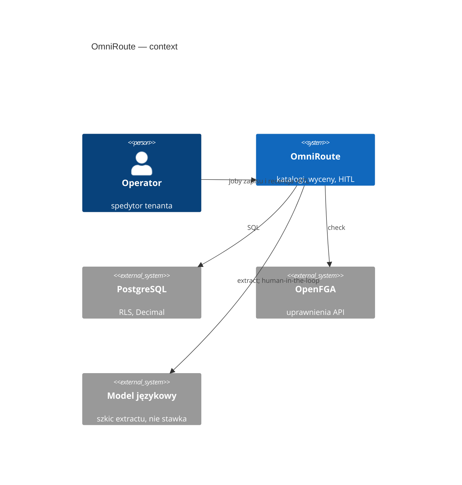
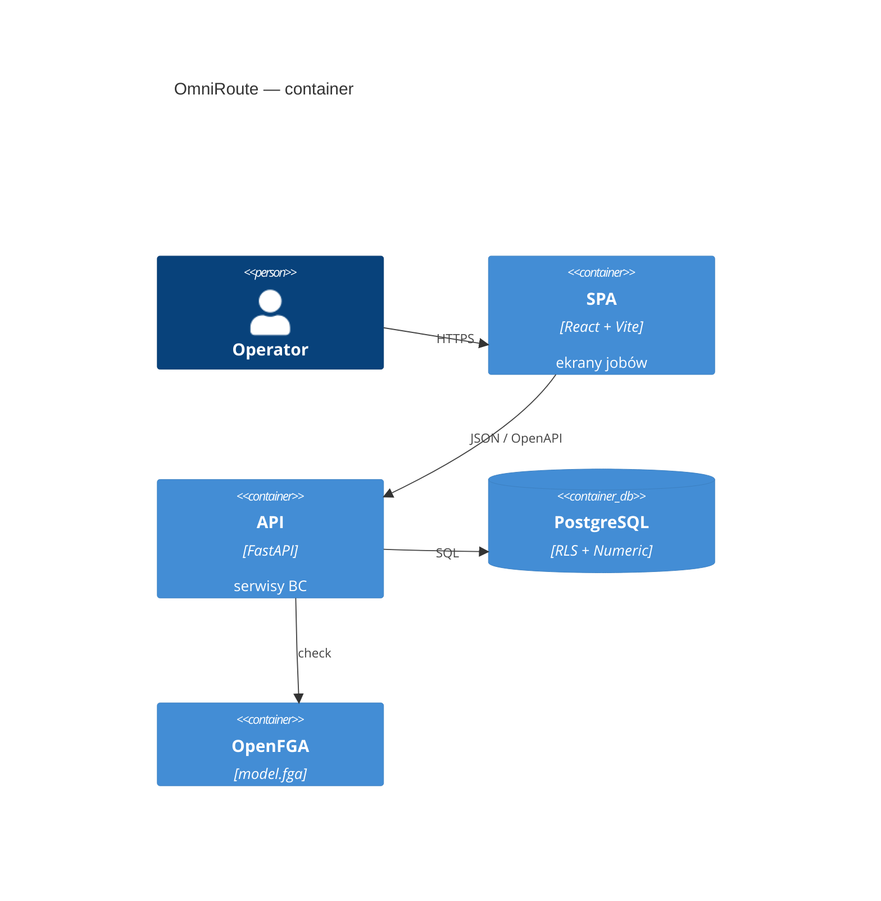

# OmniRoute — architektura

<!-- os-status:start -->
**Status:** **183.0** G2.13 `tender_ted_notice`. **Etap:** Kod. **Następny:** **184.0** G2.14 CO₂ → G2.15–G2.23 → F → C → V → W → S53 → X → WA1 → Plat → Demo-1 → CT → CI9–CI8 → G → EXP → Mob → K0. D8 parked. D9 leftover D9b–f. P1 leftover P1b–d. P2 leftover P2c. P3 leftover P3b–d. P4 leftover P4b–c. P5 leftover P5b–c. P6 leftover P6c. G2 leftover G2.14–G2.18. Named parks parked — `/noc` pomija aż CURRENT wskaże S53. Nic z pinu 2026-09-08c nie wypada. Nie zgaduj 71–212. Plan: [PLAN-REALIZACJA.md](PLAN-REALIZACJA.md).
<!-- os-status:end --> 
**Kształt:** modularny monolit (Python FastAPI + React Vite SPA)  
**ADR frontend:** [0002](adr/0002-frontend-platform-2026.md) (stack) · [0003](adr/0003-frontend-ui-system-2026.md) (tokeny, wzorce). Makiety: [docs/design/](design/README.md).

## C4

Context: operator pracuje w jednym produkcie; baza i uprawnienia są osobnymi systemami. LLM jest na zewnątrz i **nie zapisuje** stawek.



Container: SPA i API w jednym repozytorium, dwa procesy. Temporal / outbox — cel, nie runtime.



## Warstwy

<!-- os-tree:start -->
```
frontend/                 React 19 + Compiler, Vite, TanStack, shadcn, PostHog
  src/features/           ai-copilot · air-freight · bank-payment · bookkeeping · cargo-claim · cash-flow · channel-quotes · charge-codes · charge-template · charges · china-rail · cod-instruction · commodity-codes · cost-to-serve · credit-reviews · customer-sops · dangerous-goods · dock-appointment · document-template · edi-message · entity-events · extraction · extraction-quality · finance-board · fraud-flag · fuel-index · fx-difference · gdpr · geography · groupage · groupage-tariff · intermodal-rail · local-charge · mail-integration · money-cost · nbp-rates · networks · observability · ocean-bill · ocean-lcl · operational-exception · operator-decisions · operator-notice · ops · organization-settings · outbox · pallet-balance · parties · party-scorecards · port-surcharges · quotations · quote-invoice-settlement · rate-card · rate-lines · road-transport · sales-invoice · sanctions · session · shipment · shipment-document · shipment-package · tenancy · tenant-rollout · tender · tender-award-review · tender-bid-stance · tender-consortium-member · tender-data-room · tender-lane · tender-lot · tender-matrix-cell · tender-playbook · tender-prospect · tender-quote · tender-rfp-intake · tender-round · tender-ted-notice · tender-win-loss · tracking · watchtower
  src/components/ui/      shadcn
  src/components/data-table/  DataTableShell (Golden Standard)
backend/app/
  api/             routery, DTO, require_permission — bez logiki
  services/        bank_payments · booking_instructions · bookkeeping · cargo_claims · carrier_inquiries · cash_flows · channel_quotes · charge_codes · charge_templates · charges · cod_instructions · collective_invoices · commodity_codes · containers · cost_to_serve · customer_rfqs · dangerous_goods · dock_appointments · document_checklist_rules · document_dispatch_rules · document_templates · edi_messages · entity_events · extraction · field_carry_forwards · fraud_flags · fuel_indexes · fx_differences · gdpr_requests · geography · groupage_lines · groupage_tariffs · inbound_messages · incoterm_responsibilities · local_charges · mail_drafts · money_costs · nbp_rates · networks · ocean_bills · operational_exceptions · operator_decisions · operator_notices · organization_calendars · organization_settings · outbox_events · pallet_balances · parties · port_surcharges · quotations · quote_invoice_settlements · rate_cards · rate_lines · resources · sales_invoices · shipment_documents · shipment_legs · shipment_packages · shipment_stakeholders · shipments · stops · tenancy · tender_award_reviews · tender_bid_stances · tender_consortium_members · tender_data_rooms · tender_lanes · tender_lots · tender_matrix_cells · tender_playbooks · tender_prospects · tender_quotes · tender_rfp_intakes · tender_rounds · tender_ted_notices · tender_win_losses · tenders · tracking_events · trips
  repositories/    dostęp SQL
  models/          SQLAlchemy
  domain/          typy, wyjątki, Money
  ai_transforms/   ekstrakcja → JSON (stateless, HITL)
  workflows/       Temporal (wizja — nie działający system)
  integrations/    OpenFGA, docling, langfuse (trace przy extract; no-op bez kluczy)
authz/             model.fga (źródło prawdy AuthZ)
```
<!-- os-tree:end -->

## Granice

- import-linter: warstwy + niezależność BC.
- Multi-tenancy: RLS PostgreSQL + OpenFGA na API.
- AI: extract only; zapis przez `service` + HITL.
- Tabele UI: wyłącznie DataTableShell — drugi grid engine wymaga ADR.

## Integracje

PostgreSQL 16 · OpenFGA · Langfuse (trace, no-op bez kluczy) · PostHog  
**(cel, nie runtime):** Redis · MinIO · Temporal · Hatchet · EmailEngine

## Dokumentacja

- Stan: `docs/state/CURRENT.md`
- ADR: `docs/adr/`
- Spec: `docs/spec/`
- Knowledge (retrieve, nie dump): `docs/_knowledge/`
- Archiwum: `Informacje z claude/` — **nie ładować hurtowo do kontekstu agenta**
