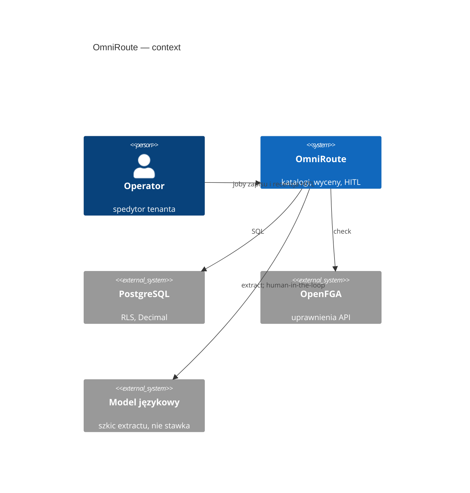
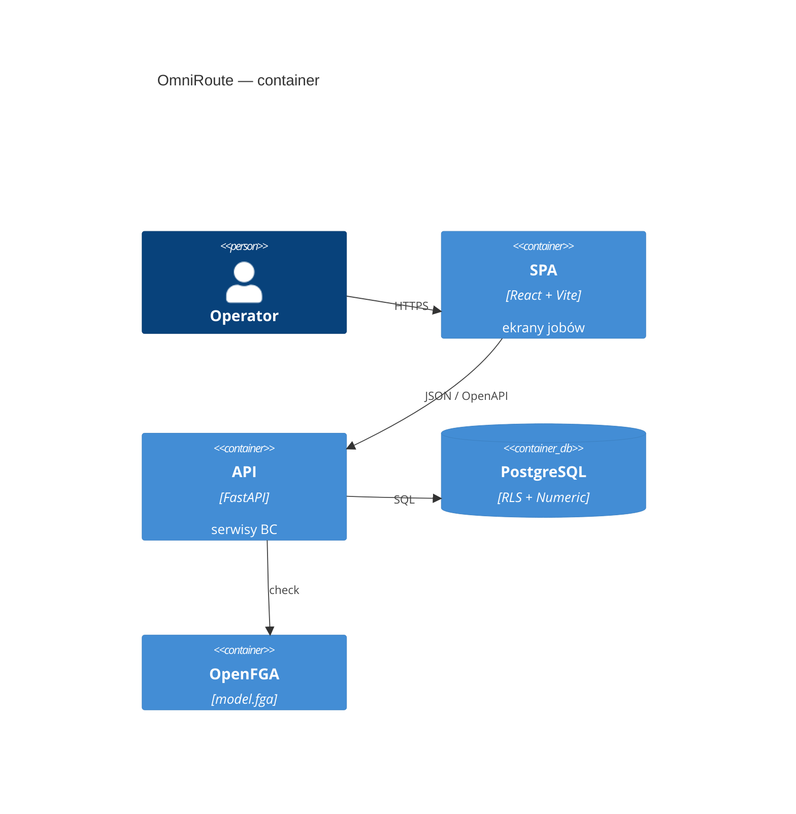

# OmniRoute — architektura

<!-- os-status:start -->
**Status:** **500.0** AI3.0 leftover — PATCH `candidates` dla `carrier_quote` / `tender_rfp`. **Etap:** Plan — delta **501.0** AI3.0 leftover próg 70% (przed `/plaster`). **Następny:** **501.0** AI3.0 leftover — próg **70%** pewności przed akceptacją zbiorczą (nie live vision) Plan: [PLAN-REALIZACJA.md](PLAN-REALIZACJA.md).
<!-- os-status:end --> 
**Kształt:** modularny monolit (Python FastAPI + React Vite SPA)  
**ADR frontend:** [0002](adr/0002-frontend-platform-2026.md) (stack) · [0003](adr/0003-frontend-ui-system-2026.md) (tokeny, wzorce). Makiety: [docs/design/](design/README.md).

## C4

Context: operator pracuje w jednym produkcie; baza i uprawnienia są osobnymi systemami. LLM jest na zewnątrz i **nie zapisuje** stawek.



Container: SPA i API w jednym repozytorium, dwa procesy. Temporal / outbox — cel, nie runtime.



## Warstwy

<!-- os-tree:start -->
```
frontend/                 React 19 + Compiler, Vite, TanStack, shadcn, PostHog
  src/features/           ab-sus-mark · abandoned-rto-mark · aeo-dossier-mark · ai-copilot · air-freight · air-ra3-mark · asn · automation-bias-mark · autonomy-level · bank-payment · benefit-ledger · bid-decision-mark · billing-mark · bin-pack-mark · bonded-mark · bookkeeping · cabotage-mark · calibration-mark · campaign-mark · capa-mark · carbon-method · cargo-claim · cargo-cover-mark · cash-discount · cash-flow · channel-quotes · charge-codes · charge-template · charges · chassis-mark · china-rail · circle-sim · clause-notice · cmms-mark · cod-instruction · collaboration-mark · combined-transport-mark · commodity-codes · company-mark · compliance-program-mark · consignment · copy-ban-mark · cost-allocation-mark · cost-to-serve · counterfactual-run · credit-reviews · crm-activity · crm-dedup-mark · crm-lead · crm-link-mark · crm-opportunity · crm-pipeline-mark · csrd-mark · customer-contract · customer-po-mark · customer-sops · cutoff-mark · dangerous-goods · delay-forecast · demand-snapshot-mark · demo-gps-mark · demo-sim-mark · demo-wipe-mark · diversion-mark · dock-appointment · document-template · dual-ledger-mark · e-cmr-mark · e-delivery-mark · e-doreczenia-mark · eccn-mark · edi-map-mark · edi-message · empty-depot-mark · entity-events · erp-connector · erru-mark · eur1-atr-mark · exchange-connector · executive-mark · extraction · extraction-quality · factoring-connector · fair-share-mark · ferry-art9-mark · ferry-booking-mark · field-confidence-mark · filing-scheme-mark · finance-board · fleet-cost-mark · fraud-flag · free-time-clock · freight-audit-mark · freight-term-mark · fuel-anomaly-mark · fuel-card-mark · fuel-index · funnel-mark · fx-difference · gdpr · general-average-mark · geography · groupage · groupage-dispatcher-mark · groupage-tariff · haulier-role-mark · high-value-mark · idp-connector · impact-scenario · impersonate-guard-mark · integration-hub-mark · intermodal-rail · interval-score · intervention-outcome · inventory-collateral-mark · inventory-finance-mark · inventory-position-mark · iso-nis2-mark · jit-jis-mark · job-metric-mark · kreptd-licence · l3-gate-mark · label-parking-mark · lane-km · lane-pattern · language-code-mark · lc-checklist · lcl-console-mark · legal-hold-mark · lez-mark · line-impact-layer-mark · line-impact-mark · load-order-mark · load-plan-mark · local-charge · mail-accept-mark · mail-integration · make-or-buy-mark · memory-edge · mobile-client-mark · money-cost · monitoring-scheme · mqc-mark · multi-manning-mark · nac-mark · named-place-mark · nbp-rates · ncts-draft · networks · nvocc-mark · observability · ocean-alliance-mark · ocean-bill · ocean-feeder-mark · ocean-lcl · offboarding-mark · oog-mark · oog-permit-mark · operational-exception · operator-decisions · operator-notice · ops · ops-room-mark · organization-settings · otif-mark · outbox · outcome-kind · outcome-ledger · pallet-balance · pallet-pool-mark · parties · partner-exchange-mark · party-document · party-scorecards · payment-terms-mark · penalty-mark · peppol-mark · phyto-ata-mark · plan-snapshot · planning · po-batch-mark · po-financing-mark · po-line · po-plant-mark · po-sku-mark · port-surcharges · position-event · posting-mark · prediction-ledgers · product-ticket-mark · profit-center-mark · purchase-order · quality-descent-mark · quotations · quote-currency-mark · quote-invoice-settlement · quote-validity-mark · rag-sop-mark · rail-cim-mark · rail-uic-mark · rank-mark · rate-card · rate-lines · reefer-mark · registry-poll-mark · regulatory-radar-mark · remediation-option · repair-playbook · rfid-mark · risk-register-mark · road-transport · role-view-mark · route-plan-mark · routing-guide · routing-guide-enforcement · routing-guide-match · sales-bind-mark · sales-invoice · sales-lane · sanctions · sanctions-mark · sap-connector · schedule-exception-mark · session · shipment · shipment-document · shipment-package · shipper-award-mark · shipper-bind-mark · shipper-like-mark · shipper-round-mark · shipper-tender-mark · sid-import-mark · silk-corridor-mark · sla-clause · slot-guarantee-mark · spend-mark · spot-contract-mark · style-cascade-mark · style-fidelity-mark · subcontract-edge-mark · suggestion-kind · suggestion-ledger · switch-bl-loi-mark · tacho-office-mark · tacho-plan-mark · task-template · telematics-connector · telematics-device · tenancy · tenant-contract-kek · tenant-rollout · tender · tender-award-review · tender-bid-stance · tender-carbon-mark · tender-consortium-member · tender-data-room · tender-decline-reason · tender-lane · tender-lot · tender-matrix-cell · tender-playbook · tender-prospect · tender-quote · tender-rfp-intake · tender-round · tender-ted-notice · tender-win-loss · terminal-slot-connector · terms-ai-mark · three-way-mark · time-to-fix-mark · tower-impact · tracking · tracking-consent · twin-kind · twin-mark · un-segregation-mark · vda-odette-mark · version-score · version-window · visibility-connector · war-room-mark · watchtower · weather-observation · webhook-outbox-mark · what-if-mark · wms-flow-mark · working-capital-mark · yard-mark
  src/components/ui/      shadcn
  src/components/data-table/  DataTableShell (Golden Standard)
backend/app/
  api/             routery, DTO, require_permission — bez logiki
  services/        ab_sus_marks · abandoned_rto_marks · aeo_dossier_marks · air_ra3_marks · automation_bias_marks · autonomy_levels · bank_payments · benefit_ledgers · bid_decision_marks · billing_marks · bin_pack_marks · bonded_marks · booking_instructions · bookkeeping · cabotage_marks · calibration_marks · campaign_marks · capa_marks · carbon_methods · cargo_claims · cargo_cover_marks · carrier_inquiries · cash_discounts · cash_flows · channel_quotes · charge_codes · charge_templates · charges · chassis_marks · circle_sims · clause_notices · cmms_marks · cod_instructions · collaboration_marks · collective_invoices · combined_transport_marks · commodity_codes · company_marks · compliance_program_marks · consignments · containers · copy_ban_marks · cost_allocation_marks · cost_to_serve · counterfactual_runs · crm_activities · crm_dedup_marks · crm_leads · crm_link_marks · crm_opportunities · crm_pipeline_marks · csrd_marks · customer_contracts · customer_po_marks · customer_rfqs · cutoff_marks · dangerous_goods · delay_forecasts · demand_snapshot_marks · demo_gps_marks · demo_sim_marks · demo_wipe_marks · diversion_marks · dock_appointments · document_checklist_rules · document_dispatch_rules · document_templates · dual_ledger_marks · e_cmr_marks · e_delivery_marks · e_doreczenia_marks · eccn_marks · edi_map_marks · edi_messages · empty_depot_marks · entity_events · erp_connectors · erru_marks · eur1_atr_marks · exchange_connectors · executive_marks · extraction · factoring_connectors · fair_share_marks · ferry_art9_marks · ferry_booking_marks · field_carry_forwards · field_confidence_marks · filing_scheme_marks · fleet_cost_marks · fraud_flags · free_time_clocks · freight_audit_marks · freight_term_marks · fuel_anomaly_marks · fuel_card_marks · fuel_indexes · funnel_marks · fx_differences · gdpr_requests · general_average_marks · geography · groupage_dispatcher_marks · groupage_lines · groupage_tariffs · haulier_role_marks · high_value_marks · idp_connectors · impact_scenarios · impersonate_guard_marks · inbound_messages · incoterm_responsibilities · integration_hub_marks · interval_scores · intervention_outcomes · inventory_collateral_marks · inventory_finance_marks · inventory_position_marks · iso_nis2_marks · jit_jis_marks · job_metric_marks · kreptd_licences · l3_gate_marks · label_parking_marks · lane_kms · lane_patterns · language_code_marks · lc_checklists · lcl_console_marks · legal_hold_marks · lez_marks · line_impact_layer_marks · line_impact_marks · load_order_marks · load_plan_marks · local_charges · mail_accept_marks · mail_drafts · make_or_buy_marks · memory_edges · mobile_client_marks · money_costs · monitoring_schemes · mqc_marks · multi_manning_marks · nac_marks · named_place_marks · nbp_rates · ncts_drafts · networks · nvocc_marks · ocean_alliance_marks · ocean_bills · ocean_feeder_marks · offboarding_marks · oog_marks · oog_permit_marks · operational_exceptions · operator_decisions · operator_notices · ops_room_marks · organization_calendars · organization_settings · otif_marks · outbox_events · outcome_kinds · outcome_ledgers · pallet_balances · pallet_pool_marks · parties · partner_exchange_marks · party_documents · payment_terms_marks · penalty_marks · peppol_marks · phyto_ata_marks · plan_snapshots · po_batch_marks · po_financing_marks · po_plant_marks · po_sku_marks · port_surcharges · position_events · posting_marks · prediction_ledgers · product_ticket_marks · profit_center_marks · purchase_orders · quality_descent_marks · quotations · quote_currency_marks · quote_invoice_settlements · quote_validity_marks · rag_sop_marks · rail_cim_marks · rail_uic_marks · rank_marks · rate_cards · rate_lines · reefer_marks · registry_poll_marks · regulatory_radar_marks · remediation_options · repair_playbooks · resources · rfid_marks · risk_register_marks · role_view_marks · route_plan_marks · routing_guide_enforcements · routing_guide_matches · routing_guides · sales_bind_marks · sales_invoices · sales_lanes · sanctions_marks · sap_connectors · schedule_exception_marks · shipment_documents · shipment_legs · shipment_packages · shipment_stakeholders · shipments · shipper_award_marks · shipper_bind_marks · shipper_like_marks · shipper_round_marks · shipper_tender_marks · sid_import_marks · silk_corridor_marks · sla_clauses · slot_guarantee_marks · spend_marks · spot_contract_marks · stops · style_cascade_marks · style_fidelity_marks · subcontract_edge_marks · suggestion_kinds · suggestion_ledgers · switch_bl_loi_marks · tacho_office_marks · tacho_plan_marks · task_templates · telematics_connectors · telematics_devices · tenancy · tenant_contract_keks · tender_award_reviews · tender_bid_stances · tender_carbon_marks · tender_consortium_members · tender_data_rooms · tender_decline_reasons · tender_lanes · tender_lots · tender_matrix_cells · tender_playbooks · tender_prospects · tender_quotes · tender_rfp_intakes · tender_rounds · tender_ted_notices · tender_win_losses · tenders · terminal_slot_connectors · terms_ai_marks · three_way_marks · time_to_fix_marks · tower_impacts · tracking_consents · tracking_events · trips · twin_kinds · twin_marks · un_segregation_marks · vda_odette_marks · version_scores · version_windows · visibility_connectors · war_room_marks · weather_observations · webhook_outbox_marks · what_if_marks · wms_flow_marks · working_capital_marks · yard_marks
  repositories/    dostęp SQL
  models/          SQLAlchemy
  domain/          typy, wyjątki, Money
  ai_transforms/   ekstrakcja → JSON (stateless, HITL)
  workflows/       Temporal (wizja — nie działający system)
  integrations/    OpenFGA, docling, langfuse (trace przy extract; no-op bez kluczy)
authz/             model.fga (źródło prawdy AuthZ)
```
<!-- os-tree:end -->

## Granice

- import-linter: warstwy + niezależność BC.
- Multi-tenancy: RLS PostgreSQL + OpenFGA na API.
- AI: extract only; zapis przez `service` + HITL.
- Tabele UI: wyłącznie DataTableShell — drugi grid engine wymaga ADR.

## Integracje

PostgreSQL 16 · OpenFGA · Langfuse (trace, no-op bez kluczy) · PostHog  
**(cel, nie runtime):** Redis · MinIO · Temporal · Hatchet · EmailEngine

## Dokumentacja

- Stan: `docs/state/CURRENT.md`
- Wizja: `docs/VISION.md`
- Plan: `docs/PLAN-REALIZACJA.md`
- ADR: `docs/adr/`
- Spec: `docs/spec/`
- Knowledge (retrieve, nie dump): `docs/_knowledge/`
- Archiwum: `Informacje z claude/` — **nie ładować hurtowo do kontekstu agenta**
