# Plan realizacji OmniRoute — aktualny (2026-08-31)

**Plan Cursor (pełny):** `.cursor/plans/omniroute-realizacja.plan.md`  
**ADR:** [0001 Cursor factory](adr/0001-cursor-software-factory-weryfikacja.md) · [0002 Frontend 2026](adr/0002-frontend-platform-2026.md)  
**Repo:** https://github.com/Spawn2018/OmniRoute  
**Stan:** B + C.1–C.5 + 0.11–0.15 leftover + **Exit Wave A (D0–0.23)** + **0.25 Money** + **1.0–1.3 charge** + **U-art50** + **U-palette-ops** + **U-density** + D minimal · następny **U-a11y** (Wave FE; nie Exit Wave FE; Auth0 I1 po U-*)

```mermaid
flowchart LR
  doneB[B_DONE] --> doneC[C1_C4_DONE]
  doneC --> doneC5[0.10_DONE]
  doneC5 --> doneXor[0.11_XOR_vitest]
  doneXor --> doneJwt[0.12_JWT]
  doneJwt --> doneSplit[0.13_split_HITL]
  doneSplit --> doneHttp[0.14_HTTP_happy]
  doneHttp --> donePwd[0.15_passwords]
  donePwd --> doneD0[D0_OS]
  doneD0 --> doneT0[T0_upload_limit]
  doneT0 --> doneT1[T1_nobypassrls]
  doneT1 --> doneT2[T2_rls_matrix]
  doneT2 --> done018[P018_http_live_pg]
  done018 --> doneA1[A1_undeclared_deny]
  doneA1 --> doneA2[A2_reviewer]
  doneA2 --> doneT4[T4_hello_off]
  doneT4 --> doneT5[T5_jwt_claims]
  doneT5 --> doneS1[S1_secrets]
  doneS1 --> next[Charge_025]
  doneB --> doneD[D_minimal_DONE]
```



---

## Ukończone

| Faza | Status |
|------|--------|
| 0 GitHub | ✅ private repo, CI |
| A Cursor OS | ✅ AGENTS, GROUNDING, rules, skills |
| A.5 IDE | ✅ gh + GitHub MCP |
| B.2 RLS 0.3 | ✅ organization, app_user, test izolacji |
| B.3 Gate | ✅ ruff/mypy/pytest/import-linter + PG |
| B.4 OpenFGA 0.4 | ✅ model, require_permission, CI |
| B.5 Frontend Shell 0.5 | ✅ Vite, Compiler, TanStack, shadcn, ⌘K, lazy PostHog |
| B.6 DataTableShell 0.6 | ✅ ColumnEditor, table_view RLS, vitest |
| B.7 Branch protection | ✅ procedura (Free private 403) |
| C.1–C.5 / 0.7–0.15 | ✅ HITL … JWT, HTTP extract unit, hasła + refresh |
| D minimal | ✅ agentlint, pr-nudge, rytm refaktor/retro |

---

## Gate dziś vs cel DoD (uczciwość)

Źródło: audyt 2026-08-31. **Nie zamykaj plastra ani nie twierdź „pełny DoD”, jeśli recipe to `echo`.**

| Obietnica | Egzekwowane teraz | Kiedy |
|---|---|---|
| ruff + mypy | ✅ `just check` | — |
| pytest unit + integration | ✅ CI | — |
| import-linter | ✅ `just arch` | — |
| frontend typecheck | ✅ `frontend-typecheck` w gate | — |
| vitest | ✅ `frontend-test` w gate | — |
| cov ≥ 80% | ✅ `test-unit --cov-fail-under=80` | — |
| jscpd ≤ 3% | ✅ `just dup` w gate | — |
| openapi-ts | ✅ `just api-types` + `frontend/src/api/` | regeneruj przy zmianie API |
| size-limit / perf | ❌ stub | po dalszym budgetingu |
| agentlint | ✅ `just agentlint` + baseline | — |
| lazy PostHog | ✅ dynamic `import("posthog-js")` | — |

---

## Faza B — domknięcie

### B.5 Frontend Shell 2026 — **DONE**
- Vite + React 19 + **React Compiler** + Tailwind v4 + shadcn
- TanStack **Router + Query + Form** (+ Table/Virtual w B.6)
- Design tokens (neutral, compact) — anti AI-slop
- Command palette ⌘K · PostHog od dnia 1
- Referencja layoutu: satnaing/shadcn-admin (**wzorce, nie fork**)
- **Spłacone:** openapi-ts (`just api-types`, `frontend/src/api/`); PostHog lazy (`dynamic import("posthog-js")`) — nie w main chunk
- **Spłacone (0.12):** hello JWT (`Authorization: Bearer`); tożsamość z claims, nie z headerów
- **Spłacone (0.15):** hasła argon2id + rotacja refresh; UUID-login wycięty
- **Dług świadomy (poza zakresem teraz):** Auth0 BFF I1 po Wave A

### B.6 DataTableShell — **DONE**
- ColumnEditor: checkbox + DnD (@dnd-kit / TanStack columnOrder)
- Filtry faceted + URL sync
- ViewManager + tabela `table_view` (RLS)
- Consumer: `tenancy.users`
- UX events PostHog
- **Dodatkowo w 0.6:** vitest minimum na DataTableShell; openapi-ts spłacone poza tym plasterem
- Źródła: Pencil & Paper; NN/G; TanStack Column DnD

### B.7 Branch protection (pull-forward z D) — **DONE (procedura)**
- Cel: status check `gate` na `main`
- **Constraint:** GitHub Free + private → API **403**
- **Obowiązuje:** [docs/ops/branch-protection.md](ops/branch-protection.md) (zakaz force-push, green CI przed push)
- Po Pro/Team: włączyć required check `gate` w UI i supersedować procedurę

**TanStack Start:** Thoughtworks **Assess** (2026-04) — **nie** jako fundament; SPA wystarczy.

---

## Faza C — Platforma AI (po B)

### C.1 / 0.7 AI extract HITL hello — **DONE**
- `extraction_draft` RLS · MockExtractor · accept/reject · UI DataTableShell
- Delta: `docs/deltas/archived/0.7-ai-extract-hitl.md`

### C.2 scaffold (równolegle z 0.7) — **DONE**
- docling stub · langfuse no-op · `promptfoo/promptfoo.yaml` · knowledge cards

### C.3 / 0.8 instructor + llm-guard — **DONE**
- Guard na wejściu · InstructorExtractor · provider mock|instructor
- Delta: `docs/deltas/archived/0.8-instructor-llm-guard.md`

### C.4 / 0.9 docling A/B — **DONE**
- fingerprint · parser A deterministyczny · B docling · `ab_delta_chars`
- Delta: `docs/deltas/archived/0.9-docling-ab.md`

### C.5 / 0.10 langfuse + promptfoo CI — **DONE**
- Trace przy extract; no-op bez kluczy; metadane bez `input_text`
- `just promptfoo` echo w CI; pytest fixture’e MockExtractor
- Delta: `docs/deltas/archived/0.10-langfuse-promptfoo.md`

## Rejestr leftoverów (audyt + canvas 2026-08-31)

Canvas `post-audit-review` to **przegląd** 0.5–0.9, nie lista do zaimplementowania w syncu docs. Sync spłacił P1 nagłówek tego pliku i `just test` bez `|| true` na unitach. Poniżej — kolejność po 0.15, żeby nie zgubić.

Pełna lista z „dlaczego”: [docs/ops/docs-debt.md](ops/docs-debt.md)

| Kolejność | Co | Nie mylić z |
|---|---|---|
| następny | U-a11y klawiatura + focus-visible | RTL ≠ DoD; nie Exit Wave FE |
| U-density DONE | compact + toggle na 5 listach biznesowych | nie tylko users |
| U-palette-ops DONE | ⌘K extract / accept-focus / save-view / clear-session | nie tylko nawigacja; clear = client |
| 1.3 DONE | accept → `rate_line` w jednej transakcji HTTP | nie ExtractionService → rates; nie outbox; nie charge/sell z LLM |
| 1.2 DONE | `charge` buy+sell + `margin()` + `/charges` | nie accept HITL; U-routes-breadth = jedna trasa, nie Exit Wave FE |
| 1.1 DONE | `rate_line` immutable + `source_ref` + `/rate-lines` | nie charge / marża; U-routes-breadth = jedna trasa, nie Exit Wave FE |
| 1.0 DONE | `charge_code` katalog M-06 + `/charge-codes` | nie rate_line / charge; U-routes-breadth = jedna trasa, nie Exit Wave FE |
| 0.25 DONE | Money Decimal + `<Money/>` na HITL | nie tabela charge / rate_line |
| Exit Wave A | D0 + 0.15 T0 … 0.23 | Charge/FE/Auth0 nie tu |
| 0.23 S1 DONE | JWT_SECRET z GitHub Encrypted Secrets | nie literał w YAML |
| 0.22 T5 DONE | iss/aud/jti/ver; TTL 15 min | nie Auth0 RS256 |
| 0.21 T4 DONE | `hello_token` default false | mint UUID tylko local/CI |
| 0.20 A2 DONE | `can_review_extractions` = reviewer | first-login = member |
| 0.19 A1 DONE | undeclared `/api/v1` → 403; playground off | /health publiczne |
| 0.18 DONE | HTTP extract live PG; token A / draft B → 404 | integration = CI (local PG hang) |
| 0.17 T2 DONE | matryca RLS S1–S6 + WITH CHECK | integration = CI (local PG hang) |
| 0.16 T1 DONE | `omniroute_app` NOBYPASSRLS; runtime URL | RLS integration = CI (local PG hang) |
| 0.15 T0 DONE | `document_base64` max_length → 422 przed decode | nie live PG |
| D0 DONE | AGENTS dziś/później, `.cursorignore` dump, leftover≠DONE | nie kasuje HITL / 13 zasad |
| 0.15 DONE | hasła argon2id + rotacja refresh | UUID-login wycięty; RLS isolation = CI |
| C.1–C.5 / 0.7–0.14 DONE | HITL … HTTP happy-path unit | nie live PG, nie IdP |
| 0.14 DONE | HTTP happy-path extract/accept/reject | unit + stub serwisu; nie integration PG |
| 0.13 DONE | Split-screen HITL (podgląd \| recenzja) | tekst źródła, nie PDF canvas |
| 0.12 DONE | JWT zamiast spoofowalnych `X-Organization-Id` / `X-User-Id` | hello HS256, nie IdP |
| 0.10+ (nie ten plaster) | żywy instructor/OpenAI w CI, llm-guard transformers, presidio, promptfoo 30 cenników, langfuse cloud | 0.10 = echo fixtures + no-op bez kluczy |
| U-density DONE | compact + toggle na listach biznesowych | nie tylko users |
| U-palette-ops DONE | ⌘K akcje operatora | nie tylko nawigacja |
| U-art50 DONE | label „propozycja AI” na szkicu HITL | nie PDF prawny; nie Exit Wave FE |
| gdy recipe realne | `just perf` / size-limit / k6 / vulture / pip-audit | dziś `echo`, nie DoD |
| po Pro/Team | branch protection UI (required check `gate`) | Free private → API 403 |

**Nie ruszać:** ręczny edit `frontend/src/api/*` (flatten anyOf\|null → cast w wrapperze); fałszywy `refactor_ratio`; persony `.cursor/agents/`; dump `Informacje z claude/`.

**Wizja, nie kod:** outbox, Temporal/Hatchet/OTel jako działające systemy — dopiero gdy są zdarzenia między modułami.

## Faza D — Rytm operacyjny — **DONE (minimal)**
- `agentlint` w `just gate` + baseline
- `.github/workflows/pr-nudge.yml` (checklist PR)
- `docs/ops/weekly-refactor.md` + `docs/ops/friday-retrospective.md`
- Pętla po każdym plasterze: [docs/ops/post-plaster.md](ops/post-plaster.md)
- Bugbot: osobna GitHub App (nie w repo)

---

## Definition of Done (merge)

1. Delta zamknięta; testy zaakceptowane — tylko to, co gate **naprawdę** egzekwuje + kryteria delty
2. `just gate` green (+ integration gdy dotyczy)
3. Łowca duplikatów + review 4-pass (**pomiar**; naprawa w pętli)
4. **Pętla po kroku:** [docs/ops/post-plaster.md](ops/post-plaster.md) — skuteczność, szybkość lub N/A, dług w diffie, honesty docs; leftover → [docs-debt.md](ops/docs-debt.md)
5. CURRENT + PROGRESS zaktualizowane
6. GROUNDING HCs + ADR-0002 (brak drugiego table engine / AI-slop)
7. **WIP:** nie startuj kolejnego plastra przy niezacommitowanym / niepushniętym zakresie bieżącego

## Start

```
/plaster
```

Kontekst: `@docs/state/CURRENT.md` `@docs/PLAN-REALIZACJA.md` `@docs/adr/0002-frontend-platform-2026.md` `@GROUNDING.md`
