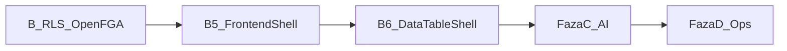

# Plan realizacji OmniRoute — aktualny (2026-08-31)

**Plan Cursor (pełny):** `.cursor/plans/omniroute-realizacja.plan.md`  
**ADR:** [0001 Cursor factory](adr/0001-cursor-software-factory-weryfikacja.md) · [0002 Frontend 2026](adr/0002-frontend-platform-2026.md)  
**Repo:** https://github.com/Spawn2018/OmniRoute  
**Stan:** Fazy 0+A+A.5+B.2–B.4 done · **0.5 lokalnie** → push → **0.6 DataTableShell** → B.7 → C → D



---

## Ukończone

| Faza | Status |
|------|--------|
| 0 GitHub | ✅ private repo, CI |
| A Cursor OS | ✅ AGENTS, GROUNDING, rules, skills |
| A.5 IDE | ✅ gh + GitHub MCP |
| B.2 RLS 0.3 | ✅ organization, app_user, test izolacji |
| B.3 Gate | ✅ ruff/mypy/pytest/import-linter + PG |
| B.4 OpenFGA 0.4 | ✅ model, require_permission, CI |

---

## Gate dziś vs cel DoD (uczciwość)

Źródło: audyt 2026-08-31. **Nie zamykaj plastra ani nie twierdź „pełny DoD”, jeśli recipe to `echo`.**

| Obietnica | Egzekwowane teraz | Kiedy |
|---|---|---|
| ruff + mypy | ✅ `just check` | — |
| pytest unit + integration | ✅ CI | — |
| import-linter | ✅ `just arch` | — |
| frontend typecheck | ✅ `frontend-typecheck` w gate | — |
| vitest | ✅ `frontend-test` w gate (od 0.6) | — |
| cov ≥ 80% | ❌ brak `--cov-fail-under` | spłata po 0.6 / slot jakości |
| jscpd ≤ 3% | ❌ `just dup` = echo | Faza D / slot jakości |
| openapi-ts | ❌ `just api-types` = echo; tymczasowy `lib/api.ts` | slot kontraktu po 0.6 |
| size-limit / perf | ❌ stub | po lazy PostHog |
| agentlint | ❌ echo | Faza D |

---

## Faza B — domknięcie

### B.5 Frontend Shell 2026 — delta `0.5-frontend-shell`
- Vite + React 19 + **React Compiler** + Tailwind v4 + shadcn
- TanStack **Router + Query + Form** (+ Table/Virtual w B.6)
- Design tokens (neutral, compact) — anti AI-slop
- Command palette ⌘K · PostHog od dnia 1
- Referencja layoutu: satnaing/shadcn-admin (**wzorce, nie fork**)
- **Dług świadomy 0.5:** ręczny klient API; PostHog w main chunk (~213 kB gzip); auth localStorage (JWT poza zakresem)

### B.6 DataTableShell — delta `0.6-datatable-views`
- ColumnEditor: checkbox + DnD (@dnd-kit / TanStack columnOrder)
- Filtry faceted + URL sync
- ViewManager + tabela `table_view` (RLS)
- Consumer: `tenancy.users`
- UX events PostHog
- **Dodatkowo w 0.6:** vitest minimum na DataTableShell; preferuj start openapi-ts (spłata długu kontraktu)
- Źródła: Pencil & Paper; NN/G; TanStack Column DnD

### B.7 Branch protection (pull-forward z D)
- Cel: status check `gate` na `main`
- **Constraint (2026-08-31):** GitHub **Free + private** → API branch protection **HTTP 403**. Opcje: GitHub Pro / Team, repo public, albo procedura ręczna (zakaz force-push, review przed merge) do czasu Pro.
- Nie blokuj 0.6 czekaniem na Pro.

**TanStack Start:** Thoughtworks **Assess** (2026-04) — **nie** jako fundament; SPA wystarczy.

---

## Faza C — Platforma AI (po B.6)
instructor, docling A/B, langfuse, promptfoo, HITL na DataTableShell / split-view

## Faza D — Rytm operacyjny
Automations PR, Bugbot, refaktor-pass (cotygodniowy — nie po każdym plastrze), agentlint CI, jscpd w gate  
(branch protection — jeśli nie B.7)

---

## Definition of Done (merge)

1. Delta zamknięta; testy zaakceptowane — tylko to, co gate **naprawdę** egzekwuje + kryteria delty
2. `just gate` green (+ integration gdy dotyczy)
3. Łowca duplikatów + review 4-pass
4. CURRENT + PROGRESS zaktualizowane
5. GROUNDING HCs + ADR-0002 (brak drugiego table engine / AI-slop)
6. **WIP:** nie startuj kolejnego plastra przy niezacommitowanym / niepushniętym zakresie bieżącego

## Start

```
/plaster
```

Kontekst: `@docs/state/CURRENT.md` `@docs/PLAN-REALIZACJA.md` `@docs/adr/0002-frontend-platform-2026.md` `@GROUNDING.md`
