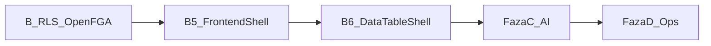

# Plan realizacji OmniRoute — aktualny (2026-08-31)

**Plan Cursor (pełny):** `.cursor/plans/omniroute-realizacja.plan.md`  
**ADR:** [0001 Cursor factory](adr/0001-cursor-software-factory-weryfikacja.md) · [0002 Frontend 2026](adr/0002-frontend-platform-2026.md)  
**Repo:** https://github.com/Spawn2018/OmniRoute  
**Stan:** Fazy 0+A+A.5+B.2–B.4 done · **Następne:** B.5 shell → B.6 DataTableShell → C → D



---

## Ukończone

| Faza | Status |
|------|--------|
| 0 GitHub | ✅ private repo, CI |
| A Cursor OS | ✅ AGENTS, GROUNDING, rules, skills |
| A.5 IDE | ✅ gh + GitHub MCP |
| B.2 RLS 0.3 | ✅ organization, app_user, test izolacji |
| B.3 Gate | ✅ ruff/mypy/pytest/import-linter + PG |
| B.4 OpenFGA 0.4 | ✅ model, require_permission, CI |

---

## Faza B — domknięcie (NASTĘPNE)

### B.5 Frontend Shell 2026 — delta `0.5-frontend-shell`
- Vite + React 19 + **React Compiler** + Tailwind v4 + shadcn
- TanStack **Router + Query + Form** (+ Table/Virtual w B.6)
- Design tokens (neutral, compact) — anti AI-slop
- Command palette ⌘K · PostHog od dnia 1
- Referencja layoutu: satnaing/shadcn-admin (**wzorce, nie fork**)
- Źródła: Thoughtworks Radar 2026-04 Adopt React/Vite; State of React/JS 2025

### B.6 DataTableShell — delta `0.6-datatable-views`
- ColumnEditor: checkbox + DnD (@dnd-kit / TanStack columnOrder)
- Filtry faceted + URL sync
- ViewManager + tabela `table_view` (RLS)
- Consumer: `tenancy.users`
- UX events PostHog
- Źródła: Pencil & Paper enterprise tables; NN/G progressive disclosure; TanStack Column DnD docs

### B.7 Branch protection (pull-forward z D)
- Wymaga status check `gate` na `main` — **teraz**, nie czekać na Fazę D

**TanStack Start:** Thoughtworks **Assess** (2026-04) — **nie** jako fundament; SPA wystarczy.

---

## Faza C — Platforma AI (po B.6)
instructor, docling A/B, langfuse, promptfoo, HITL na DataTableShell / split-view

## Faza D — Rytm operacyjny
Automations PR, Bugbot, refaktor-pass, agentlint CI  
(branch protection — jeśli nie zrobione w B.7)

---

## Definition of Done (merge)

1. Delta zamknięta; testy zaakceptowane
2. `just gate` green (+ integration gdy dotyczy)
3. Łowca duplikatów + review 4-pass
4. CURRENT + PROGRESS zaktualizowane
5. GROUNDING HCs + ADR-0002 (brak drugiego table engine / AI-slop)

## Start

```
/plaster
```

Kontekst: `@docs/deltas/open/0.5-frontend-shell.md` `@docs/adr/0002-frontend-platform-2026.md` `@GROUNDING.md`
