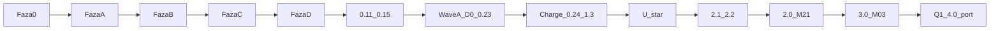

# Plan realizacji OmniRoute — jedyny kanon (2026-09-01)

**To jest jeden plan.** Pierwotna fabryka Cursor (fazy 0→A→B→C→D, leftover 0.11–0.15) i nakładka 12m (Wave A → Charge → U-* → powrót do MODULES) to **jedna oś czasu**, nie dwa drogi. Rozjazd był tylko po plasterze **0.15 hasła**. Rdzeń nigdy się nie rozszedł: RLS, HITL, LLM nie liczy, Decimal, `charge` = marża, `source_ref`, pętla post-plaster.

**Alias (nie kanon):** [docs/state/PROGRAM-12M.md](state/PROGRAM-12M.md) — krótki wskaźnik + wklejka starych promptów.  
**Plan Cursor (historia fabryki):** `.cursor/plans/omniroute-realizacja.plan.md` — nie czytaj z niego „następny = OAuth / D0”.  
**ADR:** [0001 Cursor factory](adr/0001-cursor-software-factory-weryfikacja.md) · [0002 Frontend 2026](adr/0002-frontend-platform-2026.md) · [0003 System UI](adr/0003-frontend-ui-system-2026.md)  
**Repo:** https://github.com/Spawn2018/OmniRoute  
**HEAD:** `8fb8c93` plaster **3.0** M-03 `organization_setting`. Gate green.

<!-- os-status:start -->
**Następny (zablokowany):** `/plaster` 32.0 M-39 `edi_message` tablica `/edi`. Nie nowa tabela. Nie zgaduj schematu X12.
<!-- os-status:end -->



---

## Jak czytać

| Plik | Rola |
|---|---|
| **ten dokument** | Jedyny plan: oś, reguły, honesty gate, co dalej. |
| [CURRENT.md](state/CURRENT.md) | Co jest „teraz” w tej sesji (ostatni plaster, następny, spec). |
| [PROGRESS.md](state/PROGRESS.md) | Historia plastrów — fakty, nie kolejka. |
| [MODULES.md](MODULES.md) | **Żywy** rejestr: tylko to, co jest w kodzie (+ M-02 parked). Kolejka Q i katalog M-01…M-70: ten dokument § Kolejka. |
| Archiwum `Informacje z claude/` | Pełny katalog ~70 M-xx. **Zostaje na dysku. Nie dumpować.** |
| Spec `docs/spec/<nazwa>.md` | Jedna na sesję plastra. Szkielet uzupełniany przy starcie, nie z góry. |

Dwa katalogi to nie dwa produkty. Archiwum = magazyn specyfikacji. `MODULES.md` = to, co już jest w kodzie. **Kolejność budowy** jest w tym dokumencie (§ Kolejka), nie w pamięci operatora. Gdy CURRENT wskazuje wydmuszkę: najpierw tryb **Plan** (`/plan-modul`), potem `/plaster`. Zakaz 70 pustych stubów.

---

## Cel produktu

Wielodostępna platforma spedycyjna na sprzedaż: stawki, wyceny, zlecenia; wielu tenantów; ruch produkcyjny. Praktyki ~4.4, nie teatr 5.0. Horyzont „12m” = standing rules i anti-cele, nie „czekaj rok na moduły”.

---

## Standing rules (zawsze, też po powrocie do MODULES)

1. `organization_id` w każdej tabeli biznesowej + RLS + test izolacji. Runtime: rola `omniroute_app` **NOBYPASSRLS** (nie superuser).
2. Auth produkcyjny **gdy będzie tenant** = Auth0 BFF + cookie httpOnly (Code + PKCE). **I1/I2 nie teraz.** Sesja dziś = email+hasło+JWT (0.12 + 0.15). Hello HS256 = local/CI. 0.12/0.15 **nie** są IdP.
3. Sekrety: **GitHub Encrypted Secrets** + `.env` w gitignore. **Zakaz Infisical.** JWT/AUTH0 nie w YAML.
4. GitHub **Pro później**. Branch protection = procedura + hooki, nie required check UI na Free (403).
5. Kwoty: **Decimal / Numeric**, komponent `<Money/>`. LLM **nie liczy**.
6. **charge** = jedyna prawda o marży (kupno+sprzedaż na jednym rekordzie). **rate_line** niemutowalna + `source_ref`.
7. Accept HITL → `rate_line` przez **orchestrację API** (ten sam request/transakcja). `ExtractionService` **nie** importuje rates.
8. PDF HITL w zakresie = **U-pdf-spans** (viewer + spany, lazy pdf.js). Nie teatr OCR.
9. Paleta ⌘K = akcje operatora = **U-palette-ops**, nie sam skok po trasach.
10. Ewaluacje AI = **syntetyki**. Zero PDF klienta w git.
11. Temporal / Hatchet / outbox **zakazane**, dopóki nie ma realnego zdarzenia async **między** BC poza HTTP.
12. `Informacje z claude/` zostaje na dysku. Nie dumpuj do nowych docs.
13. Echo recipe ≠ DoD. `can_*` ≠ `member`. Recenzent ≠ każdy member.
14. **Zakaz 70 pustych stubów** / `module-factory` na cały rejestr.
15. Każdy endpoint: jawne uprawnienie OpenFGA. Brak = deny.
16. **Exit Wave FE** = **wszystkie** ID `U-*`. Adapter+RTL **nie** zamyka fali. Twierdzenie „scaffold 2026 + powierzchnia 2026” **zakazane**, dopóki każdy U-* nie ma widocznego DoD i gate, który pada.

### AI Act (produkt, nie PDF prawny)

Ekstrakcja HITL, brak scoringu osoby fizycznej = **minimal risk**. **Zakaz:** automatyczny credit scoring `natural_person` / JDG. Art. 50 = label w UI (**U-art50**), nie notatka prawna. D0 **nie** zdejmuje HITL / „LLM nigdy nie liczy”.

---

## Gate dziś vs cel DoD (uczciwość)

Źródło: audyt 2026-08-31 + stan 2026-09-01. **Nie zamykaj plastra ani nie twierdź „pełny DoD”, jeśli recipe to `echo`.**

**Podział bramki (audyt runów #79–#88):** `gate` = `code-gate` + `meta-gate`. CI woła je jako **dwa niezależne joby** (`gate` i `meta`), nie `just gate`. Powód: meta-checki stały przed kodem w łańcuchu fail-fast i przez siedem pushy zasłoniły ruff, mypy, testy i import-linter — w tym oknie przeszedł niezauważony realny błąd granic modułów. Żadna kategoria nie może już tłumić drugiej.

| Obietnica | Egzekwowane teraz | Kiedy |
|---|---|---|
| ruff + mypy | tak `just check` | — |
| pytest unit + integration | tak CI | — |
| import-linter | tak `just arch` | — |
| frontend typecheck | tak `frontend-typecheck` w `code-gate` | — |
| vitest | tak `frontend-test` w `code-gate` | — |
| cov ≥ 80% | tak `test-unit --cov-fail-under=80` | — |
| jscpd ≤ 3% | tak `just dup` w `code-gate` | — |
| openapi-ts | tak `just api-types` + `frontend/src/api/` | regeneruj przy zmianie API |
| size-limit / perf | tak `just perf` initial JS gzip < 250 kB | **k6 p95 nadal stub/echo** |
| agentlint | tak `just agentlint` + baseline, job `meta` | podpis pod kontraktem: zmiana `AGENTS.md` / `.cursor/rules` wymaga `agentlint.py --write` **w tym samym commicie** |
| just docs (status OS) | tak `just docs-check`, job `meta` | CURRENT → README / ARCHITECTURE / PLAN |
| bramka przed push | hook `pre-push` = pełne `just gate` (~70 s) | **lokalnie, per-clone.** Wymaga `just hooks` po każdym clone; CI tego nie widzi. `--no-verify` omija. Migracje, `audit`, promptfoo, integration nadal tylko w CI. Sam składa PATH; błąd agentlinta wraca po ~96 s — szybciej `just meta-gate` (~1 s) |

**Nie cofaj hotfixów CI:** `005` `current_database()` zamiast `Connection.url`; agent-refs URI ≠ plik; agentlint baseline; conftest — osobne `DO $$`; live HTTP = `httpx` AsyncClient; `rate_line` mutate = commit + select kolumny.

---

## Fabryka 0–D — ukończona

| Faza | Co dała | Status |
|------|---------|--------|
| 0 GitHub | private repo Spawn2018/OmniRoute, CI `gate.yml` | DONE |
| A Cursor OS | AGENTS, GROUNDING, rules, skills, hooks | DONE |
| A.5 IDE | gh + GitHub MCP | DONE |
| B.1 szkielet | FastAPI, alembic, docker-compose | DONE |
| B.2 / 0.3 | RLS: `organization`, `app_user`, test izolacji | DONE |
| B.3 Gate | ruff/mypy/pytest/import-linter + PG | DONE |
| B.4 / 0.4 | OpenFGA model, `require_permission`, CI | DONE |
| B.5 / 0.5 | Vite, Compiler, TanStack, shadcn, ⌘K, lazy PostHog | DONE |
| B.6 / 0.6 | DataTableShell, ColumnEditor, `table_view` RLS, vitest | DONE |
| B.7 | branch protection = procedura (Free private 403) | DONE (procedura) |
| C.1–C.5 / 0.7–0.10 | HITL, instructor, docling A/B, langfuse no-op, promptfoo echo | DONE |
| leftover 0.11–0.15 | XOR vitest, JWT, split HITL, HTTP unit, hasła+refresh | DONE |
| D minimal | agentlint, pr-nudge, rytm refaktor/retro | DONE |

**Dług świadomy poza zakresem teraz:** Auth0 BFF (I1/I2 odroczone); k6; vulture; żywy OpenAI w gate; Presidio-all; branch protection UI po Pro.

TanStack Start: Thoughtworks Assess — **nie** fundament; SPA wystarczy.

---

## Overlay 12m — Wave A (D0–0.23) — Exit DONE

Fala bezpieczeństwa i honesty **przed** powrotem do MODULES. Wave FE **nie** jest częścią Wave A.

| ID | Daje | Zabija |
|---|---|---|
| **D0** | AGENTS dziś/później, `.cursorignore` dump, leftover≠DONE | overclaim Infisical/Temporal |
| **0.15 T0** | `document_base64` max_length → 422 przed decode | DoS |
| **0.16 T1** | rola `omniroute_app` NOBYPASSRLS | superuser omija RLS |
| **0.17 T2** | matryca izolacji S1–S6 + WITH CHECK | luki SQL |
| **0.18** | HTTP extract na żywej PG; token A / draft B → 404 | stub serwisu jako „HTTP done” |
| **0.19 A1** | undeclared `/api/v1` = deny; playground off | HC-05 konwencja |
| **0.20 A2** | `can_review_extractions` = reviewer, nie member | każdy member = admin |
| **0.21 T4** | `hello_token` default false (ON tylko local+CI) | mint UUID na sieci |
| **0.22 T5** | iss/aud/jti, TTL 15 min, `token_version` | goły HMAC |
| **0.23 S1** | `JWT_SECRET` z GitHub Encrypted Secrets | literał w YAML |

---

## Charge 0.24–1.3 — DONE

| ID | Moduł | Daje | Nie mylić z |
|---|---|---|---|
| **0.24** | ops | pip-audit, pin SHA Actions, `/ready`, request-id | nie w local `just gate`; k6/vulture echo |
| **0.25** | domain | Money Decimal + `<Money/>` na HITL | nie tabela `charge` / `rate_line` |
| **1.0** | M-06 | `charge_code` katalog + aliasy + `/charge-codes` | luźny string; nie stawka |
| **1.1** | M-07 | `rate_line` immutable + `source_ref` + `/rate-lines` | `charge` / marża |
| **1.2** | M-08 | `charge` buy+sell + `margin()` + `/charges` | accept HITL |
| **1.3** | M-20 | accept → `rate_line` w jednej transakcji HTTP | ExtractionService → rates; outbox; sell z LLM |

---

## Wave FE U-* — ID na origin; Exit **nie** claim

U0 adapter / U1 shell / U2 tabela ADR weszły jako 0.5 / 0.6 / openapi-ts — to **scaffold**, nie Exit Wave FE.

| ID | Operator zobaczy | Gate co padnie | Status |
|---|---|---|---|
| **U-density** | compact + toggle na listach biznesowych | lista bez compact / bez toggle | ID na origin |
| **U-palette-ops** | ⌘K: extract, accept-focus, save-view, clear-session | paleta tylko nawigacja | ID na origin |
| **U-pdf-spans** | PDF + highlight spanów HITL, lazy pdf.js | brak highlightów; PDF w initial JS; gzip > 250 kB | ID na origin |
| **U-routes-breadth** | każdy BC z jobem operatora = trasa w tym samym plasterze | backend-only charge/rate_line/session | **standing**, nie 70 UI |
| **U-a11y** | skip-to-main, focus-visible, Tab/⌘K | tylko mysz; zamknięcie na RTL | ID na origin |
| **U-size-limit-real** | `just perf` failuje CI przy ≥ 250 kB | recipe-echo | ID na origin |
| **U-art50** | label „propozycja AI” na szkicu HITL | draft bez labelu | ID na origin |
| **U-admin-ref** | gęsty sidebar/toolbar/⌘K; pulpit = joby | „adapter = Exit Wave FE” | ID na origin |

**Zakaz claim:** „scaffold 2026 + powierzchnia 2026”, „70 UI”, zamykanie fali na adapter+RTL. U-routes-breadth = standing na **kolejne** BC, nie dowód że powierzchnia 2026 jest skończona.

### Wave FE — leftover po audycie UI (2026-09-01) — **nie Q1**

ADR-0003 + makiety [docs/design/](design/README.md). **Nie** konsumują slotu Q1 (M-05). Każdy ID = osobny plaster **po** Planie tej pozycji albo wpleciony w najbliższy plaster UI, który i tak rusza dany plik. Zero kodu `frontend/` przy samym ADR.

| ID | Operator zobaczy | Gate co padnie | Zależność |
|---|---|---|---|
| **U-oklch-dark** | tokeny OKLCH, motyw jasny/ciemny, kontrast AA | hex-only; brak `.dark`; para tokenów < 4.5:1 | `index.css` |
| **U-money-align** | kwota wyrównana do przecinka + kod waluty | `<Money/>` bez osi dziesiętnej | `money.tsx` |
| **U-condensed** | trzeci tryb gęstości na gridzie stawek | condensed globalnie albo brak na `rate_line` | DataTableShell |
| **U-primitives-json** | `frontend/components.json` base radix | `shadcn add` bez `-b radix` wciąga Base UI | CLI |
| **U-i18n-structure** | klucze + locale format; jeden język (pl) w paczce | hardcoded string w **nowym** ekranie | nowe trasy |
| **U-playwright-axe** | 3 ścieżki E2E + axe na trasie | brak Playwright w gate; axe poza CI | po U-oklch-dark |
| **U-print** | arkusz druku B/L / FV / list | `@media print` chaos albo PDF-teatr | Fala 5/6 |

**Wizja (canvas 06) — parked aż będą dane:**

| Ekran | Najwcześniej |
|---|---|
| Watchtower (mapa + wyjątki) | po M-05 **i** M-35–M-37; mapa = lazy chunk, nie initial 250 kB |
| Oś multimodalna | Fala 5 (tracking) |
| Portale klienta / przewoźnika | Fala 10 (M-61+) |

Optimistic UI: wolno na filtrach/widokach/kolumnach. **Zakaz** na kwocie, `charge`, `rate_line`, accept HITL.

---

## Auth0 — odroczone

I1 (BFF + PKCE + cookie; org z `app_metadata`; first-login bez org = odmowa) i I2 (RS256 JWKS; hello OFF staging/prod) **nie teraz** — brak tenanta. Nie pytać. Hasła + refresh zostają sesją. Zero kodu Auth0 / placeholder / „hello OAuth”. Organizations feature **nie** w I1. OpenFGA = SoT ról (first-login = member; reviewer ręczny seed).

Gdy user **ma** tenant: SPA Vite → BFF FastAPI → Auth0; cookie HttpOnly; Secure; SameSite=Lax; region EU / SCC jeśli plan pozwala. **Nie** w tym samym plasterze co hasła.

---

## Moduły w kodzie (żywy rejestr)

Szczegół: [MODULES.md](MODULES.md). Poniżej odpowiedzialność, zysk, plastry, anti-confusion.

### M-01 tenancy — fundament

**Za co:** izolacja tenantów, tożsamość sesji, OpenFGA.  
**Daje:** RLS + test izolacji; JWT Bearer; hasła argon2id + refresh; `hello_token` off poza local/CI.  
**Plusy:** baza egzekwuje tenancy (NOBYPASSRLS); headery nie spoofują org; recenzent ≠ member.  
**Plastry:** 0.3, 0.4, 0.12, 0.15, 0.16 T1, 0.17 T2, 0.21 T4, 0.22 T5.  
**Nie:** IdP. 0.12/0.15 ≠ Auth0. Auth0 I1/I2 odroczone.

### M-02 outbox — planowany, **zakazany teraz**

**Za co (gdy będzie):** zdarzenia async **między** bounded contextami + idempotencja wywołań zewnętrznych.  
**Dlaczego nie:** nie ma takich zdarzeń poza HTTP. Outbox bez konsumenta = teatr Temporal.  
**Nie startować.** Nie mylić z 0.4 (OpenFGA).

### M-03 organization_setting — fundament (3.0)

**Za co:** konfiguracja jako dane (HC-02). Allowlista `default_currency`.  
**Daje:** `/organization-settings`; RLS; waluta tenanta w bazie, nie w env.  
**Plusy:** zmiana konfiguracji bez deployu; nie sekrety.  
**Nie:** Infisical, `table_view`, sekrety tenanta, env jako źródło prawdy.

### M-06 charge_code — fundament (1.0)

**Za co:** słownik kodów opłat + aliasy.  
**Daje:** `/charge-codes`; brak luźnego stringa w stawkach.  
**Nie:** `rate_line`, `charge`, marża.

### M-07 rate_line — fundament (1.1)

**Za co:** niemutowalna stawka kupna + `source_ref`.  
**Daje:** `/rate-lines`; zmiana = nowy wiersz + `superseded_by`.  
**Plusy:** audyt pochodzenia; LLM nie wstawia stawki bez HITL (1.3).  
**Nie:** marża; `charge`; k6 na 50k.

### M-08 charge — fundament (1.2)

**Za co:** jedyna prawda o marży — kupno i sprzedaż na jednym rekordzie.  
**Daje:** `margin()` w kodzie; `/charges`.  
**Nie:** accept HITL; liczenie marży w quotation / LLM.

### M-20 extraction HITL — fundament

**Za co:** wyciąg z dokumentu → draft → człowiek accept/reject.  
**Daje:** kolejka HITL, instructor+guard, docling A/B, live HTTP PG (0.18), accept→`rate_line` (1.3), label Art. 50, PDF+spany, Presidio stub + 10 `synth://`.  
**Plusy:** nic z ekstrakcji nie idzie do stawek bez HITL; `ExtractionService` nie importuje rates.  
**Plastry:** 0.7–0.14, T0, 0.18, 1.3, U-art50, U-pdf-spans, 2.1–2.2.  
**Nie:** OCR-teatr; Presidio-all; żywy OpenAI w gate; 30 PDF klienta; import rates.

### M-21 quotation — fundament (2.0)

**Za co:** wycena SQL z **bieżącego** `rate_line` (`INSERT…SELECT`).  
**Daje:** `/quotations`; RLS.  
**Plusy:** Postgres liczy z indeksem; nie Python na 50k.  
**Nie:** k6 p95 na pustej tabeli; marża (zostaje w `charge`).

---

## Dwa tryby pracy (jak Agent / Plan / Multitask)

Kolejka poniżej **zdejmuje z Ciebie pamiętanie „co dalej”**. Agent czyta `CURRENT.md` + tę sekcję. Nie zgaduje.

| Tryb w Cursorze | Kiedy | Komenda | Co wolno |
|---|---|---|---|
| **Plan** | Każda nowa pozycja kolejki, zanim powstanie kod — zwłaszcza **wydmuszka** (moduł z katalogu M-xx, którego jeszcze nie ma w `MODULES.md` jako fundament) | `/plan-modul` | Rozmowa: job operatora, tabele, UI, poza zakresem, kolizje ID. Wynik: delta w `docs/deltas/open/` + spec szkielet + `CURRENT.md` z zakresem. **Zero kodu produktu.** |
| **Agent** | Dopiero gdy Plan tej pozycji jest **zaakceptowany** (delta bez „DO USTALENIA” blokujących) | `/plaster` | Pionowy plaster: migracja → RLS → izolacja → API → UI → test → post-plaster → push. |

`/plaster` przy `CURRENT.md` **Etap: Plan** = **stop**. Nie implementuj. Powiedz, żeby przełączyć na Plan i odpalić `/plan-modul`.

Wydmuszka ≠ 70 pustych stubów w repo. Plan ustala **jeden** plaster. Kod powstaje dopiero w Agent.

---

## Kolejka realizacji (jedno po drugim)

Źródło nazw: archiwum `REJESTR-MODULOW-I-PLAN-v2.md` (na dysku, nie dumpować specyfikacji). **Kolejność budowy ≠ numer M-xx** — numery archiwum i żywy kod się rozjechały (patrz mapa kolizji).

Po zamknięciu plastra `CURRENT.md` = **następna pozycja Q**. Nie pytaj operatora „co chcesz”. Wykonaj tryb z kolumny. Q1 ma trzy żywe plastry (4.0 → 4.1 → 4.2); Q2 dopiero po 4.2.

### Mapa kolizji ID (czytaj zanim nazwiesz tabelę)

| Archiwum | Żywy kod dziś | Skutek |
|---|---|---|
| M-06 słownik opłat | **M-06** `charge_code` | fundament; aliasy na wierszu, bez pgvector |
| M-07 waluty i czas | **kolizja** — żywe **M-07** = `rate_line` | Q5 żywy ID **M-23** `nbp_rate` |
| M-08 towary niebezpieczne | **kolizja** — żywe **M-08** = `charge` | Q6 żywy ID **M-52** `dangerous_good` |
| M-17 stawki statyczne | pokryte przez żywe **M-07** `rate_line` | nie startuj drugiego silnika stawek |
| M-22 narzuty i marża | pokryte przez żywe **M-08** `charge` | marża zostaje w `margin()` |

### Fala 0 — już w kodzie (nie wracaj)

M-01 tenancy · M-03 `organization_setting` (część: `default_currency`) · M-06 `charge_code` · M-07 `rate_line` · M-08 `charge` · M-09 `commodity_code` · M-20 ekstrakcja HITL · M-21 `quotation` · M-23 `nbp_rate`. OpenFGA hello = kawałek archiwum M-04, **nie** IdP.

### Fala 1 — następna robota (tu jesteśmy)

| Q | Co | Tryb startu | Status |
|---|---|---|---|
| Q1.0 | M-05 plaster **4.0** `port` + seed `improved-un-locodes` + `resolve` + `/ports` | Plaster (delta `docs/deltas/archived/4.0-port.md`) | zamknięty |
| Q1.1 | M-05 plaster **4.1** `location` + `location_zone_member` | Plaster (delta `docs/deltas/archived/4.1-location-zones.md`) | zamknięty |
| Q1.2 | M-05 plaster **4.2** `terminal` + World Port Index | Plaster (delta `docs/deltas/archived/4.2-terminal-wpi.md`) | zamknięty |
| **Q2** | Archiwum **M-10 Kontrahenci** | Plan → plaster | zamknięty (`docs/deltas/archived/5.0-party.md`) |
| Q3 | Pogłębienie żywego **M-21** `quotation` o port + kontrahent (lista/filtry; SQL na istniejących `rate_line`; nie marża; nie k6) | Plan → plaster | zamknięty (`docs/deltas/archived/5.1-quotation-port-party.md`) |
| Q4 | Archiwum **M-09 Kody towarowe** | Plan → plaster | zamknięty (`docs/deltas/archived/5.2-commodity-code.md`) |
| Q5 | **Waluty i kurs NBP** (archiwum M-07; **nie** nadpisuj żywego M-07) | Plan → plaster | zamknięty (`docs/deltas/archived/6.0-nbp-rate.md`) |
| Q6 | **Towary niebezpieczne** (archiwum M-08; **nie** nadpisuj żywego M-08) | Plan → plaster | zamknięty (`docs/deltas/archived/7.0-dangerous-good.md`) |
| F2.0 | **M-11 Automatyczne kontakty** | Plan → plaster | zamknięty (`docs/deltas/archived/8.0-party-email-match.md`) |
| F2.1 | **M-12 Sieci i stowarzyszenia** | Plan → plaster | zamknięty (`docs/deltas/archived/9.0-network.md`) |
| F2.2 | **M-13 Karta wyników kontrahenta** | Plan → plaster | zamknięty (`docs/deltas/archived/10.0-party-scorecard.md`) |
| F2.3 | **M-16 Procedury operacyjne klienta** | Plan → plaster | zamknięty (`docs/deltas/archived/11.0-customer-sop.md`) |
| F2.4 | **M-18 Opłaty portowe warunkowe** | Plan → plaster | zamknięty (`docs/deltas/archived/12.0-port-surcharge.md`) |
| F2.5 | **M-19 Stawki live i kanały** | Plan → plaster | zamknięty (`docs/deltas/archived/13.0-channel-quote.md`) |
| F2.6 | **M-14 Ocena kredytowa** | Plan → plaster | zamknięty (`docs/deltas/archived/14.0-credit-review.md`) |
| F2.7 | **M-15 Wirtualny Dyrektor Finansowy** | Plan → plaster | zamknięty (`docs/deltas/archived/15.0-finance-board.md`) |
| F3.0 | **M-23 Waluty w ofercie** | 16.0 | zamknięty (`docs/deltas/archived/16.0-quotation-nbp.md`) |
| F3.1 | **M-24 Ryzyko oferty** | 17.0 | zamknięty (`docs/deltas/archived/17.0-offer-risk.md`) |
| F3.2 | **M-25 Negocjacja i wynik** | 18.0 | zamknięty (`docs/deltas/archived/18.0-offer-negotiation.md`) |
| F3.3 | **M-26 Dokument oferty** | 19.0 | zamknięty (`docs/deltas/archived/19.0-offer-document.md`) |
| F3.4 | **M-27 Wycena wsadowa** | 20.0 | zamknięty (`docs/deltas/archived/20.0-quotation-batch.md`) |
| F3.5 | **M-28 Zapytania od klientów** | 21.0 | zamknięty (`docs/deltas/archived/21.0-customer-inquiry.md`) |
| F3.6 | **M-29 Wykrywanie akceptacji** | 22.0 | zamknięty (`docs/deltas/archived/22.0-offer-acceptance.md`) |
| F3.7 | **M-30 Zapytania do agentów/armatorów** | 23.0 | zamknięty (`docs/deltas/archived/23.0-carrier-inquiry.md`) |
| F3.8 | **M-31 Porównanie odpowiedzi** | 24.0 | zamknięty (`docs/deltas/archived/24.0-response-comparison.md`) |
| F4.0 | **M-32 Integracja pocztowa** | 25.0 | zamknięty (`docs/deltas/archived/25.0-mail-integration.md`) |
| F4.1 | **M-33 Dodatek do Outlooka** | 26.0 | zamknięty (`docs/deltas/archived/26.0-mail-client.md`) |
| F4.2 | **M-34 Powiadomienia** | 27.0 | zamknięty (`docs/deltas/archived/27.0-operator-notice.md`) |
| F5.0 | **M-35 Zlecenie** | 28.0 | zamknięty (`docs/deltas/archived/28.0-shipment.md`) |
| F5.1 | **M-36 Tracking** | 29.0 | zamknięty (`docs/deltas/archived/29.0-tracking.md`) |
| F5.2 | **M-37 Wyjątki** | 30.0 | zamknięty (`docs/deltas/archived/30.0-operational-exception.md`) |
| F5.3 | **M-38 Dokumenty zlecenia** | 31.0 | zamknięty (`docs/deltas/archived/31.0-shipment-document.md`) |
| F5.4 | **M-39 EDI** | Plan | delta `docs/deltas/open/32.0-edi-message.md` |

### Fala 2 — po Q6, w tej kolejności, każda pozycja = Plan potem plaster

M-11 Automatyczne kontakty · M-12 Sieci i stowarzyszenia · M-13 Karta wyników kontrahenta · M-16 Procedury operacyjne klienta · M-18 Opłaty portowe warunkowe · M-19 Stawki live i kanały · M-14 Ocena kredytowa (zakaz auto-scoringu osoby) · M-15 Wirtualny Dyrektor Finansowy (LLM nie liczy).

**M-14 Ocena kredytowa:** w kolejce po M-13, ale Plan **musi** zakazać automatycznego scoringu `natural_person` / JDG (AI Act). M-15 VDF — po M-14, LLM nie liczy.

### Fala 3 — ofertowanie

M-23 Waluty w ofercie (czyta `nbp_rate` z 6.0, nie drugi katalog) · M-24 Ryzyko oferty · M-25 Negocjacja i wynik · M-26 Dokument oferty · M-27 Wycena wsadowa · M-28 Zapytania od klientów · M-29 Wykrywanie akceptacji · M-30 Zapytania do agentów/armatorów · M-31 Porównanie odpowiedzi.

### Fala 4 — komunikacja

M-32 Integracja pocztowa · M-33 Dodatek do Outlooka · M-34 Powiadomienia. Copilot/mail = label Art. 50 (U-art50).

### Fala 5 — zlecenie

M-35 Zlecenie · M-36 Tracking · M-37 Wyjątki · M-38 Dokumenty zlecenia · M-39 EDI.

### Fala 6 — finanse

M-40 Fakturowanie i KSeF · M-41 Rozliczenie wyceny z fakturą · M-42 Bank i płatności · M-43 Koszt pieniądza · M-44 Różnice kursowe · M-45 Przepływy · M-46 Koszt obsługi klienta · M-47 Księgowość (integracja). Kwoty Decimal; LLM nie liczy.

### Fala 7–11 — modały, compliance, AI, portal, ops

M-48…M-51 modały · M-52…M-56 compliance (M-53 sankcje, M-56 RODO) · M-57…M-60 AI (HITL; Art. 50; nie scoring osoby) · M-61…M-67 rynek/portal/subskrypcja · M-68…M-70 obserwowalność, jakość, wdrożenie.

### Parked (w katalogu, nie w kolejce aktywnej)

| ID | Dlaczego nie teraz |
|---|---|
| **M-02** outbox | Brak zdarzeń async między BC poza HTTP. Wejdzie, gdy Fala 5/integracje naprawdę publikują zdarzenie. Wtedy najpierw **Plan**. |
| **Auth0 I1/I2** | Brak tenanta. Nie moduł M-xx. Nie pytać. |
| **Watchtower / mapa / portale** | Canvas 06. Po M-05 + Fali 5/10. Nie Q1. |
| **M-04 SSO** | Kawałek OpenFGA jest. Reszta tożsamości = Auth0 parked. „Handlowiec widzi swoich” **po Q2** (kontrahenci), Plan bez SSO. |
| **M-03 reszta** | Żyje tylko `default_currency`. Szablony, numeracja, workflow — Plan jako leftover M-03 **po Fali 1**, nie zamiast Q1. |

**WIP=1.** Po plasterze: [docs/ops/post-plaster.md](ops/post-plaster.md), PROGRESS, CURRENT = następne Q, push, **nowa rozmowa**. Nie startuj kolejnego Q przy niepushniętym zakresie.

Kolizja numeru historyczna: WIP **0.15 hasła** ≠ **0.15 T0**.

---

## Katalog wydmuszek M-01…M-70 (status, nie spec)

Nie implementuj z tej tabeli „na zapas”. To mapa, żeby nic nie zginęło. Szczegóły obiektów zostają w archiwum aż **Plan** danej pozycji je wciągnie do `docs/spec/` + `MODULES.md`.

| Arch. | Nazwa | Status żywy |
|---|---|---|
| M-01 | Wielodostępność | DONE fundament |
| M-02 | Niezawodność zdarzeń | PARKED |
| M-03 | Konfiguracja per organizacja | CZĘŚĆ (`default_currency`) |
| M-04 | Uprawnienia i tożsamość | CZĘŚĆ (OpenFGA hello; SSO parked) |
| M-05 | Geografia | DONE fundament (`port` + `location`/strefy + `terminal`/WPI; `operator_party_id` od 5.0) |
| M-06 | Słownik opłat | DONE jako `charge_code` |
| M-07 | Waluty i czas | DONE katalog 6.0; żywy ID **M-23** `nbp_rate` (nie M-07) |
| M-08 | Towary niebezpieczne | kolejka Q6; żywy ID **M-52** `dangerous_good` (nie M-08) |
| M-09 | Kody towarowe | DONE fundament (5.2 katalog) |
| M-10 | Kontrahenci | DONE fundament (5.0 katalog; lookup = fixture) |
| M-11 | Automatyczne kontakty | DONE fundament (8.0 `resolve_email`) |
| M-12 | Sieci i stowarzyszenia | DONE fundament (9.0 `network`; nie katalog agentów) |
| M-13 | Karta wyników kontrahenta | DONE fundament (10.0 `party_scorecard`; nie SQL-refresh) |
| M-14 | Ocena kredytowa | DONE fundament (14.0 `credit_review`; nie auto-scoring) |
| M-15 | Wirtualny Dyrektor Finansowy | DONE fundament (15.0 `finance_board`; LLM nie liczy) |
| M-16 | Procedury operacyjne klienta | DONE fundament (11.0 `customer_sop`; nie generator zadań) |
| M-17 | Stawki statyczne | COVERED (`rate_line`) |
| M-18 | Opłaty portowe warunkowe | DONE fundament (12.0 `port_surcharge`; nie zapis do `charge`) |
| M-19 | Stawki live i kanały | DONE fundament (13.0 `channel_quote`; nie live HTTP) |
| M-20 | Pipeline ekstrakcji | DONE fundament HITL |
| M-21 | Silnik wyceny | DONE 2.0 + 5.1 POL/POD/`party_id` |
| M-22 | Narzuty i marża | COVERED (`charge`) |
| M-23–M-31 | Ofertowanie | Fala 3 |
| M-32–M-34 | Komunikacja | DONE fundament (25.0–27.0) |
| M-35–M-39 | Zlecenie / EDI | Fala 5 (M-35–M-38 DONE fundament 28.0–31.0) |
| M-40–M-47 | Finanse | Fala 6 |
| M-48–M-51 | Modały | Fala 7 |
| M-52–M-56 | Compliance | Fala 8 (żywe M-52 = `dangerous_good` z 7.0, nie drugi `charge`) |
| M-57–M-60 | AI / copilot | Fala 9 |
| M-61–M-67 | Rynek / portal | Fala 10 |
| M-68–M-70 | Ops / wdrożenie | Fala 11 |

---

## Anti-cele (odmów) + nie pytaj ponownie

Temporal/Hatchet/outbox na zapas · Infisical · 70 pustych M-xx · k6 50k · OTel-sprint · `just perf` / k6 echo jako DoD · Presidio na każdym endpoincie · żywy OpenAI w gate · `can_*` = member · accept bez HITL · hasła+Auth0 w jednym plasterze · persony `.cursor/agents/` · dump Claude · zmiana starych migracji · Next.js · pgvector „bo stos” · required checks na Free · twierdzenie że 0.12 = IdP · OCR-teatr · zamknięcie Wave FE na adapter+RTL · „powierzchnia 2026” przed Exit Wave FE · auto credit scoring `natural_person` / JDG · zdejmowanie HITL w D0 · Base UI bez ADR · mapa w initial JS · optimistic na kwocie/`accept` · cztery silniki tabel Fiori.

**Nie pytaj ponownie:** Auth0 I1/I2 (aż user ma tenant), IdP, Infisical, Temporal, Pro, dump, „adapter wystarczy na powierzchnię 2026”, „0.12/0.15 = IdP”, start M-02 bez zdarzeń, kompromis na Exit Wave FE.

**Nie ruszać:** ręczny edit `frontend/src/api/*` (flatten anyOf\|null → cast w wrapperze); fałszywy `refactor_ratio`; persony `.cursor/agents/`.

---

## Definition of Done (merge)

1. Delta zamknięta; testy zaakceptowane — tylko to, co gate **naprawdę** egzekwuje + kryteria delty.
2. `just gate` green (+ integration gdy dotyczy).
3. Łowca duplikatów + review 4-pass (**pomiar**; naprawa w pętli).
4. Pętla [post-plaster.md](ops/post-plaster.md); leftover → [docs-debt.md](ops/docs-debt.md).
5. CURRENT + PROGRESS + `just docs` (README/ARCHITECTURE/PLAN z CURRENT).
6. GROUNDING HCs + ADR-0002 (brak drugiego table engine / AI-slop) + ADR-0003 (tokeny, Money, HITL, tenant).
7. **WIP:** nie startuj kolejnego plastra przy niezacommitowanym / niepushniętym zakresie.

## Skills i start

Obowiązkowe: `nowy-plaster`, `zamknij-plaster`, `lowca-duplikatow` (przed kodem), `migracja-rls`, `openfga-change` (gdy model FGA), `ekstraktor` (granica accept), `pr-review`, `knowledge-retrieve` ≤8 kart.

**Nie:** `module-factory` na 70 BC.

<!-- os-start:start -->
**Teraz:** `/plan-modul` (Etap z CURRENT.md).

```
/plan-modul
```

Kontekst: `@docs/state/CURRENT.md` `@docs/PLAN-REALIZACJA.md` `@GROUNDING.md`

Druga komenda (`/plaster`) tylko gdy CURRENT zmieni Etap.
<!-- os-start:end -->
