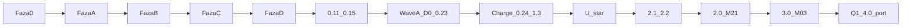

# Plan realizacji OmniRoute — jedyny kanon (2026-09-01; oś pin 2026-09-08c)

**To jest jeden plan.** Pierwotna fabryka Cursor (fazy 0→A→B→C→D, leftover 0.11–0.15) i nakładka 12m (Wave A → Charge → U-* → powrót do MODULES) to **jedna oś czasu**, nie dwa drogi. Rozjazd był tylko po plasterze **0.15 hasła**. Rdzeń nigdy się nie rozszedł: RLS, HITL, LLM nie liczy, Decimal, `charge` = marża, `source_ref`, pętla post-plaster.

**Alias (nie kanon):** [docs/state/PROGRAM-12M.md](state/PROGRAM-12M.md) — krótki wskaźnik + wklejka starych promptów.  
**Plan Cursor (historia fabryki):** `.cursor/plans/omniroute-realizacja.plan.md` — nie czytaj z niego „następny = OAuth / D0”.  
**ADR:** [0001 Cursor factory](adr/0001-cursor-software-factory-weryfikacja.md) · [0002 Frontend 2026](adr/0002-frontend-platform-2026.md) · [0003 System UI](adr/0003-frontend-ui-system-2026.md)  
**Repo:** https://github.com/Spawn2018/OmniRoute  
**Stan żywy:** [CURRENT.md](state/CURRENT.md) — ten wiersz nie trzyma SHA (context rot: tu stało `8fb8c93` / 3.0 przy żywym 127.0).

<!-- os-status:start -->
**Następny (zablokowany):** **223.0** leftover T3 `packaging_code` na `container` → leftover T2c km/`party`/`/fleet` parked → leftover T1b tabela `stop_group` parked → leftover T1 EXP1 waga/plomba parked → leftover T7b override/`charge` parked → leftover T7c U4 D-1 parked → leftover T4b rentowność SQL parked → leftover U3c pule M-03 parked → leftover P4c warning parked → leftover P1c WHEN/IF/CALC parked → leftover P1d exclusion parked → leftover D9c–f PDF/ZPL/409 sieci parked → leftover V7 tacho TO_VERIFY parked → leftover V8 what-if parked → leftover V6 silnik EBITDA / `sla_clause` CI5 parked → leftover V5 `position_event` / ciphertext / 3 dni U4 parked → leftover V5b `exchange_message` parked → leftover V4 AIS wieży (S32) parked → leftover V2b myto→`charge` parked → leftover C3 live VIES/GUS parked → leftover C4 eCMR parked → leftover C9 Trans.eu parked → leftover C2 AIS/PUESC parked → leftover C6 BDO parked → leftover F2b Decimal/rezerwy parked → leftover F3 noty/period lock parked → leftover F4 CAMT parked → leftover G2.20–G2.22 circle_sim/km/P parked → leftover G2.15–G2.18 kg/CBAM parked → leftover F1 live FA(3) parked → leftover C1 filing XML parked → leftover C8 409/`relation_document_requirement` parked → leftover N3 countdown D&D / szkic `charge` parked → leftover P3b SQL na `charge` parked → leftover P3c live HTTP parked → leftover P3d A11 parked → leftover P5b–c parked → leftover P6c auto-award parked → leftover G2.23 Citizen API parked → leftover P4b armator/serwis parked → leftover N1 `consignment` parked → leftover T5 outbox M-02 parked → leftover T6 mapa parked → leftover T8 live API parked → leftover N11 handover parked → S53 → X → WA1 → Plat → Demo-1 → CT → CI9–CI8 → G → EXP → Mob → K0. D8 parked. Named parks parked — `/noc` pomija aż CURRENT wskaże S53. Nic z pinu 2026-09-08c nie wypada. Nie zgaduj 71–223.
<!-- os-status:end -->



---

## Jak czytać

| Plik | Rola |
|---|---|
| **ten dokument** | Jedyny plan: oś, reguły, honesty gate, co dalej. |
| [CURRENT.md](state/CURRENT.md) | Co jest „teraz” w tej sesji (ostatni plaster, następny, spec). |
| [PROGRESS.md](state/PROGRESS.md) | Historia plastrów — fakty, nie kolejka. |
| [MODULES.md](MODULES.md) | **Żywy** rejestr: tylko to, co jest w kodzie (+ M-02 parked aż S16). Kolejka Q, Q-E i Fala S: ten dokument § Kolejka. |
| Archiwum `Informacje z claude/` | Pełny katalog ~70 M-xx. **Zostaje na dysku. Nie dumpować.** |
| Spec `docs/spec/<nazwa>.md` | Jedna na sesję plastra. Szkielet uzupełniany przy starcie, nie z góry. |

Dwa katalogi to nie dwa produkty. Archiwum = magazyn specyfikacji. `MODULES.md` = to, co już jest w kodzie. **Kolejność budowy** jest w tym dokumencie (§ Kolejka), nie w pamięci operatora. Gdy CURRENT wskazuje wydmuszkę: najpierw tryb **Plan** (`/plan-modul`), potem `/plaster`. Zakaz 70 pustych stubów.

---

## Cel produktu

Wielodostępna platforma spedycyjna na sprzedaż: stawki, wyceny, zlecenia; wielu tenantów; ruch produkcyjny. Horyzont „12m” = standing rules i anti-cele, nie „czekaj rok na moduły”.

## Cel jakości (4,4–5)

Spedytor kończy job w czasie, który da się zmierzyć. Następny człowiek czyta kod i dokument jak czyjąś utrzymywaną rzecz, nie jak noc generatora. Cokolwiek nie jest **4,4** zostaje nazwane albo spłacone w tej samej cegiełce. Zielony gate jest podłogą, nie celem.

Nota **4,4–5** stawia karta i diff — nie prompt „pisz jak senior”. Kalibracja: **5,0** = `charge.margin` + niemutowalna `rate_line` + `source_ref` + HITL przed stawką; **4,4** = to samo plus drobna kopia na trzy ruchy `/refaktor`; **3,x** = generator (bliźniaczy katalog, sklonowany nagłówek modelu); **2,x** = nowa nazwa M-xx, stara tabela. Cel 4,4–5 = **Grupa A** (własna tabela, zapis, izolacja). Tablice-odczyty Fal 3–11 nie idą na 5,0: makieta w docs albo prawdziwy moduł.

Trzy twarde reguły: (1) szybkość jest liczbą z budżetu AGENTS albo jawnym N/A — k6-echo nie zamyka; (2) dług ukryty zakazany — wiersz w [docs-debt.md](ops/docs-debt.md) z „dlaczego” albo gwoźdź w diffie; (3) komentarz mówi *dlaczego* (ustawa, HC), linia powtarzająca kod obniża notę. Dokumentacja programu ≠ `AGENTS.md`.

Procedura nie jedzie „aż 5,0 sama”. Hamulec: karta [post-plaster.md](ops/post-plaster.md). Spłata starego 3,x: `/refaktor` (max 3). Kolejka: **Fala E** (zamknięta), **Fala S** (named parks **parked** — `/noc` pomija), potem **P0** + oś pinu **2026-09-08c** (O/I/U/T/D/P/G2/F/C/V/W/X/WA/Plat/Demo/CT/CI/G/EXP/K0). F9.1 bez żywej nazwy aż wiersze **S56–S58** (zamknięte). Nie zgaduj 71–212. Puste ID zostają puste.

---

## Standing rules (zawsze, też po powrocie do MODULES)

1. `organization_id` w każdej tabeli biznesowej + RLS + test izolacji. Runtime: rola `omniroute_app` **NOBYPASSRLS** (nie superuser).
2. Auth produkcyjny **gdy będzie tenant** = Auth0 BFF + cookie httpOnly (Code + PKCE). **I1/I2 nie teraz.** Sesja dziś = email+hasło+JWT (0.12 + 0.15). Hello HS256 = local/CI. 0.12/0.15 **nie** są IdP.
3. Sekrety: **GitHub Encrypted Secrets** + `.env` w gitignore. **Zakaz Infisical.** JWT/AUTH0 nie w YAML.
4. GitHub **Pro później**. Branch protection = procedura + hooki, nie required check UI na Free (403).
5. Kwoty: **Decimal / Numeric**, komponent `<Money/>`. LLM **nie liczy**.
6. **charge** = jedyna prawda o marży (kupno+sprzedaż na jednym rekordzie). **rate_line** niemutowalna + `source_ref`.
7. Accept HITL → `rate_line` przez **orchestrację API** (ten sam request/transakcja). `ExtractionService` **nie** importuje rates.
8. PDF HITL w zakresie = **U-pdf-spans** (viewer + spany, lazy pdf.js). Nie teatr OCR.
9. Paleta ⌘K = akcje operatora = **U-palette-ops**, nie sam skok po trasach.
10. Ewaluacje AI = **syntetyki**. Zero PDF klienta w git.
11. Temporal / Hatchet / outbox **zakazane**, dopóki nie ma realnego zdarzenia async **między** BC poza HTTP.
12. `Informacje z claude/` zostaje na dysku. Nie dumpuj do nowych docs.
13. Echo recipe ≠ DoD. `can_*` ≠ `member`. Recenzent ≠ każdy member.
14. **Zakaz 70 pustych stubów** / `module-factory` na cały rejestr.
15. Każdy endpoint: jawne uprawnienie OpenFGA. Brak = deny.
16. **Exit Wave FE** = **wszystkie** ID `U-*`. Adapter+RTL **nie** zamyka fali. Twierdzenie „scaffold 2026 + powierzchnia 2026” **zakazane**, dopóki każdy U-* nie ma widocznego DoD i gate, który pada.

### AI Act (produkt, nie PDF prawny)

Ekstrakcja HITL, brak scoringu osoby fizycznej = **minimal risk**. **Zakaz:** automatyczny credit scoring `natural_person` / JDG. Art. 50 = label w UI (**U-art50**), nie notatka prawna. D0 **nie** zdejmuje HITL / „LLM nigdy nie liczy”.

---

## Gate dziś vs cel DoD (uczciwość)

Źródło: audyt 2026-08-31 + stan 2026-09-01. **Nie zamykaj plastra ani nie twierdź „pełny DoD”, jeśli recipe to `echo`.**

**Podział bramki (audyt runów #79–#88):** `gate` = `code-gate` + `meta-gate`. CI woła je jako **dwa niezależne joby** (`gate` i `meta`), nie `just gate`. Powód: meta-checki stały przed kodem w łańcuchu fail-fast i przez siedem pushy zasłoniły ruff, mypy, testy i import-linter — w tym oknie przeszedł niezauważony realny błąd granic modułów. Żadna kategoria nie może już tłumić drugiej.

| Obietnica | Egzekwowane teraz | Kiedy |
|---|---|---|
| ruff + mypy | tak `just check` | — |
| pytest unit + integration | tak CI | — |
| import-linter | tak `just arch` | — |
| frontend typecheck | tak `frontend-typecheck` w `code-gate` | — |
| vitest | tak `frontend-test` w `code-gate` | — |
| playwright + axe | tak `frontend-e2e` w `code-gate` | Chromium; nie Firefox |
| cov ≥ 80% | tak `test-unit --cov-fail-under=80` | — |
| jscpd ≤ 3% | tak `just dup` w `code-gate` | — |
| openapi-ts | tak `just api-types` + `frontend/src/api/` | regeneruj przy zmianie API |
| size-limit / perf | tak `just perf` initial JS gzip < 250 kB | **k6 p95 nadal stub/echo** |
| agentlint | tak `just agentlint` + baseline, job `meta` | podpis pod kontraktem: zmiana `AGENTS.md` / `.cursor/rules` wymaga `agentlint.py --write` **w tym samym commicie** |
| styl slopu (OS-4) | tak `just craft-style` + sufit w `quality-floor`, job `meta` | TODO, `except Exception`, echo-komentarz, `float()`, `as any`; funkcje >40 linii tylko w dół. **Nie** smak ani merytoryka. |
| just docs (status OS) | tak `just docs-check`, job `meta` | CURRENT → README / ARCHITECTURE / PLAN |
| bramka przed push | hook `pre-push` = pełne `just gate` (~70 s) | **lokalnie, per-clone.** Wymaga `just hooks` po każdym clone; CI tego nie widzi. `--no-verify` omija. Migracje, `audit`, promptfoo, integration nadal tylko w CI. Sam składa PATH; błąd agentlinta wraca po ~96 s — szybciej `just meta-gate` (~1 s) |

**Nie cofaj hotfixów CI:** `005` `current_database()` zamiast `Connection.url`; agent-refs URI ≠ plik; agentlint baseline; conftest — osobne `DO $$`; live HTTP = `httpx` AsyncClient; `rate_line` mutate = commit + select kolumny.

---

## Fabryka 0–D — ukończona

| Faza | Co dała | Status |
|------|---------|--------|
| 0 GitHub | private repo Spawn2018/OmniRoute, CI `gate.yml` | DONE |
| A Cursor OS | AGENTS, GROUNDING, rules, skills, hooks | DONE |
| A.5 IDE | gh + GitHub MCP | DONE |
| B.1 szkielet | FastAPI, alembic, docker-compose | DONE |
| B.2 / 0.3 | RLS: `organization`, `app_user`, test izolacji | DONE |
| B.3 Gate | ruff/mypy/pytest/import-linter + PG | DONE |
| B.4 / 0.4 | OpenFGA model, `require_permission`, CI | DONE |
| B.5 / 0.5 | Vite, Compiler, TanStack, shadcn, ⌘K, lazy PostHog | DONE |
| B.6 / 0.6 | DataTableShell, ColumnEditor, `table_view` RLS, vitest | DONE |
| B.7 | branch protection = procedura (Free private 403) | DONE (procedura) |
| C.1–C.5 / 0.7–0.10 | HITL, instructor, docling A/B, langfuse no-op, promptfoo echo | DONE |
| leftover 0.11–0.15 | XOR vitest, JWT, split HITL, HTTP unit, hasła+refresh | DONE |
| D minimal | agentlint, pr-nudge, rytm refaktor/retro | DONE |

**Dług świadomy poza zakresem teraz:** Auth0 BFF (I1/I2 odroczone); k6; vulture; żywy OpenAI w gate; Presidio-all; branch protection UI po Pro.

TanStack Start: Thoughtworks Assess — **nie** fundament; SPA wystarczy.

---

## Overlay 12m — Wave A (D0–0.23) — Exit DONE

Fala bezpieczeństwa i honesty **przed** powrotem do MODULES. Wave FE **nie** jest częścią Wave A.

| ID | Daje | Zabija |
|---|---|---|
| **D0** | AGENTS dziś/później, `.cursorignore` dump, leftover≠DONE | overclaim Infisical/Temporal |
| **0.15 T0** | `document_base64` max_length → 422 przed decode | DoS |
| **0.16 T1** | rola `omniroute_app` NOBYPASSRLS | superuser omija RLS |
| **0.17 T2** | matryca izolacji S1–S6 + WITH CHECK | luki SQL |
| **0.18** | HTTP extract na żywej PG; token A / draft B → 404 | stub serwisu jako „HTTP done” |
| **0.19 A1** | undeclared `/api/v1` = deny; playground off | HC-05 konwencja |
| **0.20 A2** | `can_review_extractions` = reviewer, nie member | każdy member = admin |
| **0.21 T4** | `hello_token` default false (ON tylko local+CI) | mint UUID na sieci |
| **0.22 T5** | iss/aud/jti, TTL 15 min, `token_version` | goły HMAC |
| **0.23 S1** | `JWT_SECRET` z GitHub Encrypted Secrets | literał w YAML |

---

## Charge 0.24–1.3 — DONE

| ID | Moduł | Daje | Nie mylić z |
|---|---|---|---|
| **0.24** | ops | pip-audit, pin SHA Actions, `/ready`, request-id | nie w local `just gate`; k6/vulture echo |
| **0.25** | domain | Money Decimal + `<Money/>` na HITL | nie tabela `charge` / `rate_line` |
| **1.0** | M-06 | `charge_code` katalog + aliasy + `/charge-codes` | luźny string; nie stawka |
| **1.1** | M-07 | `rate_line` immutable + `source_ref` + `/rate-lines` | `charge` / marża |
| **1.2** | M-08 | `charge` buy+sell + `margin()` + `/charges` | accept HITL |
| **1.3** | M-20 | accept → `rate_line` w jednej transakcji HTTP | ExtractionService → rates; outbox; sell z LLM |

---

## Wave FE U-* — ID na origin; Exit **nie** claim

U0 adapter / U1 shell / U2 tabela ADR weszły jako 0.5 / 0.6 / openapi-ts — to **scaffold**, nie Exit Wave FE.

| ID | Operator zobaczy | Gate co padnie | Status |
|---|---|---|---|
| **U-density** | compact + toggle na listach biznesowych | lista bez compact / bez toggle | ID na origin |
| **U-palette-ops** | ⌘K: extract, accept-focus, save-view, clear-session | paleta tylko nawigacja | ID na origin |
| **U-pdf-spans** | PDF + highlight spanów HITL, lazy pdf.js | brak highlightów; PDF w initial JS; gzip > 250 kB | ID na origin |
| **U-routes-breadth** | każdy BC z jobem operatora = trasa w tym samym plasterze | backend-only charge/rate_line/session | **standing**, nie 70 UI |
| **U-a11y** | skip-to-main, focus-visible, Tab/⌘K | tylko mysz; zamknięcie na RTL | ID na origin |
| **U-size-limit-real** | `just perf` failuje CI przy ≥ 250 kB | recipe-echo | ID na origin |
| **U-art50** | label „propozycja AI” na szkicu HITL | draft bez labelu | ID na origin |
| **U-admin-ref** | gęsty sidebar/toolbar/⌘K; pulpit = joby | „adapter = Exit Wave FE” | ID na origin |

**Zakaz claim:** „scaffold 2026 + powierzchnia 2026”, „70 UI”, zamykanie fali na adapter+RTL. U-routes-breadth = standing na **kolejne** BC, nie dowód że powierzchnia 2026 jest skończona.

### Wave FE — leftover po audycie UI (2026-09-01) — **nie Q1**

ADR-0003 + makiety [docs/design/](design/README.md). **Nie** konsumują slotu Q1 (M-05). Każdy ID = osobny plaster **po** Planie tej pozycji albo wpleciony w najbliższy plaster UI, który i tak rusza dany plik. Zero kodu `frontend/` przy samym ADR.

| ID | Operator zobaczy | Gate co padnie | Zależność |
|---|---|---|---|
| **U-oklch-dark** | tokeny OKLCH, motyw jasny/ciemny, kontrast AA | hex-only; brak `.dark`; para tokenów < 4.5:1 | `index.css` · 51.0 zamknięty |
| **U-money-align** | kwota wyrównana do przecinka + kod waluty | `<Money/>` bez osi dziesiętnej | `money.tsx` · 52.0 zamknięty |
| **U-condensed** | trzeci tryb gęstości na gridzie stawek | condensed globalnie albo brak na `rate_line` | DataTableShell · 53.0 zamknięty |
| **U-primitives-json** | `frontend/components.json` base radix | `shadcn add` bez `-b radix` wciąga Base UI | CLI · 54.0 zamknięty |
| **U-i18n-structure** | klucze + locale format; jeden język (pl) w paczce | hardcoded string w **nowym** ekranie | nowe trasy · 55.0 zamknięty |
| **U-playwright-axe** | 3 ścieżki E2E + axe na trasie | brak Playwright w gate; axe poza CI | po U-oklch-dark · 56.0 zamknięty |
| **U-print** | arkusz druku B/L / FV / list | `@media print` chaos albo PDF-teatr | Fala 5/6 · 57.0 zamknięty |
| **U-omniroute-ui-dna** | rail `--ink` / `--on-ink` z `#v-quote` / `#v-ship` | druga paleta albo brak nazwy `--ink` | `index.css` · 127.0 zamknięty |

**Wizja (canvas 06) — parked aż będą dane:**

| Ekran | Najwcześniej |
|---|---|
| Watchtower (mapa + wyjątki) | po M-05 **i** M-35–M-37; mapa = lazy chunk, nie initial 250 kB |
| Oś multimodalna | Fala 5 (tracking) |
| Portale klienta / przewoźnika | Fala 10 (M-61+) |

Optimistic UI: wolno na filtrach/widokach/kolumnach. **Zakaz** na kwocie, `charge`, `rate_line`, accept HITL.

---

## Auth0 — odroczone

I1 (BFF + PKCE + cookie; org z `app_metadata`; first-login bez org = odmowa) i I2 (RS256 JWKS; hello OFF staging/prod) **nie teraz** — brak tenanta. Nie pytać. Hasła + refresh zostają sesją. Zero kodu Auth0 / placeholder / „hello OAuth”. Organizations feature **nie** w I1. OpenFGA = SoT ról (first-login = member; reviewer ręczny seed).

Gdy user **ma** tenant: SPA Vite → BFF FastAPI → Auth0; cookie HttpOnly; Secure; SameSite=Lax; region EU / SCC jeśli plan pozwala. **Nie** w tym samym plasterze co hasła.

---

## Moduły w kodzie (żywy rejestr)

Szczegół: [MODULES.md](MODULES.md). Poniżej odpowiedzialność, zysk, plastry, anti-confusion.

### M-01 tenancy — fundament

**Za co:** izolacja tenantów, tożsamość sesji, OpenFGA.  
**Daje:** RLS + test izolacji; JWT Bearer; hasła argon2id + refresh; `hello_token` off poza local/CI.  
**Plusy:** baza egzekwuje tenancy (NOBYPASSRLS); headery nie spoofują org; recenzent ≠ member.  
**Plastry:** 0.3, 0.4, 0.12, 0.15, 0.16 T1, 0.17 T2, 0.21 T4, 0.22 T5.  
**Nie:** IdP. 0.12/0.15 ≠ Auth0. Auth0 I1/I2 odroczone.

### M-02 outbox — fundament (79.0)

**Za co:** zdarzenia async **między** bounded contextami + idempotencja zapisu.  
**Daje:** `outbox_event` + `/outbox`; kind `inbound_message_saved` po zapisie wiadomości.  
**Nie:** Temporal / Hatchet / worker / konsument. Nie mylić z 0.4 (OpenFGA).

### M-03 organization_setting — fundament (3.0)

**Za co:** konfiguracja jako dane (HC-02). Allowlista `default_currency`.  
**Daje:** `/organization-settings`; RLS; waluta tenanta w bazie, nie w env.  
**Plusy:** zmiana konfiguracji bez deployu; nie sekrety.  
**Nie:** Infisical, `table_view`, sekrety tenanta, env jako źródło prawdy.

### M-06 charge_code — fundament (1.0)

**Za co:** słownik kodów opłat + aliasy.  
**Daje:** `/charge-codes`; brak luźnego stringa w stawkach.  
**Nie:** `rate_line`, `charge`, marża.

### M-07 rate_line — fundament (1.1)

**Za co:** niemutowalna stawka kupna + `source_ref`.  
**Daje:** `/rate-lines`; zmiana = nowy wiersz + `superseded_by`.  
**Plusy:** audyt pochodzenia; LLM nie wstawia stawki bez HITL (1.3).  
**Nie:** marża; `charge`; k6 na 50k.

### M-08 charge — fundament (1.2)

**Za co:** jedyna prawda o marży — kupno i sprzedaż na jednym rekordzie.  
**Daje:** `margin()` w kodzie; `/charges`.  
**Nie:** accept HITL; liczenie marży w quotation / LLM.

### M-20 extraction HITL — fundament

**Za co:** wyciąg z dokumentu → draft → człowiek accept/reject.  
**Daje:** kolejka HITL, instructor+guard, docling A/B, live HTTP PG (0.18), accept→`rate_line` (1.3), label Art. 50, PDF+spany, Presidio stub + 10 `synth://`.  
**Plusy:** nic z ekstrakcji nie idzie do stawek bez HITL; `ExtractionService` nie importuje rates.  
**Plastry:** 0.7–0.14, T0, 0.18, 1.3, U-art50, U-pdf-spans, 2.1–2.2.  
**Nie:** OCR-teatr; Presidio-all; żywy OpenAI w gate; 30 PDF klienta; import rates.

### M-21 quotation — fundament (2.0)

**Za co:** wycena SQL z **bieżącego** `rate_line` (`INSERT…SELECT`).  
**Daje:** `/quotations`; RLS.  
**Plusy:** Postgres liczy z indeksem; nie Python na 50k.  
**Nie:** k6 p95 na pustej tabeli; marża (zostaje w `charge`).

---

## Dwa tryby pracy (jak Agent / Plan / Multitask)

Kolejka poniżej **zdejmuje z Ciebie pamiętanie „co dalej”**. Agent czyta `CURRENT.md` + tę sekcję. Nie zgaduje.

| Tryb w Cursorze | Kiedy | Komenda | Co wolno |
|---|---|---|---|
| **Plan** | Każda nowa pozycja kolejki, zanim powstanie kod — zwłaszcza **wydmuszka** (moduł z katalogu M-xx, którego jeszcze nie ma w `MODULES.md` jako fundament) | `/plan-modul` | Rozmowa: job operatora, tabele, UI, poza zakresem, kolizje ID. Wynik: delta w `docs/deltas/open/` + spec szkielet + `CURRENT.md` z zakresem. **Zero kodu produktu.** |
| **Agent** | Dopiero gdy Plan tej pozycji jest **zaakceptowany** (delta bez „DO USTALENIA” blokujących) | `/plaster` | Pionowy plaster: migracja → RLS → izolacja → API → UI → test → post-plaster → push. |
| **Refaktor** | `CURRENT.md` **Etap: Refaktor** (Fala E, Q-E1 i kolejne sloty `/refaktor`) | `/refaktor` | Max 3 ruchy, zachowanie bez zmian, testy bez zmiany asercji. Nie nowy M-xx. |

`/plaster` przy `CURRENT.md` **Etap: Plan** = **stop**. Nie implementuj. Powiedz, żeby przełączyć na Plan i odpalić `/plan-modul`.
`/plaster` przy **Etap: Refaktor** = **stop**. Odpal `/refaktor`.

Wydmuszka ≠ 70 pustych stubów w repo. Plan ustala **jeden** plaster. Kod powstaje dopiero w Agent.

---

## Kolejka realizacji (jedno po drugim)

Źródło nazw: archiwum `REJESTR-MODULOW-I-PLAN-v2.md` (na dysku, nie dumpować specyfikacji). **Kolejność budowy ≠ numer M-xx** — numery archiwum i żywy kod się rozjechały (patrz mapa kolizji).

Po zamknięciu plastra `CURRENT.md` = **następna pozycja Q**. Nie pytaj operatora „co chcesz”. Wykonaj tryb z kolumny. Q1 ma trzy żywe plastry (4.0 → 4.1 → 4.2); Q2 dopiero po 4.2.

Po Fali 11 i leftover FE: **Fala E (Q-E1…E4)**, potem **Fala S** (S1…). Nie F9.1 po Q-E4. Q-E0 = 59.0 (kanon jakości). F9.1 = S56–S58.

### Mapa kolizji ID (czytaj zanim nazwiesz tabelę)

| Archiwum | Żywy kod dziś | Skutek |
|---|---|---|
| M-06 słownik opłat | **M-06** `charge_code` | fundament; aliasy na wierszu, bez pgvector |
| M-07 waluty i czas | **kolizja** — żywe **M-07** = `rate_line` | Q5 żywy ID **M-23** `nbp_rate` |
| M-08 towary niebezpieczne | **kolizja** — żywe **M-08** = `charge` | Q6 żywy ID **M-52** `dangerous_good` |
| M-17 stawki statyczne | pokryte przez żywe **M-07** `rate_line` | nie startuj drugiego silnika stawek |
| M-22 narzuty i marża | pokryte przez żywe **M-08** `charge` | marża zostaje w `margin()` |
| M-52 ślad węglowy (katalog) | żywe **M-52** = `dangerous_good` | ślad = nowy żywy ID przy CBAM (Fala S faza 10); nie nadpisuj DG |
| M-57 serwer MCP (katalog) | żywe **M-57** = tablica extract | MCP później; nie nadpisuj. Kat. M-58 = pogłębienie M-57 (**S56**) |
| Historyczne **F11.0** M-68 | Fala F **F11** książka PP | kropka = obserwowalność (48.0); F11 bez kropki = Poczta Polska |
| Historyczne **F9.0** M-57 | Fala F **F9** adapter ERP | F9.1 = S56–S58 (zamknięte); F9 = FS+FZ do FK |
| Fala **O** biurko ocean | M-51 `ocean_lcl` | O = wycena/kupno (M-19/M-30/M-31); LCL = odcinek zlecenia |
| Arch. M-179 szyna decyzji | **kolizja M-57** | S11 żywy ID **M-71** `operator_decision` |
| Arch. M-91 zbiorcze FV | brak kolizji z żywym M-40 | S43 żywy ID **M-91** `collective_invoice`; nie nadpisuj `sales_invoice` |
| M-35 vs arch. M-89 booking | default: **jedna** tabela `shipment` | dwa obiekty tylko gdy Plan **S28** udowodni dwa joby |

### Fala 0 — już w kodzie (nie wracaj)

M-01 tenancy · M-03 `organization_setting` (część: `default_currency`) · M-06 `charge_code` · M-07 `rate_line` · M-08 `charge` · M-09 `commodity_code` · M-20 ekstrakcja HITL · M-21 `quotation` · M-23 `nbp_rate`. OpenFGA hello = kawałek archiwum M-04, **nie** IdP.

### Fala 1 — zamknięta (fundament; pogłębienia = Fala S)

| Q | Co | Tryb startu | Status |
|---|---|---|---|
| Q1.0 | M-05 plaster **4.0** `port` + seed `improved-un-locodes` + `resolve` + `/ports` | Plaster (delta `docs/deltas/archived/4.0-port.md`) | zamknięty |
| Q1.1 | M-05 plaster **4.1** `location` + `location_zone_member` | Plaster (delta `docs/deltas/archived/4.1-location-zones.md`) | zamknięty |
| Q1.2 | M-05 plaster **4.2** `terminal` + World Port Index | Plaster (delta `docs/deltas/archived/4.2-terminal-wpi.md`) | zamknięty |
| **Q2** | Archiwum **M-10 Kontrahenci** | Plan → plaster | zamknięty (`docs/deltas/archived/5.0-party.md`) |
| Q3 | Pogłębienie żywego **M-21** `quotation` o port + kontrahent (lista/filtry; SQL na istniejących `rate_line`; nie marża; nie k6) | Plan → plaster | zamknięty (`docs/deltas/archived/5.1-quotation-port-party.md`) |
| Q4 | Archiwum **M-09 Kody towarowe** | Plan → plaster | zamknięty (`docs/deltas/archived/5.2-commodity-code.md`) |
| Q5 | **Waluty i kurs NBP** (archiwum M-07; **nie** nadpisuj żywego M-07) | Plan → plaster | zamknięty (`docs/deltas/archived/6.0-nbp-rate.md`) |
| Q6 | **Towary niebezpieczne** (archiwum M-08; **nie** nadpisuj żywego M-08) | Plan → plaster | zamknięty (`docs/deltas/archived/7.0-dangerous-good.md`) |
| F2.0 | **M-11 Automatyczne kontakty** | Plan → plaster | zamknięty (`docs/deltas/archived/8.0-party-email-match.md`) |
| F2.1 | **M-12 Sieci i stowarzyszenia** | Plan → plaster | zamknięty (`docs/deltas/archived/9.0-network.md`) |
| F2.2 | **M-13 Karta wyników kontrahenta** | Plan → plaster | zamknięty (`docs/deltas/archived/10.0-party-scorecard.md`) |
| F2.3 | **M-16 Procedury operacyjne klienta** | Plan → plaster | zamknięty (`docs/deltas/archived/11.0-customer-sop.md`) |
| F2.4 | **M-18 Opłaty portowe warunkowe** | Plan → plaster | zamknięty (`docs/deltas/archived/12.0-port-surcharge.md`) |
| F2.5 | **M-19 Stawki live i kanały** | Plan → plaster | zamknięty (`docs/deltas/archived/13.0-channel-quote.md`) |
| F2.6 | **M-14 Ocena kredytowa** | Plan → plaster | zamknięty (`docs/deltas/archived/14.0-credit-review.md`) |
| F2.7 | **M-15 Wirtualny Dyrektor Finansowy** | Plan → plaster | zamknięty (`docs/deltas/archived/15.0-finance-board.md`) |
| F3.0 | **M-23 Waluty w ofercie** | 16.0 | zamknięty (`docs/deltas/archived/16.0-quotation-nbp.md`) |
| F3.1 | **M-24 Ryzyko oferty** | 17.0 | zamknięty (`docs/deltas/archived/17.0-offer-risk.md`) |
| F3.2 | **M-25 Negocjacja i wynik** | 18.0 | zamknięty (`docs/deltas/archived/18.0-offer-negotiation.md`) |
| F3.3 | **M-26 Dokument oferty** | 19.0 | zamknięty (`docs/deltas/archived/19.0-offer-document.md`) |
| F3.4 | **M-27 Wycena wsadowa** | 20.0 | zamknięty (`docs/deltas/archived/20.0-quotation-batch.md`) |
| F3.5 | **M-28 Zapytania od klientów** | 21.0 | zamknięty (`docs/deltas/archived/21.0-customer-inquiry.md`) |
| F3.6 | **M-29 Wykrywanie akceptacji** | 22.0 | zamknięty (`docs/deltas/archived/22.0-offer-acceptance.md`) |
| F3.7 | **M-30 Zapytania do agentów/armatorów** | 23.0 | zamknięty (`docs/deltas/archived/23.0-carrier-inquiry.md`) |
| F3.8 | **M-31 Porównanie odpowiedzi** | 24.0 | zamknięty (`docs/deltas/archived/24.0-response-comparison.md`) |
| F4.0 | **M-32 Integracja pocztowa** | 25.0 | zamknięty (`docs/deltas/archived/25.0-mail-integration.md`) |
| F4.1 | **M-33 Dodatek do Outlooka** | 26.0 | zamknięty (`docs/deltas/archived/26.0-mail-client.md`) |
| F4.2 | **M-34 Powiadomienia** | 27.0 | zamknięty (`docs/deltas/archived/27.0-operator-notice.md`) |
| F5.0 | **M-35 Zlecenie** | 28.0 | zamknięty (`docs/deltas/archived/28.0-shipment.md`) |
| F5.1 | **M-36 Tracking** | 29.0 | zamknięty (`docs/deltas/archived/29.0-tracking.md`) |
| F5.2 | **M-37 Wyjątki** | 30.0 | zamknięty (`docs/deltas/archived/30.0-operational-exception.md`) |
| F5.3 | **M-38 Dokumenty zlecenia** | 31.0 | zamknięty (`docs/deltas/archived/31.0-shipment-document.md`) |
| F5.4 | **M-39 EDI** | 32.0 | zamknięty (`docs/deltas/archived/32.0-edi-message.md`) |
| F6.0 | **M-40 Fakturowanie i KSeF** | 33.0 | zamknięty (`docs/deltas/archived/33.0-sales-invoice.md`) |
| F6.1 | **M-41 Rozliczenie wyceny z fakturą** | 34.0 | zamknięty (`docs/deltas/archived/34.0-quote-invoice-settlement.md`) |
| F6.2 | **M-42 Bank i płatności** | 35.0 | zamknięty (`docs/deltas/archived/35.0-bank-payment.md`) |
| F6.3 | **M-43 Koszt pieniądza** | 36.0 | zamknięty (`docs/deltas/archived/36.0-money-cost.md`) |
| F6.4 | **M-44 Różnice kursowe** | 37.0 | zamknięty (`docs/deltas/archived/37.0-fx-difference.md`) |
| F6.5 | **M-45 Przepływy** | 38.0 | zamknięty (`docs/deltas/archived/38.0-cash-flow.md`) |
| F6.6 | **M-46 Koszt obsługi klienta** | 39.0 | zamknięty (`docs/deltas/archived/39.0-cost-to-serve.md`) |
| F6.7 | **M-47 Księgowość (integracja)** | 40.0 | zamknięty (`docs/deltas/archived/40.0-bookkeeping.md`) |
| F7.0 | **M-48 Transport drogowy** | 41.0 | zamknięty (`docs/deltas/archived/41.0-road-transport.md`) |
| F7.1 | **M-49 Kolej intermodalna** | 42.0 | zamknięty (`docs/deltas/archived/42.0-intermodal-rail.md`) |
| F7.2 | **M-50 Kolej z Chin** | 43.0 | zamknięty (`docs/deltas/archived/43.0-china-rail.md`) |
| F7.3 | **M-51 Drobnica morska** | 44.0 | zamknięty (`docs/deltas/archived/44.0-ocean-lcl.md`) |
| F8.0 | **M-53 Sankcje** | 45.0 | zamknięty (`docs/deltas/archived/45.0-sanctions.md`) |
| F8.1 | **M-56 RODO** | 46.0 | zamknięty (`docs/deltas/archived/46.0-gdpr.md`) |
| F9.0 | **M-57** | 47.0 | zamknięty (`docs/deltas/archived/47.0-ai-copilot.md`) |
| F9.1 | **M-58–M-60** | — | bez żywej nazwy aż **S56–S58**; nie zgaduj po Q-E |
| F10 | **M-61–M-67** | parked | odblokowanie **S55** (po Auth0 **S53**) |
| F11.0 | **M-68 Obserwowalność** | 48.0 | zamknięty (`docs/deltas/archived/48.0-observability.md`) |
| F11.1 | **M-69 Jakość** | 49.0 | zamknięty (`docs/deltas/archived/49.0-extraction-quality.md`) |
| F11.2 | **M-70 Wdrożenie** | 50.0 | zamknięty (`docs/deltas/archived/50.0-tenant-rollout.md`) |
| **Q-E0** | Kanon jakości 4,4–5 w tym dokumencie | 59.0 | zamknięty (ten wiersz) |
| **Q-E1** | `/refaktor` — katalogi Grupa A do 4,4 (`catalog-parts`) | 60.0 | zamknięty (`docs/deltas/archived/60.0-catalog-parts.md`) |
| **Q-E2** | Testy przez Alembic; pomiar wyceny (EXPLAIN / p95 albo N/A z liczbą wierszy) | 61.0 | zamknięty (`docs/deltas/archived/61.0-alembic-quote-budget.md`) |
| **Q-E3** | How-to jobów zapisu + C4 w ARCHITECTURE | 62.0 | zamknięty (`docs/deltas/archived/62.0-operator-howto-c4.md`) |
| **Q-E4** | Threat model tenant+HITL + CodeQL w CI | 63.0 | zamknięty (`docs/deltas/archived/63.0-threat-model-codeql.md`) |
| po Q-E4 | **Fala S**, named parks (Auth0 / portale / AIS) | — | parked (`/noc` pomija) |
| po parks | **P0** → pełna oś pinu **2026-09-08c** (O/I/U/T/D/P/G2/F/C/V/W/X/Plat/CT/CI/G/EXP) | Plan → plaster | **O4 138.0 zamknięty; O5 139.0 następny** |

### Fala S — pogłębienie wydmuszek (po Q-E4, nie zamiast Q-E1)

To **nie** jest nowy produkt. Fale 0–11 zostają fundamentem. Każdy wiersz S zdejmuje **jedno** „nie X” z [MODULES.md](MODULES.md) (obiekt → silnik → karta wieży). `/plan-modul` potem `/plaster`. WIP=1. LLM nie liczy. HITL zostaje.

**Nie startuj S1 przy Fali E.** CURRENT przy Q-E2…E4 = kolejka E (Plan albo `/refaktor`), nie S1. Po zamknięciu Q-E4: `CURRENT` = **S1**, Etap **Plan**.

Reguły kolejności (żeby `/noc` nie złożył awarii):

1. Tabela + RLS zanim HTTP.
2. Szyna Akceptuj/Zmień (**S11**, nowy żywy ID — **nie** M-57) i SOP zanim wysyłka.
3. Ingest Graph (**S15**) ≠ send (**S18**). IMAP = **S17**, nie w tym samym plasterze co Graph.
4. Screening i kredyt (**S25–S27**) zanim `shipment` (**S28**).
5. Auth0 (**S53**) zanim portale (**S55**).
6. Katalog 71–212 **wpinany** gdy jest poprzednik (faza 10), nie odliczany od 71.
7. COVERED: nie drugi silnik pod arch. M-17 / M-22.
8. Po pinie 2026-09-08 `/noc` **pomija** named parks i startuje od **P0**, nie od S53.

| S | Co | Tryb | Status | Powód / poza zakresem tego wiersza |
|---|---|---|---|---|
| **S1** | Żywe **M-32** tabela wiadomości + draft, fixture | 64.0 | zamknięty (`docs/deltas/archived/64.0-inbound-message.md`) |
| S2 | Żywe **M-11** `resolve_email` na wiadomości | 65.0 | zamknięty (`docs/deltas/archived/65.0-inbound-resolve-email.md`) |
| S3 | Żywe **M-20** treść/załącznik maila → extract | 66.0 | zamknięty (`docs/deltas/archived/66.0-inbound-extract.md`) | HITL zostaje. Serwis nie zapisuje `rate_line`. S3 = treść, nie blob |
| S4 | Żywe **M-28** obiekt RFQ powiązany z wiadomością | 67.0 | zamknięty (`docs/deltas/archived/67.0-customer-rfq.md`) | Nie ślad wycen. S5 = silnik |
| S5 | Żywe **M-21** istniejący silnik na tym RFQ | 68.0 | zamknięty (`docs/deltas/archived/68.0-quotation-on-rfq.md`) | Nie nowy silnik. LLM nie liczy |
| S6 | Żywe **M-18** ewaluacja `applies_when` w SQL | 69.0 | zamknięty (`docs/deltas/archived/69.0-port-surcharge-when.md`) | Nie zapis marży do `charge` |
| S7 | Żywe **M-09** HS/CN na RFQ/wycenie | 70.0 | zamknięty (`docs/deltas/archived/70.0-hs-cn-on-rfq.md`) | Katalog jest. S7b: UN→M-52 |
| **S7b** | Leftover **UN z M-52** na RFQ/wycenie | 122.0 | zamknięty (`docs/deltas/archived/122.0-un-on-rfq.md`) | Etykieta ładunku. Nie LLM. Nie filtr stawki |
| S8 | Żywe **M-03** reszta + arch. M-84 (scalać) | 71.0 | zamknięty (`docs/deltas/archived/71.0-org-number-template.md`) | Prefiks i token szablonu. Nie licznik. Nie PDF |
| S9 | Żywe **M-26** dokument oferty | 72.0 | zamknięty (`docs/deltas/archived/72.0-offer-document-number.md`) | Numer na ofercie + print 57.0. Nie send |
| S10 | Żywe **M-16** SOP „kiedy nie wolno auto” | 73.0 | zamknięty (`docs/deltas/archived/73.0-sop-blocks-auto.md`) | `blocks_auto`. Nie send |
| **S11** | Arch. **M-179** szyna Akceptuj/Zmień/Odrzuć | 74.0 | zamknięty (`docs/deltas/archived/74.0-operator-decision.md`) | Żywy **M-71**. Nie M-57. `changed` = 121.0 |
| **S11b** | Leftover **`changed`** na `operator_decision` | 121.0 | zamknięty (`docs/deltas/archived/121.0-decision-changed.md`) | Trzeci werdykt + lock. Nie extract. Nie send |
| S12 | Żywe **M-34** tabela powiadomień | 75.0 | zamknięty (`docs/deltas/archived/75.0-operator-notice-table.md`) | Tabela. Filtr 27.0 = 123.0. Nie send |
| **S12b** | Leftover **filtr 27.0** na tablicy pending | 123.0 | zamknięty (`docs/deltas/archived/123.0-notice-pending-filter.md`) | Filtr kind. Nie auto-INSERT. Nie send |
| S13 | Żywe **M-57** draft maila obok extract | 76.0 | zamknięty (`docs/deltas/archived/76.0-mail-draft.md`) | Tabela. Accept przez S11. Nie send |
| S14 | Arch. **M-187** lock optymistyczny na decyzji | 77.0 | zamknięty (`docs/deltas/archived/77.0-decision-lock.md`) | `lock_version`. Nie nowa tabela |
| **S15** | Żywe **M-32** tylko ingest Graph | 78.0 | zamknięty (`docs/deltas/archived/78.0-graph-ingest.md`) | `graph://` + `external_id`. Live HTTP leftover. Nie send |
| **S16** | Żywe **M-02** outbox | 79.0 | zamknięty (`docs/deltas/archived/79.0-outbox.md`) | `inbound_message_saved`. Konsument leftover. Nie Temporal |
| S17 | Żywe **M-32** ingest IMAP / EmailEngine | 80.0 | zamknięty (`docs/deltas/archived/80.0-imap-ingest.md`) | `imap://` + `external_id`. Live leftover. Nie send |
| **S18** | Żywe **M-33** wysyłka po S11+S10 | 81.0 | zamknięty (`docs/deltas/archived/81.0-mail-send.md`) | Świadomy `mailto:` po accept. Graph HTTP leftover. Auto-send zakazane |
| S19 | Żywe **M-12** `network_member` | 82.0 | zamknięty (`docs/deltas/archived/82.0-network-member.md`) | Ręczny katalog. Portal leftover |
| S20 | Żywe **M-30** zapytanie do agenta | 83.0 | zamknięty (`docs/deltas/archived/83.0-carrier-inquiry.md`) | Buy side. Tabela. Live leftover |
| S21 | Żywe **M-19** live HTTP kanału **przy umowie** | parked | brak umowy (`docs/deltas/archived/S21-channel-http-parked.md`) | Nie teatr HTTP |
| S22 | Żywe **M-31** porównanie | 84.0 | zamknięty (`docs/deltas/archived/84.0-response-comparison-charge.md`) | Spread w `charge` / `margin()` |
| S23 | Żywe **M-25** wynik negocjacji | 85.0 | zamknięty (`docs/deltas/archived/85.0-offer-negotiation-result.md`) | Wskazanie kanału. Nie zamiast `margin()` |
| S24 | Żywe **M-29** won/lost; accept oferty przez S11 | 86.0 | zamknięty (`docs/deltas/archived/86.0-offer-acceptance-decision.md`) | Decyzja S11 na `quotation`. Nie accept extractu |
| S25 | Żywe **M-24** fakty ryzyka | 87.0 | zamknięty (`docs/deltas/archived/87.0-offer-risk-fact.md`) | Wskazanie recenzji. Nie scoring osoby |
| S26 | Żywe **M-14** recenzja + załącznik wywiadowni | 88.0 | zamknięty (`docs/deltas/archived/88.0-credit-review-bureau.md`) | Nie auto-limit |
| **S27** | Żywe **M-53** sankcje HTTP na `party` | 89.0 | zamknięty (`docs/deltas/archived/89.0-party-sanctions-screen.md`) | Przed bookingiem. S27b: M-13 snapshot z won/lost |
| **S27b** | Żywe **M-13** karta z decyzji oferty | 120.0 | zamknięty (`docs/deltas/archived/120.0-scorecard-offer-outcomes.md`) | Przyjęte/odrzucone S11. Nie scoring osoby. Nie zapis KPI |
| **S28** | Żywe **M-35** tabela `shipment` (= M-89 default) | 90.0 | zamknięty (`docs/deltas/archived/90.0-shipment-table.md`) | Tablica wycen ≠ zlecenie |
| **S29** | Żywe **M-36** zdarzenia trackingu | 91.0 | zamknięty (`docs/deltas/archived/91.0-tracking-event.md`) | Nie mapa w paczce JS |
| **S30** | Żywe **M-38** + arch. M-205 dokumenty | 92.0 | zamknięty (`docs/deltas/archived/92.0-shipment-document.md`) | Skan = M-20 |
| **S31** | Żywe **M-37** tabela wyjątków | 93.0 | zamknięty (`docs/deltas/archived/93.0-operational-exception.md`) | Nie filtr wycen bez POL/POD |
| **S32** | Watchtower UI (lista + S11 + lazy mapa) | 94.0 · 124.0 | zamknięty (`docs/deltas/archived/124.0-watchtower-tiles.md`) | Nie leaflet. AIS leftover |
| **S33** | Żywe **M-39** EDI gdy partner | 95.0 | zamknięty (`docs/deltas/archived/95.0-edi-message.md`) | Nie parser. Nie live HTTP |
| **S34** | Żywe **M-40** faktura | 96.0 | zamknięty (`docs/deltas/archived/96.0-sales-invoice.md`) | Fakturujesz zlecenie. Nie KSeF |
| **S35** | KSeF (osobny plaster) | 97.0 | zamknięty (`docs/deltas/archived/97.0-ksef-ref.md`) | Numer sesji, nie live HTTP |
| **S36** | Żywe **M-41** rozliczenie | 98.0 | zamknięty (`docs/deltas/archived/98.0-quote-invoice-settlement.md`) | Wiąże wycenę z fakturą. Nie druga marża |
| **S37** | Żywe **M-42** bank | 99.0 | zamknięty (`docs/deltas/archived/99.0-bank-payment.md`) | Faktura na rachunek. Nie SEPA. Nie druga marża |
| **S38** | Żywe **M-43** koszt pieniądza | 100.0 | zamknięty (`docs/deltas/archived/100.0-money-cost.md`) | Płatność przy kursie NBP. Nie odsetki. Nie mnożenie |
| **S39** | Żywe **M-44** różnice kursowe | 101.0 | zamknięty (`docs/deltas/archived/101.0-fx-difference.md`) | Wycena przy kursie NBP. Nie przeliczenie |
| **S40** | Żywe **M-45** przepływy | 102.0 | zamknięty (`docs/deltas/archived/102.0-cash-flow.md`) | Wycena przy płatności. Nie księga kwot. Nie odejmowanie |
| **S41** | Żywe **M-46** koszt obsługi | 103.0 | zamknięty (`docs/deltas/archived/103.0-cost-to-serve.md`) | SOP przy wycenie. Nie ABC. Nie suma |
| **S42** | Żywe **M-47** księgowość | 104.0 | zamknięty (`docs/deltas/archived/104.0-bookkeeping.md`) | Opłata na fakturę. Nie JPK. Nie odejmowanie |
| S43 | Arch. M-91 zbiorcze FV | 105.0 | zamknięty (`docs/deltas/archived/105.0-collective-invoice.md`) | Dodatkowe zlecenie na FV. Nie płatność paczką. Nie JPK |
| S44 | Żywe **M-15** tablica faktów (teraz z FV) | 106.0 | zamknięty (`docs/deltas/archived/106.0-finance-board-invoices.md`) | FV na `/finance`. Nie narracja. Nie silnik limitu |
| S45 | Żywe **M-56** wniosek/usuwanie RODO | 107.0 | zamknięty (`docs/deltas/archived/107.0-gdpr-request.md`) | Wniosek na `/gdpr`. Nie DPIA. Nie kasowanie innych BC |
| S46–S49 | M-48…M-51 obiekt nogi | 108.0 · 109.0 · 110.0 · 111.0 | zamknięte | Nie druga mapa. S50 leftover |
| S50 | Arch. M-111 flota | 112.0 park | named park (`docs/deltas/archived/112.0-fleet-named-park.md`) | Brak jobu „własne auto”. Nie TMS |
| S51 | Żywe **M-55** reklamacja | 113.0 | zamknięty (`docs/deltas/archived/113.0-cargo-claim.md`) | Reklamacja na zleceniu. Nie kwota. Nie scoring |
| S52 | Kat. M-54 oszustwo | 114.0 | zamknięty (`docs/deltas/archived/114.0-fraud-flag.md`) | Flaga na kontrahencie. Nie scoring osoby |
| **S53** | M-04 / Auth0 | Plan → plaster | po S52 | Tu odblokowanie Auth0. Przed portalami |
| S54 | Arch. M-76 status klienta | 115.0 park | named park (`docs/deltas/archived/115.0-client-status-named-park.md`) | Aż Auth0 S53. Nie wieża operatora |
| **S55** | F10 M-61…M-67, M-73, M-199 | Plan → plaster | po S53 | Giełda live tylko przy umowie i prawie do danych |
| **S56** | Pogłębienie M-57 (kat. M-58) | 116.0 | zamknięty (`docs/deltas/archived/116.0-copilot-watchtower.md`) | Szkice na wieży. Nie nowy czat |
| S57 | Kat. M-59 narracja po SQL | 117.0 | zamknięty (`docs/deltas/archived/117.0-finance-narrative.md`) | Zdania z pól SQL. LLM nie liczy |
| S58 | Kat. M-60 drafty po SOP | 118.0 | zamknięty (`docs/deltas/archived/118.0-sop-drafts.md`) | SOP `blocks_auto` na `/ai`. Nigdy auto-send |
| S59 | M-68 OTel, M-69 QA, M-70 rollout | 119.0 park | named park (`docs/deltas/archived/119.0-otel-rollout-named-park.md`) | Aż konsument outboxa / umowa SaaS. Nie k6 |

Po S59 named parks **zostają parked** (S53 Auth0, S55 ogólnik portali, S21, S50, S54, S59, AIS leftover). Katalog 71–212 wpinany gdy jest poprzednik (cło/WMS po C/D; fintech po F). Luki **M-203, M-204** puste — nie zgaduj.

Pin operatora **2026-09-08c** (akceptacja „Luki i ulepszenia”): **nic nie wypada**. Oś:

`P0 → O0 → M10-1/M10-2 → B0a → O1–O3 → I0/U2 → O4–O8 → N5 → U1+U5 → I1–I4 → U4 → T1–T8 → B0b → U3 → D1–D9 → P1–P6 → G2.0–G2.23 → F1–F11 → C1–C9 → V1–V8 → W1–W5 → S53 → X1–X9 → WA1 → Plat → Demo-1 → CT1–CT12 → CI9 → CI1–CI8 → G1+G3–G17 → EXP2–EXP8 (co nie wkleiło się w falę) → Mob → K0`

Klej (nie osobny rok): **U6** + **M-72** = DoD każdego UI; **N** i **A** wchodzą z falą w kolumnie „Gdzie”; **EXP0/EXP1** = pola przy `/plan-modul` obiektu. Fala **X** i **Mob** po **S53**. Named parks (S53/S55/AIS/S21/S50/S54/S59) **parked** — `/noc` nie zgaduje ich „przy okazji”; S53 rusza gdy CURRENT dojdzie do tego wiersza osi.

Karty: [karty-pol-fala-o.md](analysis/karty-pol-fala-o.md) · [i](analysis/karty-pol-fala-i.md) · [u](analysis/karty-pol-fala-u.md) · [n](analysis/karty-pol-fala-n.md) · [a](analysis/karty-pol-fala-a.md) · [t](analysis/karty-pol-fala-t.md) · [d](analysis/karty-pol-fala-d.md) · [p](analysis/karty-pol-fala-p.md) · [f](analysis/karty-pol-fala-f.md) · [c](analysis/karty-pol-fala-c.md) · [v](analysis/karty-pol-fala-v.md) · [w](analysis/karty-pol-fala-w.md) · [x](analysis/karty-pol-fala-x.md) · [g](analysis/karty-pol-fala-g.md) · [g2](analysis/karty-pol-g2-tender.md) · [ci](analysis/karty-pol-fala-ci.md) · [ct](analysis/karty-pol-fala-ct.md) · [plat](analysis/karty-pol-fala-plat.md) · [exp](analysis/karty-pol-fala-exp.md). Pola: [pola-wizja-2026-09.md](analysis/pola-wizja-2026-09.md).

Reguły: tabela+RLS przed HTTP; TO_VERIFY = park, nie teatr API; WIP=1; `/plan-modul` potem `/plaster`; LLM nie liczy; HITL zostaje; `charge` = marża; umowy CI = CI9 (zero AI, zero super-admina); zakaz scrapingu; zakaz copy „8 min / 15k userów / 500k od ręki / −12% Bayer jako nasza liczba”.

### Leftover P0 + M10 + B0a + Fala O + Fala I — **następna oś**

Pogłębienie żywych M-07/M-08 (`source_ref`), M-10, M-12, M-13, M-19, M-20, M-30, M-31, M-57. Nie nowy numer M-xx. Nie M-51 LCL.

| ID | Co | Tryb | Status | Zależności / poza zakresem |
|---|---|---|---|---|
| **P0** | `charge.source_ref` (nullable stare fixture; obowiązkowe na nowym INSERT) | Plan → plaster | zamknięty (`docs/deltas/archived/129.0-charge-source-ref.md`) | HC-05. Migracja 072. Nie backfill |
| **O0** | `network_member.party_id` FK tenanta | Plan → plaster | zamknięty (`docs/deltas/archived/130.0-network-member-party.md`) | FK tenanta. 409 rankingu = O3 |
| **M10-1** | Dedup NIP/VAT-EU/EORI/DUNS + wymóg ID biznesowego | Plan → plaster | zamknięty (`docs/deltas/archived/131.0-party-business-ids.md`) | 409 z linkiem. Zakaz B2C bez NIP |
| **M10-2** | `party_role_assignment` + JDG + `parent_party_id` | Plan → plaster | zamknięty (`docs/deltas/archived/132.0-party-roles-jdg.md`) | JDG → kredyt HITL. Agent/armator/podwykonawca = role, nie trzy tabele |
| **B0a** | `entity_event` append-only | Plan → plaster | zamknięty (`docs/deltas/archived/133.0-entity-event.md`) | Kind: `inquiry_queued` / `inquiry_sent` / `quote_recorded`. Ledger/what-if = B0b po T2 |
| **O1** | `channel_quote.transit_days` + znaczki najtańsza / najszybszy TT (SQL, ta sama waluta) | Plan → plaster | zamknięty (`docs/deltas/archived/134.0-channel-quote-transit.md`) | Nie mnożenie NBP (T7). UI `/quotations` |
| **O2** | Ręczny POST `channel_quote` z wyceny (`source_ref=tenant:manual:`) | Plan → plaster | zamknięty (`docs/deltas/archived/135.0-channel-quote-from-quote.md`) | Nie mutacja stawki. Nie 1.3 `rate_line` w tym wierszu |
| **O3** | `carrier_inquiry` batch; statusy `queued`/`sent`/`answered`/`declined`; lane POL/POD | Plan → plaster | zamknięty (`docs/deltas/archived/136.0-carrier-inquiry-batch.md`) | Wskazanie wyceny w API, nie import serwisu. 1 / wielu / wszyscy |
| **O4** | Checkboxy + default N z M-03; N× `mail_draft`; ranking SQL | Plan → plaster | zamknięty (`docs/deltas/archived/138.0-inquiry-mail-draft-batch.md`) | Send = S18 po S11. Zakaz auto-send. Graph HTTP leftover |
| **O5** | `party_lane_scorecard` + szablon podpowiedzi z SQL | Plan → plaster | **delta 139.0 zaakceptowana** | `sample_size=0` i tak ma tekst. Nie LLM. Nie scoring osoby |
| **O6** | `extraction_draft.draft_kind=carrier_quote` → HITL → `channel_quote` + `answered` | Plan → plaster | po O2 | ExtractionService nie zapisuje stawek |
| **O7** | Kraj ISO na liście agentów (`party.country_code` już jest) + filtr | Plan → plaster | z O4 | Holandia na SHA→RTM. Nie druga kolumna kraju |
| **O8** | Buy-desk: group-by edytowalny (party/kraj/wątek/status) + saved view | Plan → plaster | po O4 | Nie nowy czat. Audyt [incoterms-booking-customs-ux.md](analysis/incoterms-booking-customs-ux.md) |
| **N5** | Cisza agenta: SLA `no_reply_after` (U4 dni robocze) → notice | Plan → plaster | zamknięty (`docs/deltas/archived/143.0-inquiry-no-reply.md`) | nie auto-send ponaglenia |

### Fala U — klej oferty i UI (w osi, nie leftover)

Karta: [karty-pol-fala-u.md](analysis/karty-pol-fala-u.md). **U6** + **M-72** = DoD każdego ekranu (nie osobny rok).

| ID | Co | Tryb | Status | Poza |
|---|---|---|---|---|
| **I0 / U2** | `quotation.incoterm` + `trade_side` + `named_place` + wersja 2020/2010 | Plan → plaster | zamknięty (`docs/deltas/archived/137.0-quotation-incoterm.md`) | DAP bez miejsca = 409; nie cytat ICC |
| **U1** | `field_carry_forward` oferta→zlecenie→booking→FV; diff przy POST | zamknięty (`docs/deltas/archived/144.0-u1-u5-carry-checklist.md`) | po O8, przed I1 | mutacja = nowy wiersz / `superseded_by` |
| **U5** | `document_checklist_rule` (incoterm×side×mode) + `blocks_dispatch` | zamknięty (z U1, 144.0) | z U1 | ≠ C8 polisa podwykonawcy |
| **U4** | `organization_calendar` + `is_working_day`; grace V5 = 3 dni **robocze** | zamknięty (`docs/deltas/archived/149.0-organization-calendar.md`) | po I4, przed T1 | nie `+3` kalendarzowe |
| **U3** | `shipment_leg.kind=air` HAWB/MAWB + pule; lotnisko = `port` air | zamknięty ([154.0](deltas/archived/154.0-air.md); leftover U3b HAWB/MAWB [209.0](deltas/archived/209.0-air-hawb.md); leftover U3c pule) | po T, przed D | nie live IATA bez umowy |
| **N9** | F2 + klon ostatniego podobnego zlecenia | Plan → plaster | z U1 | nie drugi SoR |

### Fala I — Incoterms, booking, odprawa (po U1; zlecenie już jest)

Macierz = **dane**. LLM nie wybiera adresata. Send jak O4. Audyt: [incoterms-booking-customs-ux.md](analysis/incoterms-booking-customs-ux.md). Karta: [karty-pol-fala-i.md](analysis/karty-pol-fala-i.md).

| ID | Co | Tryb | Status | Poza |
|---|---|---|---|---|
| **I1** | `incoterm_responsibility` (11 reguł × import/export) | zamknięty (`docs/deltas/archived/145.0-incoterm-responsibility.md`) | po U1+M10-2 | nie cytat ICC; seed ops Omni |
| **I2** | `shipment_stakeholder` + EXP1: sold_to / bill_to / ship_to / notify | zamknięty (`docs/deltas/archived/146.0-shipment-stakeholder.md`) | po I1 | 409 dispatch bez party |
| **I3** | `document_dispatch_rule` + batch mail dokumentów odprawy | zamknięty (`docs/deltas/archived/147.0-document-dispatch-rule.md`) | po I2+O4 | nie auto-send; nie Selenium celny |
| **I4** | `booking_instruction` (scope + target z macierzy; DAP = contact_exchange) | zamknięty (`docs/deltas/archived/148.0-booking-instruction.md`) | po I2 | nie live HTTP S21; accept człowieka |

### Fala T — warstwa wykonawcza (pełna, nie szkic)

Przy `/plan-modul`: karta T + [EXP1](analysis/karty-pol-fala-exp.md) (stop/kontener/role). N1/N4/N10/N11 wklejone.

| ID | Co | Tryb | Status | Poza |
|---|---|---|---|---|
| T1 | `stop` + `stop_group` + timezone + `eta_physical`/`eta_legal` + EXP1 (awizacja, plomba, waga, waiting, POD quality) | zamknięty punkt ([150.0](deltas/archived/150.0-stop.md)); ETA HITL ([194.0](deltas/archived/194.0-stop-eta.md)); leftover `stop_group` kolumna [213.0](deltas/archived/213.0-stop-group.md); leftover T1 `notes_for_driver` [215.0](deltas/archived/215.0-stop-notes-for-driver.md); leftover T1b tabela; leftover EXP1 | po U4 | nie mapa |
| **N1** | `consignment` obok `shipment` | Plan → plaster | po T1, przed D2 | FTL=1; LTL/LCL=N |
| T2 | `trip` + `resource`; floating trailer; multi-manning | zamknięty (`resource` [151.0](deltas/archived/151.0-resource.md); `trip` [152.0](deltas/archived/152.0-trip.md); leftover T2c `driver2` [212.0](deltas/archived/212.0-trip-driver2.md); leftover T2 `route_label` [214.0](deltas/archived/214.0-trip-route-label.md); leftover T2c km/`party`/`/fleet`) | po T1 | nie własne HW; job S50 |
| T3 | `container` ISO + EXP1 (VGM, free time, BL kind, cutoffy CY/CFS/VGM/SI/AMS) | zamknięty ([153.0](deltas/archived/153.0-container.md); leftover T3 `seal_no_1` [216.0](deltas/archived/216.0-container-seal.md); leftover T3 `seal_no_2` [217.0](deltas/archived/217.0-container-seal2.md); leftover T3 `seal_no_3` [218.0](deltas/archived/218.0-container-seal3.md); leftover T3 `vessel_name` [219.0](deltas/archived/219.0-container-vessel.md); leftover T3 `voyage_no` [220.0](deltas/archived/220.0-container-voyage.md); leftover T3 `remarks` [221.0](deltas/archived/221.0-container-remarks.md); leftover T3 `cargo_description` [222.0](deltas/archived/222.0-container-cargo.md); leftover T3 `packaging_code`; leftover EXP1 VGM/cutoffy/PIN) | po T1 | nie booking armatorski |
| T4 | `parent_shipment_id`; rentowność SQL na `charge` | zamknięty HITL ([210.0](deltas/archived/210.0-shipment-parent.md); leftover T4b SQL na `charge`) | po T1 | nie druga marża |
| T5 | task engine (warunki = dane) | Plan → plaster | po T2 | async po konsumencie outboxa (leftover M-02) |
| T6 | planning board 4 widoki + mapa lazy + klawiatura N10 | Plan → plaster | po T2 | mapa poza 250 kB |
| **N11** | handover SBAR zmiany | Plan → plaster | po T6 | |
| T7 | `fx_rate_basis` SQL; kalendarz U4 | zamknięty HITL ([211.0](deltas/archived/211.0-fx-rate-basis.md); leftover T7b override/`charge`; leftover T7c U4 D-1) | po T1+U4 | LLM/JS nie liczą |
| T8 | slot capability + godziny terminalu N4; **confirmed tylko z API** | Plan → plaster | po T3 | nie gwarancja prawna; nie Selenium |

**B0b** (po T2): zamknięty HITL `prediction_ledger` + N7 ([193.0](deltas/archived/193.0-prediction-ledger.md)); leftover `plan_snapshot` / TT z actuals — karta [karty-pol-fala-v.md](analysis/karty-pol-fala-v.md). Indeks paliwa = P3 `fuel_index`.

**N / A w T:** N9 z U1; A3/A6/A7/A9/A14/A17 przy T — karta [karty-pol-fala-n.md](analysis/karty-pol-fala-n.md) · [a](analysis/karty-pol-fala-a.md).

### Fala D — drobnica / LTL (pełna)

| ID | Co | Status | Uwagi |
|---|---|---|---|
| D1–D7 | linie, paczka, cross-dock, COD, cennik LTL, LCL/HBL, palety Chep/LPR (EXP2.17) | D1 zamknięty ([155.0](deltas/archived/155.0-groupage-line.md); leftover OR hubów); D2 zamknięty ([156.0](deltas/archived/156.0-shipment-package.md); leftover kamera/WMS/SSCC); D3 zamknięty ([157.0](deltas/archived/157.0-dock-appointment.md); leftover D3b/G15/T8); D4 zamknięty ([158.0](deltas/archived/158.0-cod-instruction.md); leftover D4b POD/ROD); D5 zamknięty ([159.0](deltas/archived/159.0-groupage-tariff.md); leftover D5b/P1); D6 zamknięty ([160.0](deltas/archived/160.0-ocean-bill.md); leftover D6b/D6c); D7 zamknięty ([161.0](deltas/archived/161.0-pallet-balance.md); leftover D7b–d) | po U3+T2; nie WMS; karta [karty-pol-fala-d.md](analysis/karty-pol-fala-d.md) |
| D8 | etykieta sieci po oficjalnym API | parked aż TO_VERIFY API | zakaz generatora Palletforce |
| D9 | silnik wydruków + QR `shipment_ref` | zamknięty ([162.0](deltas/archived/162.0-document-template.md); leftover D9b HITL numer ([204.0](deltas/archived/204.0-shipment-ref.md)); leftover D9c–f) | 409 bez etykiety sieci = D9c; D8 parked |

### Fala P — pricing (P1–P6; P0 wyżej)

| ID | Co | Status | Uwagi |
|---|---|---|---|
| P1–P3 | rate card / szablony / FSC + indeks BAF/CAF (EXP1) + A11 nowy wiersz | P1 zamknięty ([163.0](deltas/archived/163.0-rate-card.md); leftover P1b matching GET ([205.0](deltas/archived/205.0-rate-card-match.md)); leftover P1c–d); P2 zamknięty ([164.0](deltas/archived/164.0-charge-template.md); leftover P2c exclusion daterange ([206.0](deltas/archived/206.0-charge-template-span.md))); P3 zamknięty ([165.0](deltas/archived/165.0-fuel-index.md); leftover P3b–d) | po T7 + M-18; dane + SQL; nie T-SQL |
| **N6** | `margin_floor` per tenant/lane → 409 albo S11 | po P0+P1 | Decimal; nie LLM |
| P4 | Local Charge Library + THC/ISPS/seal/amendment (EXP4.5) + warning | zamknięty ([166.0](deltas/archived/166.0-local-charge.md); leftover P4b `port_unlocode` ([207.0](deltas/archived/207.0-local-charge-port.md)); leftover P4b rest `iso_size_type` ([208.0](deltas/archived/208.0-local-charge-iso.md)); leftover P4b armator/serwis; leftover P4c) | po O2; warning ≠ fakt |
| P5 | expected vs actual na `trip` | zamknięty ([167.0](deltas/archived/167.0-trip-expected-buy.md); leftover P5b–c) | po T2; nie druga marża |
| P6 | tender quotes (buy) | zamknięty ([168.0](deltas/archived/168.0-tender-quote.md); leftover P6b–c) | po M-25; nie auto-award; klej G2 |

### G2 — Tender desk Enterprise (sell + buy; po P)

Karta: [karty-pol-g2-tender.md](analysis/karty-pol-g2-tender.md). P6 = oferty od podwykonawców. G2 = obiekt `tender`.

| ID | Co | Status | Poza |
|---|---|---|---|
| G2.0 | obiekt `tender` (nagłówek sell+buy) | zamknięty ([169.0](deltas/archived/169.0-tender.md); leftover G2.2–G2.18) | po P6; nie loty; nie auto-award |
| G2.1 | partia `tender_lot` | zamknięty ([170.0](deltas/archived/170.0-tender-lot.md); leftover G2.3–G2.18) | po G2.0; nie lane; nie kwota |
| G2.2 | korytarz `tender_lane` | zamknięty ([171.0](deltas/archived/171.0-tender-lane.md); leftover G2.4–G2.18) | po G2.1; nie runda; nie kwota |
| G2.3 | runda `tender_round` | zamknięty ([172.0](deltas/archived/172.0-tender-round.md); leftover G2.4–G2.18) | po G2.2; nie data room; nie kwota |
| G2.4 | pokój `tender_data_room` (NDA jako dane) | zamknięty ([173.0](deltas/archived/173.0-tender-data-room.md); leftover G2.5–G2.18) | po G2.3; nie extract; nie bajty; nie kwota |
| G2.5 | komórka `tender_matrix_cell` (kwota z P) | zamknięty ([174.0](deltas/archived/174.0-tender-matrix-cell.md); leftover G2.6–G2.18) | po G2.4; nie LLM kolumny; nie druga marża |
| G2.6 | playbook `tender_playbook` (twierdzenie + source_ref) | zamknięty ([175.0](deltas/archived/175.0-tender-playbook.md); leftover G2.7–G2.18) | po G2.5; nie extract RFP |
| G2.7 | win/loss `tender_win_loss` (wynik + source_ref) | zamknięty ([176.0](deltas/archived/176.0-tender-win-loss.md); leftover G2.8–G2.18) | po G2.6; nie extract RFP; nie four-eyes |
| G2.8 | konsorcjum `tender_consortium_member` (fotel + source_ref) | zamknięty ([177.0](deltas/archived/177.0-tender-consortium-member.md); leftover G2.9–G2.18) | po G2.7; nie extract RFP; nie TED |
| G2.9–G2.18 | extract RFP HITL, prospecting HITL, bid/no-bid, award four-eyes, TED capability, CO₂ | zamknięty intake ([178.0](deltas/archived/178.0-tender-rfp-intake.md)); zamknięty kind/accept ([179.0](deltas/archived/179.0-tender-rfp-draft-kind.md)); zamknięty prospect ([180.0](deltas/archived/180.0-tender-prospect.md)); zamknięty bid/no-bid ([181.0](deltas/archived/181.0-tender-bid-stance.md)); zamknięty four-eyes ([182.0](deltas/archived/182.0-tender-award-review.md)); zamknięty TED HITL ([183.0](deltas/archived/183.0-tender-ted-notice.md)); zamknięty CO₂ HITL ([184.0](deltas/archived/184.0-tender-carbon-mark.md)); leftover G2.15–G2.18 kg/CBAM | auto-award; scrape kontaktów |
| G2.19–G2.22 | `lane_pattern`, `circle_sim` ≥500k w Postgres, km ładowny/pusty/dolot, lista przewoźników | zamknięty HITL para UN/LOCODE ([185.0](deltas/archived/185.0-lane-pattern.md)); leftover G2.20–G2.22 circle_sim/km/P | LLM-VRP; copy „natychmiast” bez p95 stage |
| **G2.23** | KREPTD/GITD (ITD): P0 link+HITL; P1 Citizen API po certyfikacie; lead + C8 licencja | zamknięty HITL numer licencji ([186.0](deltas/archived/186.0-kreptd-licence.md)); leftover Citizen API / C8 `party_document` | scrape HTML kreptd; scoring osoby |

### Fala F — finanse głębiej (ID **F1–F11** bez kropki)

| ID | Co | Status | Uwagi |
|---|---|---|---|
| F1 | KSeF live FA(3) + VAT matrix N12 | po S35 | mandat 2026; nie LLM VAT |
| F2–F4 | skonto, noty, CAMT+HITL + period lock N13 | zamknięty HITL F2 katalog ([189.0](deltas/archived/189.0-cash-discount.md)); leftover Decimal / F3 noty / F4 CAMT | karta [karty-pol-fala-f.md](analysis/karty-pol-fala-f.md) |
| **N2** | `trips_to_bill` | po T2+F1 | |
| F5 / F7 | diety / faktoring | TO_VERIFY | nie LLM diet |
| F6 | windykacja + blokada zlecenia | po T2 | S11; zakaz auto art. 22 |
| **M14b** | Szkic oceny kredytowej | po M-14 | LLM nie liczy limitu |
| F8 | Peppol + MPP/split (EXP2.20) | kalendarz UE | nie zastępuje KSeF |
| F9 | `purchase_invoice` + ERP FS+FZ | TO_VERIFY licencje | zakaz SQL `sa` |
| **N14** | self-billing podwykonawcy | po F9+D | |
| F10 | ingest FV HITL + ranking SQL | po F9 + X9 | nigdy auto-link |
| F11 | książka PP EN+USS+EPO | TO_VERIFY umowa | **≠ e-Doręczenia** (EXP2.19) |
| **EXP2.1** | working capital: DSO, cash-at-risk, aging | po F1 | nie druga marża |

### Fala C — celna / compliance

| ID | Co | Status | Uwagi |
|---|---|---|---|
| C1 / C6–C8 | SENT, BDO, `monitoring_scheme`, `party_document` 409 + KREPTD C8 | zamknięty HITL C7 katalog ([187.0](deltas/archived/187.0-monitoring-scheme.md)); zamknięty HITL C8 katalog ([188.0](deltas/archived/188.0-party-document.md)); leftover C1 filing / 409 / `relation_document_requirement` | karta [karty-pol-fala-c.md](analysis/karty-pol-fala-c.md) |
| C2 | AIS/AES/Intrastat | TO_VERIFY PUESC | |
| C3–C5 / C9 | lookup live, eCMR 2027 (EXP2.18), CO₂+metodyka, Trans.eu snapshot | zamknięty HITL C5 katalog ([190.0](deltas/archived/190.0-carbon-method.md)); leftover C3 live VIES/GUS / C4 eCMR / C9 Trans.eu | C9 bez scrapingu opinii |
| **EXP0.8** | `cargo_claim` deadline CMR 7/21/365 + OS&D | zamknięty HITL OS&D + terminy ([191.0](deltas/archived/191.0-cargo-claim-cmr.md)); leftover Deadline Engine / evidence / S11 | nie kwota z LLM |
| **EXP0.9** | UN: `adr_tunnel_code` + `segregation_group` | zamknięty HITL tunel ADR + SG ([192.0](deltas/archived/192.0-dangerous-good-adr.md)); leftover packing group / live IMO | LLM nie nadaje klasy |

### Fala V — predykcje / telematyka / wieża

| ID | Co | Status | Uwagi |
|---|---|---|---|
| V1 | Prediction Ledger + N7 przedział/kalibracja | zamknięty HITL CRPS/MAE ([193.0](deltas/archived/193.0-prediction-ledger.md)); leftover champion/challenger / drift | punkt bez CRPS = zakaz |
| V2 / V2b | ETA **dwa czasy** `eta_physical`/`eta_legal` + pogoda; myto → `charge`+`source_ref` | ETA HITL zamknięte ([194.0](deltas/archived/194.0-stop-eta.md)); pogoda HITL zamknięta ([195.0](deltas/archived/195.0-weather-observation.md)); leftover Open-Meteo / geometria / myto | brak taryfy = warning |
| V3 | D&D / rollover + zegar N3 + blank sailing EXP2.7 | zamknięty HITL katalog ([196.0](deltas/archived/196.0-free-time-clock.md)); leftover N3 countdown / szkic charge / kolumny na container / blank sailing | |
| V4 | AIS wieży | leftover S32 | nie V5 |
| V5 / V5b | hub GPS; `omni_telematic` vs `external_api` 3 dni **robocze** (U4) | zamknięty HITL katalog ([197.0](deltas/archived/197.0-telematics-connector.md)); leftover `position_event` / ciphertext / 3 dni U4 / V5b | zero własnego HW |
| V6 | wieża impact; bez `sla_clause` = „brak danych umowy” (EXP0.1 → CI5) | zamknięty HITL katalog ([198.0](deltas/archived/198.0-tower-impact.md)); leftover silnik EBITDA / `sla_clause` CI5 / V8 | nie scoring osoby |
| V7 | tacho / posting; TO_VERIFY prawo | | apka nie poprawia firmware |
| V8 | what-if na `plan_snapshot` (paliwo/port/bankructwo) EXP2.10 | po B0b | nie „AI widzi wojnę” |

### Fala W — twins / war room (po V)

Karta: [karty-pol-fala-w.md](analysis/karty-pol-fala-w.md).

| ID | Co | Status | Poza |
|---|---|---|---|
| W1 | 8 twinów (pojazd, kierowca, kontener, zlecenie, sieć, plan, urząd, ładunek) | zamknięty HITL katalog ([199.0](deltas/archived/199.0-twin-mark.md)); leftover `plan_snapshot` / 8 silników | twin ≠ fizyka; kółka = G2.20 |
| W2 | war room + koalescencja N8 | zamknięty HITL katalog ([200.0](deltas/archived/200.0-war-room-mark.md)); leftover N8 / T8 live API / widok sklejony | drugi czat |
| W3 | memory graph na `entity_event` | 201.0 HITL `memory_edge` [delta](deltas/archived/201.0-memory-edge.md); leftover graf / pgvector / FK zdarzeń | RAG na stawkach / umowach CI |
| W4 | Executive AI = narracja po SQL | 202.0 HITL `executive_mark` [delta](deltas/archived/202.0-executive-mark.md); leftover zdania SQL / 117.0 | LLM sumuje |
| W5 | procurement ranking + szkic maila | zamknięty HITL katalog ([203.0](deltas/archived/203.0-rank-mark.md)); leftover ranking SQL / N szkiców | auto-award |

### Fala X — portale / mobile (po **S53**)

| ID | Co | Status | Uwagi |
|---|---|---|---|
| X1–X5 | portal klienta/przewoźnika, apka, outbox consumer, OAuth2 | po S53 + T2 | zastępuje ogólnik S55 |
| X6–X9 | ePOD, lejek PDF (piksel tylko zgoda), podkłady, skan OpenCV | X8 bez OSMF CDN | karta [karty-pol-fala-x.md](analysis/karty-pol-fala-x.md) |
| **WA1** | WhatsApp Cloud API (Meta WABA); send S11; inbound → HITL | po X + N17 | nie scrape; nie bramki cienia |
| **G9** | SMS + WeChat oficjalne API | z WA1 | TO_VERIFY |
| **G17** | LinkedIn: paste URL + schowek; nie InMail live | z G1+O4 | nie scrape |

### Fala Plat — platforma / Demo-1 / Mob

Karta: [karty-pol-fala-plat.md](analysis/karty-pol-fala-plat.md). R1 (responsive) = DoD od pierwszego UI po P0.

| ID | Co | Status | Poza |
|---|---|---|---|
| Plat-R1 | 360–1920+; tabela→karty | DoD UI | |
| Plat-Env | prod / stage=klon / sandbox API / demo | przed płatnym tenancie | mieszanie danych |
| Admin-P | limity, billing, `platform_usage_daily`; CI = tylko `contracts_count` | | unwrap umów; impersonate≠decrypt |
| Plat-DR | PITR; RPO≤15 min; RTO≤4 h; restore stage co tydzień | | backup bez restore |
| Plat-Scale | k6 real 10k VU na stage | | copy „15k” bez pomiaru |
| **Demo-1** | 10 mies. + 150 aut `demo_sim`; GPS live 7 dni; wipe `USUN` | pełne po T+V+D+G6 | flota klienta na sali; prawdziwe PDF umów |
| **Mob** | Expo iOS/Android + EAS OTA z Admin-P | po S53+X | |

### Fala CT — wieża załadowcy / 4PL

Karta: [karty-pol-fala-ct.md](analysis/karty-pol-fala-ct.md). Tenant `shipper` RLS. Nie portal Qargo.

| ID | Co | Status | Poza |
|---|---|---|---|
| CT1 | PO → ASN → shipment (U1); plant/SKU | po X1+U1 | |
| CT2 | impact chain; klej CI5 | po V6 | auto „zatrzymaj produkcję” |
| CT3 | OTIF pickup vs delivery vs SKU | | |
| CT4 | routing guide 409 | | |
| CT5 | EDI 214/315/856/210 + webhook | TO_VERIFY partner | |
| CT6 | SAP/Oracle adapter jak F9 | TO_VERIFY | SQL do SAP |
| CT7 | p44 **albo** FourKites **albo** Shippeo | TO_VERIFY umowa | scrape ocean |
| CT8 | AIS + kongestia | TO_VERIFY licencja | |
| CT9 | CO₂ GLEC + `methodology_version` CSRD | z C5 | |
| CT10 | freight audit FV vs `charge` | | druga marża |
| CT11 | collaboration 3-way role OpenFGA | | wspólny SELECT |
| CT12 | QMS CAPA/8D | | |

### Fala CI — umowy / SLA / strata / uratowane (kamień sprzedaży)

Karta: [karty-pol-fala-ci.md](analysis/karty-pol-fala-ci.md). **CI9 przed CI1.** LLM nie liczy kar. Extract M-20 **nie** na umowach.

| ID | Co | Status | Poza |
|---|---|---|---|
| **CI9** | zero-knowledge: ciphertext + KEK tenanta; deny-list AI; test super-admin = bytea | przed CI1 | klucz Omni-master; Langfuse na PDF |
| CI1 | upload + formularz `sla_clause` (wiele umów × odbiorców) | po X1+CI9 | extract LLM |
| CI2 | FV vs umowa (spend leakage) | | druga marża |
| CI3 | operacja czyta klauzulę (409/notice) | | auto-kara na FV |
| CI4 | `delay_forecast` wcześniej niż okno | po V2 | wróżba punktowa |
| CI5 | które SLA pęknie + kara SQL; bez klauzuli = „brak danych umowy” | | auto linia produkcyjna |
| CI6 | strata / koszt naprawy / uratowane | po B0b | float; LLM |
| CI7 | scorecard MAE/kalibracja; sample≥N zanim oferta | | suma nachodzących oszczędności |
| CI8 | playbook naprawczy + S11 | | auto-send do jego klienta |

### Fala G — reszta modułów (nie dubluj T–V)

Karta: [karty-pol-fala-g.md](analysis/karty-pol-fala-g.md). G2 wyżej.

| ID | Co | Klej | Poza |
|---|---|---|---|
| G1 | CRM lead→szansa | po X7 | cold auto-send |
| G3 | LC checklista | I3 | bank live |
| G4 | NCTS T1/T2 szkic | C2 | teatr PUESC |
| G5 | OOG / lashing / eskort | T1 | |
| G6 | load plan OR (osie, bin) | po T2 | LLM-VRP |
| G7 | CMMS + DTC | T2+V5 | kara kierowcy |
| G8 | eIDAS / retencja / legal hold | F1 | |
| G10 | multi-company w tenancie | F | drugi tenant |
| G11 | bonded / miejsce uznane | C+D | WMS e-com |
| G12 | ICS2/CBAM/EUDR/eFTI | C7 | „SENT-UE” |
| G13 | EDI parser → draft | M-39 | silent write |
| G14 | AEO dossier | C8 | |
| G15 | yard / waga / EIR | D3+T3 | |
| G16 | SaaS billing Omni | S53 | |
| **EXP7.2** | poll CEIDG/KRS/VIES/biała lista → notice | M-10 | scrape |

### Fala EXP — silniki i pola, które nie wkleiły się wyżej

Pełna lista: [karty-pol-fala-exp.md](analysis/karty-pol-fala-exp.md). `/noc` po G: kolejne EXP2.x / EXP3.x / EXP4.x / EXP5.x których jeszcze nie ma w T–CI. EXP0 = poprawka przy pierwszej fali obiektu. EXP8 = świadome odrzuty (zostają).

### Fala K — katalog 71–212

| ID | Co | Status |
|---|---|---|
| **K0** | inwentaryzacja **nazw** z rejestru (ID+nazwa+1 linia; nie dump archiwum) | po osi produktowej |
| K1…Kn | tylko nazwane i niepokryte | puste ID zostają puste |

### Fala 2 — po Q6, w tej kolejności, każda pozycja = Plan potem plaster

M-11 Automatyczne kontakty · M-12 Sieci i stowarzyszenia · M-13 Karta wyników kontrahenta · M-16 Procedury operacyjne klienta · M-18 Opłaty portowe warunkowe · M-19 Stawki live i kanały · M-14 Ocena kredytowa (zakaz auto-scoringu osoby) · M-15 Wirtualny Dyrektor Finansowy (LLM nie liczy).

**M-14 Ocena kredytowa:** w kolejce po M-13, ale Plan **musi** zakazać automatycznego scoringu `natural_person` / JDG (AI Act). M-15 VDF — po M-14, LLM nie liczy.

### Fala 3 — ofertowanie

M-23 Waluty w ofercie (czyta `nbp_rate` z 6.0, nie drugi katalog) · M-24 Ryzyko oferty · M-25 Negocjacja i wynik · M-26 Dokument oferty · M-27 Wycena wsadowa · M-28 Zapytania od klientów · M-29 Wykrywanie akceptacji · M-30 Zapytania do agentów/armatorów · M-31 Porównanie odpowiedzi.

### Fala 4 — komunikacja

M-32 Integracja pocztowa · M-33 Dodatek do Outlooka · M-34 Powiadomienia. Copilot/mail = label Art. 50 (U-art50).

### Fala 5 — zlecenie

M-35 Zlecenie · M-36 Tracking · M-37 Wyjątki · M-38 Dokumenty zlecenia · M-39 EDI.

### Fala 6 — finanse

M-40 Fakturowanie i KSeF · M-41 Rozliczenie wyceny z fakturą · M-42 Bank i płatności · M-43 Koszt pieniądza · M-44 Różnice kursowe · M-45 Przepływy · M-46 Koszt obsługi klienta · M-47 Księgowość (integracja). Kwoty Decimal; LLM nie liczy.

### Fala 7–11 — modały, compliance, AI, portal, ops

M-48…M-51 modały · M-52…M-56 compliance (M-53 sankcje, M-56 RODO) · M-57…M-60 AI (HITL; Art. 50; nie scoring osoby) · M-61…M-67 rynek/portal/subskrypcja · M-68…M-70 obserwowalność, jakość, wdrożenie.

### Parked (w katalogu, nie w kolejce aktywnej)

| ID | Dlaczego nie teraz | Kiedy |
|---|---|---|
| **M-02** outbox | **DONE 79.0** (`inbound_message_saved`). Konsument leftover | S17+ |
| **Auth0 I1/I2** | Brak tenanta / nie bieżące Q | **S53**. JWT hello zostaje do tego wiersza |
| **Watchtower / mapa** | **DONE 94.0 + 124.0** lista + liczniki + lazy placeholder | AIS leftover, nie F9.1 |
| **Portale F10** | Brak IdP | **S55** po **S53** |
| **M-04 SSO** | OpenFGA hello ≠ IdP | Razem z Auth0 **S53** |
| **M-03 reszta** | Żyje `default_currency` | **S8** (numeracja/szablon), nie zamiast Q-E |

**WIP=1.** Po plasterze: [docs/ops/post-plaster.md](ops/post-plaster.md), PROGRESS, CURRENT = następne Q, push, **nowa rozmowa**. Nie startuj kolejnego Q przy niepushniętym zakresie.

Kolizja numeru historyczna: WIP **0.15 hasła** ≠ **0.15 T0**.

---

## Katalog wydmuszek M-01…M-70 (status, nie spec)

Nie implementuj z tej tabeli „na zapas”. To mapa, żeby nic nie zginęło. Szczegóły obiektów zostają w archiwum aż **Plan** danej pozycji je wciągnie do `docs/spec/` + `MODULES.md`.

| Arch. | Nazwa | Status żywy |
|---|---|---|
| M-01 | Wielodostępność | DONE fundament |
| M-02 | Niezawodność zdarzeń | DONE fundament 79.0 (`outbox_event`) |
| M-03 | Konfiguracja per organizacja | CZĘŚĆ (`default_currency` + prefiks/szablon; numer oferty od 72.0) |
| M-04 | Uprawnienia i tożsamość | CZĘŚĆ (OpenFGA hello; SSO parked) |
| M-05 | Geografia | DONE fundament (`port` + `location`/strefy + `terminal`/WPI; `operator_party_id` od 5.0) |
| M-06 | Słownik opłat | DONE jako `charge_code` |
| M-07 | Waluty i czas | DONE katalog 6.0; żywy ID **M-23** `nbp_rate` (nie M-07) |
| M-08 | Towary niebezpieczne | kolejka Q6; żywy ID **M-52** `dangerous_good` (nie M-08) |
| M-09 | Kody towarowe | DONE fundament (5.2 katalog) |
| M-10 | Kontrahenci | DONE fundament (5.0 katalog; lookup = fixture) |
| M-11 | Automatyczne kontakty | DONE fundament (8.0 `resolve_email`) |
| M-12 | Sieci i stowarzyszenia | DONE fundament (9.0 `network`; nie katalog agentów) |
| M-13 | Karta wyników kontrahenta | DONE fundament (10.0 `party_scorecard`; nie SQL-refresh) |
| M-14 | Ocena kredytowa | DONE fundament (14.0 `credit_review`; nie auto-scoring) |
| M-15 | Wirtualny Dyrektor Finansowy | DONE fundament (15.0 + 106.0 FV; LLM nie liczy) |
| M-16 | Procedury operacyjne klienta | DONE fundament (11.0 `customer_sop`; nie generator zadań) |
| M-17 | Stawki statyczne | COVERED (`rate_line`) |
| M-18 | Opłaty portowe warunkowe | DONE fundament (12.0 `port_surcharge`; nie zapis do `charge`) |
| M-19 | Stawki live i kanały | DONE fundament (13.0 `channel_quote`; nie live HTTP) |
| M-20 | Pipeline ekstrakcji | DONE fundament HITL |
| M-21 | Silnik wyceny | DONE 2.0 + 5.1 POL/POD/`party_id` |
| M-22 | Narzuty i marża | COVERED (`charge`) |
| M-23–M-31 | Ofertowanie | Fala 3 |
| M-32–M-34 | Komunikacja | DONE fundament (25.0–27.0, 64.0, 66.0, 78.0 ingest `graph://`); pogłębienie **S4–S18** |
| M-35–M-39 | Zlecenie / EDI | DONE fundament (28.0–32.0) |
| M-40–M-47 | Finanse | DONE fundament (33.0–40.0); pogłębienie **S34–S42** |
| M-48–M-51 | Modały | Fala 7 (M-48–M-51 DONE fundament 41.0–44.0) |
| M-52–M-56 | Compliance | Fala 8 (M-52 7.0 + M-53/M-56 DONE 45.0–46.0; M-55 113.0; M-54 114.0) |
| M-57–M-60 | AI / copilot | Fala 9 (M-57 DONE fundament 47.0) |
| M-61–M-67 | Rynek / portal | Fala 10 |
| M-68–M-70 | Ops / wdrożenie | Fala 11 (M-70 DONE fundament 50.0) |

---

## Anti-cele (odmów) + nie pytaj ponownie

Temporal/Hatchet/outbox na zapas · Infisical · 70 pustych M-xx · k6 50k · OTel-sprint · `just perf` / k6 echo jako DoD · Presidio na każdym endpoincie · żywy OpenAI w gate · `can_*` = member · accept bez HITL · hasła+Auth0 w jednym plasterze · persony `.cursor/agents/` · dump Claude · zmiana starych migracji · Next.js · pgvector „bo stos” · required checks na Free · twierdzenie że 0.12 = IdP · OCR-teatr · zamknięcie Wave FE na adapter+RTL · „powierzchnia 2026” przed Exit Wave FE · auto credit scoring `natural_person` / JDG · zdejmowanie HITL w D0 · Base UI bez ADR · mapa w initial JS · optimistic na kwocie/`accept` · cztery silniki tabel Fiori · 5,0 na tablicy-odczycie · agent sam sobie stawia 4,4 · „szybkie” przy 0 wierszach `rate_line` · drugi plik `AUDIT_PLAN.md` · `.cursorrules` obok AGENTS.

**Nie pytaj ponownie:** Auth0 I1/I2 (aż user ma tenant), IdP, Infisical, Temporal, Pro, dump, „adapter wystarczy na powierzchnię 2026”, „0.12/0.15 = IdP”, start M-02 bez zdarzeń, kompromis na Exit Wave FE, F9.1 bez żywej nazwy.

**Nie ruszać:** ręczny edit `frontend/src/api/*` (flatten anyOf\|null → cast w wrapperze); fałszywy `refactor_ratio`; persony `.cursor/agents/`.

---

## Definition of Done (merge)

1. Delta zamknięta; testy zaakceptowane — tylko to, co gate **naprawdę** egzekwuje + kryteria delty.
2. `just gate` green (+ integration gdy dotyczy).
3. Łowca duplikatów + review 4-pass (**pomiar**; naprawa w pętli).
4. Pętla [post-plaster.md](ops/post-plaster.md); leftover → [docs-debt.md](ops/docs-debt.md).
5. CURRENT + PROGRESS + `just docs` (README/ARCHITECTURE/PLAN z CURRENT).
6. GROUNDING HCs + ADR-0002 (brak drugiego table engine / AI-slop) + ADR-0003 (tokeny, Money, HITL, tenant).
7. **WIP:** nie startuj kolejnego plastra przy niezacommitowanym / niepushniętym zakresie.

## Skills i start

Obowiązkowe: `nowy-plaster`, `zamknij-plaster`, `lowca-duplikatow` (przed kodem), `migracja-rls`, `openfga-change` (gdy model FGA), `ekstraktor` (granica accept), `pr-review`, `knowledge-retrieve` ≤8 kart.

**Nie:** `module-factory` na 70 BC.

<!-- os-start:start -->
**Teraz:** `/plan-modul` (Etap z CURRENT.md).

```
/plan-modul
```

Kontekst: `@docs/state/CURRENT.md` `@docs/PLAN-REALIZACJA.md` `@GROUNDING.md`

Druga komenda (`/plaster`) tylko gdy CURRENT zmieni Etap.
<!-- os-start:end -->
