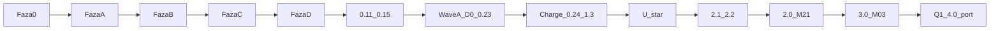

# Historia fabryki — nie steruje nocą

```
status:        archiwum osi czasu
utworzony:     2026-09-13
źródło:        wydzielone z docs/PLAN-REALIZACJA.md (karta badań 19)
```

**Żywy plan:** [PLAN-REALIZACJA.md](../PLAN-REALIZACJA.md) — pin **2026-09-08c**
+ Fala AI/BR. **Teraz:** [CURRENT.md](CURRENT.md).

Ten plik trzyma warstwy, które już nie sterują `/noc`: mermaid 0→Q1, Fabryka
0–D, Wave A, Charge 0.24–1.3, rzeka leftoverów nocy T3→CI9, zdublowane listy
Fal 2–11. **Żaden ID nie ginie.** Kolejka pinu, Fala S, Fala AI/BR i leftover
U-* zostają w żywym PLAN.

Nie czytaj stąd „następny plaster”. Nie wymieniaj pinu.

---

## Mermaid — Faza 0 → Q1 (historia)



Rozjazd po plasterze **0.15 hasła** był tylko w dokumentacji. Rdzeń nigdy
się nie rozszedł: RLS, HITL, LLM nie liczy, Decimal, `charge` = marża,
`source_ref`, pętla post-plaster.

---

## Fabryka 0–D — ukończona

| Faza | Co dała | Status |
|------|---------|--------|
| 0 GitHub | private repo Spawn2018/OmniRoute, CI `gate.yml` | DONE |
| A Cursor OS | AGENTS, GROUNDING, rules, skills, hooks | DONE |
| A.5 IDE | gh + GitHub MCP | DONE |
| B.1 szkielet | FastAPI, alembic, docker-compose | DONE |
| B.2 / 0.3 | RLS: `organization`, `app_user`, test izolacji | DONE |
| B.3 Gate | ruff/mypy/pytest/import-linter + PG | DONE |
| B.4 / 0.4 | OpenFGA model, `require_permission`, CI | DONE |
| B.5 / 0.5 | Vite, Compiler, TanStack, shadcn, ⌘K, lazy PostHog | DONE |
| B.6 / 0.6 | DataTableShell, ColumnEditor, `table_view` RLS, vitest | DONE |
| B.7 | branch protection = procedura (Free private 403) | DONE (procedura) |
| C.1–C.5 / 0.7–0.10 | HITL, instructor, docling A/B, langfuse no-op, promptfoo echo | DONE |
| leftover 0.11–0.15 | XOR vitest, JWT, split HITL, HTTP unit, hasła+refresh | DONE |
| D minimal | agentlint, pr-nudge, rytm refaktor/retro | DONE |

**Dług świadomy poza zakresem wtedy:** Auth0 BFF (I1/I2 odroczone); k6; vulture; żywy OpenAI w gate; Presidio-all; branch protection UI po Pro.

TanStack Start: Thoughtworks Assess — **nie** fundament; SPA wystarczy.

---

## Overlay 12m — Wave A (D0–0.23) — Exit DONE

Fala bezpieczeństwa i honesty **przed** powrotem do MODULES. Wave FE **nie**
jest częścią Wave A. Leftover U-* zostaje w żywym PLAN (Exit FE nie claim).

| ID | Daje | Zabija |
|---|---|---|
| **D0** | AGENTS dziś/później, `.cursorignore` dump, leftover≠DONE | overclaim Infisical/Temporal |
| **0.15 T0** | `document_base64` max_length → 422 przed decode | DoS |
| **0.16 T1** | rola `omniroute_app` NOBYPASSRLS | superuser omija RLS |
| **0.17 T2** | matryca izolacji S1–S6 + WITH CHECK | luki SQL |
| **0.18** | HTTP extract na żywej PG; token A / draft B → 404 | stub serwisu jako „HTTP done” |
| **0.19 A1** | undeclared `/api/v1` = deny; playground off | HC-05 konwencja |
| **0.20 A2** | `can_review_extractions` = reviewer, nie member | każdy member = admin |
| **0.21 T4** | `hello_token` default false (ON tylko local+CI) | mint UUID na sieci |
| **0.22 T5** | iss/aud/jti, TTL 15 min, `token_version` | goły HMAC |
| **0.23 S1** | `JWT_SECRET` z GitHub Encrypted Secrets | literał w YAML |

---

## Charge 0.24–1.3 — DONE

| ID | Moduł | Daje | Nie mylić z |
|---|---|---|---|
| **0.24** | ops | pip-audit, pin SHA Actions, `/ready`, request-id | nie w local `just gate`; k6/vulture echo |
| **0.25** | domain | Money Decimal + `<Money/>` na HITL | nie tabela `charge` / `rate_line` |
| **1.0** | M-06 | `charge_code` katalog + aliasy + `/charge-codes` | luźny string; nie stawka |
| **1.1** | M-07 | `rate_line` immutable + `source_ref` + `/rate-lines` | `charge` / marża |
| **1.2** | M-08 | `charge` buy+sell + `margin()` + `/charges` | accept HITL |
| **1.3** | M-20 | accept → `rate_line` w jednej transakcji HTTP | ExtractionService → rates; outbox; sell z LLM |

---

## Oś leftoverów `/noc` — rzeka T3→CI9 (dziennik nocy)

Kolejka żywa jest w [CURRENT.md](CURRENT.md). Ten akapit jest **PROGRESS**,
nie „co dalej”.

Kolejność (WIP=1 na `main`): T3 cutoffy na `container` → eventy `entity_event`
z warstwy API (2a/2b; BC nie importuje `entity_events`) → `stop_group`/EXP1 →
km/`/fleet` → `consignment` → T6 mapa → SQL na `charge` → lookup/KSeF TE →
outbox T5 → `plan_snapshot` (DONE 265.0) → `circle_sim` HITL (DONE 266.0) →
leftover km ładowny/pusty/dolot (DONE 267.0) → leftover F9 Optima fixture
(DONE 268.0) → leftover T8 slot capability (DONE 269.0) → leftover S53 HITL
`idp_connector` (DONE 270.0) → leftover S55 HITL `exchange_connector`
(DONE 271.0) → leftover CI9 HITL `customer_contract` nagłówek (DONE 272.0) →
leftover CI9 opaque `blob_ciphertext` (DONE 273.0; present/absent, nie szyfr) →
leftover CI9 KEK mark (DONE 274.0; znacznik, nie klucz) → leftover CT7 HITL
`visibility_connector` (DONE 275.0; token `p44`, nie live) → leftover CT1 HITL
`purchase_order` nagłówek (DONE 276.0) → leftover CT1 HITL `po_line`
(DONE 277.0) → leftover CT1 HITL `asn` (DONE 278.0) → leftover CT4 HITL
`routing_guide` (DONE 279.0; auto shipment/CT2 parked z powodem) → leftover
CT3 HITL `otif_mark` (DONE 280.0) → leftover CT6 HITL `sap_connector`
(DONE 281.0) → leftover CT12 HITL `capa_mark` (DONE 282.0) → leftover CT10
HITL `freight_audit_mark` (DONE 283.0) → leftover CT11 HITL
`collaboration_mark` (DONE 284.0) → leftover 409/compose / reszta pinu.
`plan_snapshot` **po** obiektach, **przed** kółkami — nie w jednym worku ze
stopami. Cały łańcuch XL→WAPRO nie wchodzi przed outbox. P6c auto-award = zakaz.

Bliźniak = wzorzec (stan RLS + `entity_event` + opcjonalnie kopia planu /
karta komunikacji), nie druga tabela `*_twin`. Rodziny rosną katalogiem.
AI szuka i proponuje; `operator_decision` zamyka. LLM nie liczy.

---

## Fala 2–11 — lista M-xx (zdublowana wobec Fali 1)

Te fale są **DONE** w tabeli Fala 1 żywego PLAN. Tu zostaje wskaźnik, żeby
nazwa M-xx nie zginęła.

### Fala 2 — po Q6

M-11 Automatyczne kontakty · M-12 Sieci i stowarzyszenia · M-13 Karta wyników
kontrahenta · M-16 Procedury operacyjne klienta · M-18 Opłaty portowe
warunkowe · M-19 Stawki live i kanały · M-14 Ocena kredytowa (zakaz
auto-scoringu osoby) · M-15 Wirtualny Dyrektor Finansowy (LLM nie liczy).

**M-14 Ocena kredytowa:** w kolejce po M-13, ale Plan **musi** zakazać
automatycznego scoringu `natural_person` / JDG (AI Act). M-15 VDF — po M-14,
LLM nie liczy.

### Fala 3 — ofertowanie

M-23 Waluty w ofercie (czyta `nbp_rate` z 6.0, nie drugi katalog) · M-24
Ryzyko oferty · M-25 Negocjacja i wynik · M-26 Dokument oferty · M-27 Wycena
wsadowa · M-28 Zapytania od klientów · M-29 Wykrywanie akceptacji · M-30
Zapytania do agentów/armatorów · M-31 Porównanie odpowiedzi.

### Fala 4 — komunikacja

M-32 Integracja pocztowa · M-33 Dodatek do Outlooka · M-34 Powiadomienia.
Copilot/mail = label Art. 50 (U-art50).

### Fala 5 — zlecenie

M-35 Zlecenie · M-36 Tracking · M-37 Wyjątki · M-38 Dokumenty zlecenia ·
M-39 EDI.

### Fala 6 — finanse

M-40 Fakturowanie i KSeF · M-41 Rozliczenie wyceny z fakturą · M-42 Bank i
płatności · M-43 Koszt pieniądza · M-44 Różnice kursowe · M-45 Przepływy ·
M-46 Koszt obsługi klienta · M-47 Księgowość (integracja). Kwoty Decimal;
LLM nie liczy.

### Fala 7–11 — modały, compliance, AI, portal, ops

M-48…M-51 modały · M-52…M-56 compliance (M-53 sankcje, M-56 RODO) ·
M-57…M-60 AI (HITL; Art. 50; nie scoring osoby) · M-61…M-67
rynek/portal/subskrypcja · M-68…M-70 obserwowalność, jakość, wdrożenie.

---

## Co zostaje w żywym PLAN

Pin **2026-09-08c** (P0…K0) · Fala S · Fala AI · Fala BR · leftover U-* ·
park · anti-cele · DoD. Katalog M-01…M-70 = wskaźnik w żywym PLAN.
